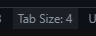
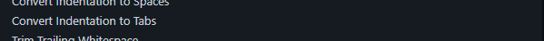

# codeingstyle標準

## 目錄
- [codeingstyle標準](#codeingstyle標準)
	- [目錄](#目錄)
	- [html標準](#html標準)
		- [骨架](#骨架)
		- [可使用元素表](#可使用元素表)
			- [但如果有需要SEO開放下列標籤](#但如果有需要seo開放下列標籤)
		- [可用屬性表](#可用屬性表)
		- [書寫規範](#書寫規範)
	- [css標準](#css標準)
		- [命名規則](#命名規則)
	- [js/php標準](#jsphp標準)
		- [命名規則](#命名規則-1)
		- [基本架構](#基本架構)
		- [其他規範](#其他規範)
	- [其他](#其他)

## html標準

### 骨架

```html
<!DOCTYPE html>
<html>
	<head>
		<meta charset="UTF-8">
		<meta name="viewport" content="width=device-width, initial-scale=1.0">
		<!-- meta tag -->
		<title>Document</title>
		<!-- style sheet -->
		<!-- js script -->
	</head>
	<body>
		<!-- 網頁內容 -->
	</body>
</html>
```

### 可使用元素表
| 元素 | 元素 |
| --- | --- |
| `<a>` | `<audio>` |
| `<b>` | `<body>` |
| `<br>` | `<canvas>`(X) |
| `<del>` | `<div>` |
| `<form>` | `<h1>`(X) |
| `<h2>`(X) | `<h3>`(X) |
| `<h4>`(X) | `<h5>`(X) |
| `<h6>`(X) | `<hr>` |
| `<html>` | `<i>` |
| `<iframe>`(X) | `` |
| X | `<input type="button">` |
| `<input type="checkbox">` | `<input type="color">` |
| `<input type="date">` | `<input type="datetime-local">` |
| `<input type="email">` | `<input type="file">` |
| `<input type="hidden">` | `<input type="image">`(X) |
| `<input type="month">` | `<input type="number">` |
| `<input type="password">` | `<input type="radio">` |
| `<input type="range">` | `<input type="reset">` |
| `<input type="search">` | `<input type="submit">` |
| `<input type="tel">` | `<input type="text">` |
| `<input type="time">` | `<input type="url">` |
| `<input type="week">` | `<li>` |
| `<link>` | `<meta>` |
| `<ol>` | `<option>` |
| `<p>`(X) | `<script>` |
| `<select>` | `<span>` |
| `<strong>` | `<sub>` |
| `<sup>` | `<table>` |
| `<tbody>` | `<td>` |
| `<textarea>` | `<tfoot>` |
| `<th>` | `<thead>` |
| `<title>` | `<tr>` |
| `<u>` | `<ul>` |
| `<video>` | X |

#### 但如果有需要SEO開放下列標籤
| 元素 | 元素 |
| --- | --- |
| `<article>` |
| `<aside>` |
| `<footer>` |
| `<header>` |
| `<label>` |
| `<legend>` |
| `<main>` |
| `<nav>` |
| `<summary>` |

### 可用屬性表
| 屬性 | 屬性 |
| --- | --- |
| accesskey(X) | autocapitalize |
| autofocus | class |
| data-* | draggable |
| hidden | id |
| lang(SEO開放) | slot |
| spellcheck | tabindex(X) |
| title | accept |
| autocomplete | capture |
| disabled | max |
| maxlength(X) | min |
| minlength(X) | multiple |
| pattern(X) | readonly |
| required | size |
| step | |

### 書寫規範
在屬性內將分為"有值"及"無值"兩種
- 有值屬性: 如`class="example"`
- 無值屬性: 如`disabled`

架構如下:

`<主標籤 必要屬性 有值次要屬性(以開頭由大到小排列) 無值次要屬性(以開頭由大到小排列)>`

範例:

`<input type="text" class="input" id="name" name="name" placeholder="請輸入您的姓名" value="abc" required>`


## css標準

### 命名規則
- 選擇器名稱: 小寫,單字間不分隔
    - 但如果樣式只有一行可以使用`元素名(小駝峰或全小寫)-值(空白使用_分隔)` 例如: `display-none`
- 不得使用#選擇器
- 盡量不用偽類選擇器及偽元素
- 首先是content
- 接者是border
- 接者是定位
- 接者是寬高
- 接者是背景
- 接者是文字
- 接者是內外距
- 接者是display
- 最後是其他(以字母順序排列)


## js/php標準

### 命名規則
- 如果為const使用全大寫命名法
- 如果為let或函式使用全小寫命名法

### 基本架構
```js
// import 區塊
import XXX from "XXX"
// 換一行

// 全域變數定義區塊
// 先const再let
const XXX = "XXX"
let xxxaa = "XXX"
/*
先字串
再數字
再布林值
再陣列
再物件
最後空值或未定義
*/

// 換一行

// 函式定義區塊
function xxx(){
	// 函式內容(與外層架構相同)
}

// 換一行

// 初始化區塊
// 換一行

// 主區塊
// 換一行

// 事件監聽區塊
// 換一行

// 全域函數呼叫或需初始化的函數呼叫區塊
// 換一行
```

### 其他規範
- 字元間不加多餘空白
- 結尾不加上分號
- 先雙引號再單引號
- 基本上不用foreach
  - 除了dom控制
- 不使用eval
- 不用switch-case
- 不用class
- 盡量不用while loop
- 能不用function就不用function
- 預到`,{,[[]]務必換行並加tab
  - 但如果只有一行可以放在同一行但前後加空格
- 不用簡化表示法(如:i++等)

## 其他
- 請將space改為tab size,值設為4
如圖:




*v1.0.0 2024/05/19*