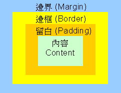
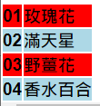
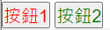

# CSS基本介紹及其基本操作

## 介紹
階層式樣式表(Cascading Style Sheets(CSS)又稱串樣式列表、級聯樣式表、串接樣式表)，是一種用來為結構化文件(如HTML文件或XML應用)用來添加樣式、動畫、響應式網頁等的工具，目前普遍使用CSS3。CSS不僅可以靜態地修飾網頁，還可以配合各種手稿語言動態地對網頁各元素進行格式化。CSS 能夠對網頁中元素位置的排版進行像素級精確控制，支援幾乎所有的字型字號樣式，擁有對網頁物件和模型樣式編輯的能力。

## 基本語法
```
selector{
    declaration; /* properties:property value */
    ..inf
}
```

## 詳細介紹
css優先權比較順序:
style 屬性(行內樣式) &gt; style標籤(嵌入樣式)  &gt; 載入 CSS 檔案(外連樣式) &gt; 如果兩個選擇器相同，後者會優先於前者<sup>1</sup> &gt; animation(@keyframes) &gt; !important<sup>2</sup> &gt; inline style(ex:) &gt; id  &gt; class = 屬性<sup>3</sup> &gt; tag(ex:div) &gt; *<sup>4</sup> &gt; 繼承<sup>5</sup> &gt;&gt;<sup>6</sup> ~ = +<sup>7</sup>
1:ex:


2:ex:
```
body{
    color: white;
}

.div{
    color: white !important;
}
```

3:ex:

4:
萬用選擇器(universal selector)
萬用選擇器是以 HTML 文件中的所有元素做為要套用樣式規則的對象，其命名格是為星號(*)。
```
*{
    padding: 0px;
    margin: 0px;
}
```
邊界介紹於註8

5:
指定在父標籤的屬性，有分為有繼承與無繼承性的屬性，有繼承性的例如 font- family、font-size 等等，無繼承性的例如有 display、margin、padding。
html:
```
<p>
    <strong>text</strong>
</p>
```

css:
```
p{
    color: white
}

strong{
    font-size: 20px;
}
```
在以上的例子中，雖然沒有對&lt;strong&gt;設定顏色，可是可以看到，整個句子的顏色都是綠色的。這是因為，&lt;strong&gt;是&lt;p&gt;的子標籤，所以&lt;strong&gt;繼承了&lt;p&gt;的樣式，而在&lt;p&gt;的樣式中，文字顏色是設定為綠色的。

6.極小於
css命名規則: 可以使用英文 (“有”區分大小寫)-   _ 數字(但第一位置不得為數字) 、emoji(??) 、中文(非常不建議使用)

8:

margin: [上面邊界值] [右邊邊界值] [下面邊界值] [左邊邊界值]
padding: [上面留白值] [右邊留白值] [下面留白值] [左邊留白值]


偽類別種類:動態偽類別 結構偽類別 迴圈偽類別 表單偽類別


關於 CSS 選擇器、階層、與繼承
CSS 選擇器
CSS 選取器是用來將 CSS 樣式套用在 HTML 中指定的標籤，以下為常用的選擇器
1.	類型選擇器(type selector)
類型選擇器是以某個HTML 元素做為套用樣式規則的對象，名稱必須和指定的HTML
元素符合。HTML  tag：&lt;a&gt;、&lt;p&gt;、&lt;div&gt;、&lt;li&gt;、&lt;h1&gt;…等

```
/* 將1階標題的文字色彩設為藍色 */
h1{
    color: blue
}

/* 將段落的文字設定為 10 像素、左邊界 20 像素*/
p{
    font-size: 10px;margin-left: 20px;
}

```

2.	類別選擇器(class selector)
類別選擇器是以隸屬於指定類別的 HTML 元素做為要套用樣式規則的對象，以『.』為始命名的類別，如.main、.photo、.row、.user-name
html:
```
<table>
    <tr class="odd">
        <td>01</td>
        <td>玫瑰花</td>
    </tr>
    <tr class="even">
        <td>02</td>
        <td>滿天星</td>
    </tr>
    <tr class="odd">
        <td>03</td>
        <td>野薑花</td>
    </tr>
    <tr class="even">
        <td>04</td>
        <td>香水百合</td>
    </tr>
</table>
```

css:
```
.odd{background:red}
.even{background: lightblue;}
```

執行結果如下


3.	ID 選擇器(class selector)
ID 選擇器是以符合指定id(識別字)的HTML 元素做為要套用樣式規則的對象，以『#』為始命名的識別，如#photo001、#user01、#mainblock、#CompanyInfo。

範例：將兩個按鈕的 ID 屬性設為”btn1”和”btn2”，然後定義#btn1 和#btn2 兩個 ID
選擇器，以便將按鈕的前景色彩設定為紅色和綠色。
html:
```
<button id="btn1">按鈕 1</button>
<button id="btn2">按鈕 2</button>
```

css:
```
#btn1{font-size: 20px;color:red;}
#btn2{font-size: 20px;color:green;}
```
執行結果如下


4.複合選擇器
是由兩個或多個基礎選擇器透過不同方式組合而成。
div.user{ }
指的是 html 中  &lt;div class="user"&gt;...&lt;/div&gt;的元件

.user.name{ }
指的是 html 中  &lt;div class="user name"&gt;...&lt;/div&gt;的元件

5.偽類選擇器(pseudo-class)
偽類選擇器可以將樣式規則套用在符合特定條件的資訊，或其他簡單的選擇器所無法表達的資訊，說明請移至[這裡](css/pseudoclass.md)查看。

6.屬性選擇器(attribute-class)
屬性選擇器可以將樣式規則套用在有設定某個屬性的元素。
input[type="text"]{ }
//指的是 html 中  &lt;input type="text"&gt;的元件

div[class="block"]{ }
指的是 html 中  &lt;div class="block"&gt;...&lt;/div&gt;的元件

未歸類標籤、屬性
1. 加入註解(Ctrl+/) css/* */

2. 關於id選擇器與class選擇器
    - id 選擇器
        - id 選擇器可以用在任何標籤上，為全域屬性，它的作用是在頁面的標籤中，將需要辨識的標籤獨立辨識，值必須以字母或下滑線作開頭，不能使用數字或是其他字元，同一個頁面上的兩個標籤也不能有相同的 id 屬性值，這個屬性可以與CSS、Javascript 的程式碼作互動，之後的文章會慢慢說明。
    - class 選擇器
        - class 選擇器也可套用在任何標籤，用途是用來把一些標籤做出獨立區隔或可以把想要做出同效果的標籤放入設定好的屬性內容，與 id 選擇器的不同為 id 選擇器在一個Html 內只能使用一次，class 選擇器則可以重複套用，並且 id(getElementById)/class(getElementsByClassName)選擇器皆可被js及css運用。


3.	關於&lt;div&gt;與&lt;span&gt;標籤
    - &lt;div&gt;
        -此標籤可以將多個標籤群組起來，做成一個區塊。例如可以製作&lt;div&gt;標籤來將網頁上不同位置或是功能的內容作出區分，也可以使用 id 選擇器或是 class 選擇器來決定&lt;div&gt;的 CSS 樣式，並改變外觀或是顯示大小等等。
    - &lt;span&gt;
        -這個標籤為行內標籤，可以容納一個或多個行內標籤，或透過 CSS 來控制這些標籤內容的外觀，也可使用id選擇器與class選擇器。

1. 區塊與行內標籤

行內元素
(inline)
1. 和其他元素都在同一行內呈現，圖片或文字均不換行，也不會影響其版面配置。不會另起一行。
2. 不可設定長寬，設定長寬無效，元素的寬高由它的內容撐開，寬度就是它的文字或圖片的寬度，長度就像一條線(行高及頂和底邊距不可改變)	a(錨點 abbr 縮寫)、span、input、img、em
區塊元素
(block)
1. 元素寬度預設會撐到最大，使其占滿整個容器。會另起一行。
2. 可以設定長寬/margin/padding，但仍會占
滿一整行h1~h6(標題)、p、hr(水平線)、ul-li(無序清單)、ol-li(有序清單)、table 表格、div
inline-block 行內區塊
1. 以inline的方式呈現，但同時擁有block的屬性
2. 可設定元素的寬高/margin/padding
3. 可水平排列導覽列很常使用inline-block製作
利用『display: inline-block』，把 menu 的高度撐開來

群組型宣告
注意事項:
1.	最後一個選取器不得有逗號
2.	當大量使用時，可以先可以先考慮是否新建共同選取器
3.	逗號前後空白不影響選取器
4.	可是使用換行或濃縮成一行

群組型宣告範例如下:
css:
```

```

組合式宣告


疊層式宣告


## 主程式架構(原生)

```

```


## 主功用
美化版面及製作輕量動畫

## 註解及參見
- 附錄1-[css指令一覽表](css/keyword.md):
- 附錄2-[顏色表](css/color.md):
- 附錄3-大小(位置):
- 附錄4-[css wiki](https://zh.wikipedia.org/zh-tw/CSS)
- 附錄5-[css mozilla](https://developer.mozilla.org/en-US/docs/Learn/CSS/Building_blocks)
- 附錄6-[css w3c](https://www.w3schools.com/cssref/)
- 附錄7-[css偽類選擇器](https://developer.mozilla.org/en-US/docs/Web/CSS/Pseudo-classes)
- 附錄8-[css偽元素](https://developer.mozilla.org/en-US/docs/Web/CSS/Pseudo-elements)


1. [css基本](../css.md)
2. [文字及段落]()
3. [背景]()
4. [容器及其副屬]()
5. [基本動畫]()
6. [清單及表單]()
7. [排版及定位]()
8. [display及基本排版]()
9. [網格系統](grid.md)
10. [偽元素]()
11. [偽類選擇器]()
12. [單位]()
13. [其他]()


小賀chris:) 2023/06/16 v1.0.1