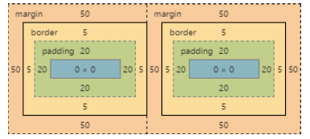

# css
# 專業人士須知

<div style="page-break-after: always;"></div>

---

免費程式設計書籍

免責聲明

這是一本出於教育目的而創建的非官方免費書籍,

不隸屬於官方 css 團體或公司.

所有商標和註冊商標均為

其各自所有者的財產

---

<div style="page-break-after: always;"></div>

## 目錄
- [css](#css)
- [專業人士須知](#專業人士須知)
	- [目錄](#目錄)
	- [第0章 - 介紹](#第0章---介紹)
	- [第1章 - 開始使用css](#第1章---開始使用css)
		- [1-1節: 外部樣式表](#1-1節-外部樣式表)
		- [1-2節:內部樣式](#1-2節內部樣式)
		- [1-3節: css @import規則(css at-rule 之一)](#1-3節-css-import規則css-at-rule-之一)
		- [1-4節: 內嵌樣式](#1-4節-內嵌樣式)
		- [1-5節: 用js更改css](#1-5節-用js更改css)
		- [1-6節: 使用css設定清單樣式](#1-6節-使用css設定清單樣式)
	- [第2章-css規則的結構與格式](#第2章-css規則的結構與格式)
		- [2-1節: 屬性清單](#2-1節-屬性清單)
		- [2-2節: 多重選擇器](#2-2節-多重選擇器)
		- [2-3節: 規則,選擇器,聲明區塊](#2-3節-規則選擇器聲明區塊)
	- [第3章-註解](#第3章-註解)
	- [第4章-選擇器](#第4章-選擇器)
		- [4-1節: 基本選擇器](#4-1節-基本選擇器)
		- [4-2節: 屬性選擇器](#4-2節-屬性選擇器)
			- [概述](#概述)
			- [註釋](#註釋)
			- [細節](#細節)
		- [4-3節: 關係選擇器](#4-3節-關係選擇器)
			- [後代組合器](#後代組合器)
			- [子組合器](#子組合器)
			- [鄰近兄弟組合器](#鄰近兄弟組合器)
			- [通用兄弟組合器](#通用兄弟組合器)
		- [4-4節: 偽類選擇器](#4-4節-偽類選擇器)
		- [4-5節: nth偽類](#4-5節-nth偽類)
		- [4-6節: 類別選擇器](#4-6節-類別選擇器)
		- [4-7節: id選擇器](#4-7節-id選擇器)
		- [4-8節: id選擇器,不含高位id選擇器的優先級](#4-8節-id選擇器不含高位id選擇器的優先級)
		- [4-9節: :last-of-type選擇器](#4-9節-last-of-type選擇器)
		- [4-10節: css3 :in-range 選擇器範例](#4-10節-css3-in-range-選擇器範例)
		- [4-11節: :not 偽類範例](#4-11節-not-偽類範例)
		- [4-12節: :focus-within 偽類範例](#4-12節-focus-within-偽類範例)
		- [4-13節: 帶複選框的全域布林值 checkbox:checked 和 一般兄弟組合器(~)](#4-13節-帶複選框的全域布林值-checkboxchecked-和-一般兄弟組合器)
		- [4-14節: :only-child 偽類選擇器範例](#4-14節-only-child-偽類選擇器範例)
	- [第5章: 背景](#第5章-背景)
		- [5-1節: background-color](#5-1節-background-color)
			- [顏色名稱](#顏色名稱)
			- [十六進位顏色代碼(HEX)](#十六進位顏色代碼hex)
			- [RGB/RGBa](#rgbrgba)
			- [HSL/HSLa](#hslhsla)
		- [5-2節: 背景梯度](#5-2節-背景梯度)
			- [線性梯度](#線性梯度)
			- [半徑梯度](#半徑梯度)
			- [重複梯度](#重複梯度)
		- [5-3節: background-image](#5-3節-background-image)
		- [5-4節: background縮寫](#5-4節-background縮寫)
			- [語法](#語法)
		- [5-5節: background-size](#5-5節-background-size)
			- [總覽](#總覽)
			- [保持長寬比](#保持長寬比)
			- [contain](#contain)
			- [cover](#cover)
		- [第5.6節:背景位置](#第56節背景位置)
			- [單位說明](#單位說明)
				- [value%](#value)
				- [valuepx](#valuepx)
				- [長形背景位置屬性](#長形背景位置屬性)
		- [5-7節: background-origin](#5-7節-background-origin)
		- [5-8節: 多個背景圖片](#5-8節-多個背景圖片)
		- [5-9節: background-attachment](#5-9節-background-attachment)
			- [background-attachment: scroll](#background-attachment-scroll)
			- [background-attachment: fixed](#background-attachment-fixed)
			- [background-attachment: local](#background-attachment-local)
		- [5-10節: background-clip](#5-10節-background-clip)
		- [5-11節: background-repeat](#5-11節-background-repeat)
		- [5-12節: background-blend-mode](#5-12節-background-blend-mode)
		- [5-13節: bachground-color 不透明度](#5-13節-bachground-color-不透明度)
	- [第6章:置中](#第6章置中)
		- [6-1節: 使用flexbox](#6-1節-使用flexbox)
		- [6-2節: 使用css transform](#6-2節-使用css-transform)
		- [6-3節: 使用margin: 0 auto](#6-3節-使用margin-0-auto)
		- [6-4節: 使用text-align](#6-4節-使用text-align)
		- [6-5節: 使用position: absolute](#6-5節-使用position-absolute)
		- [6-6節: 使用calc()](#6-6節-使用calc)
		- [6-7節: 使用line-height](#6-7節-使用line-height)
		- [6-8節: 使用三行程式碼垂直對齊任何內容](#6-8節-使用三行程式碼垂直對齊任何內容)
		- [6-9節: 依靠其他元素置中](#6-9節-依靠其他元素置中)
		- [6-10節: 幽靈元素](#6-10節-幽靈元素)
		- [6-11節: 不考慮高寬即可實現垂直和水平置中](#6-11節-不考慮高寬即可實現垂直和水平置中)
		- [6-12節: 將圖片垂直置中在div中](#6-12節-將圖片垂直置中在div中)
		- [6-13節: 使用固定尺寸置中](#6-13節-使用固定尺寸置中)
		- [6-14節: 垂直對齊動態高度元素](#6-14節-垂直對齊動態高度元素)
		- [6-15節: 使用表格布局實現水平垂直居中](#6-15節-使用表格布局實現水平垂直居中)
	- [第7章: 箱子模型](#第7章-箱子模型)
		- [7-1節: 什麼是箱子模型](#7-1節-什麼是箱子模型)
		- [7-2節: box-sizing](#7-2節-box-sizing)
	- [第8章-外距](#第8章-外距)
		- [8-1節: 外距合併](#8-1節-外距合併)
			- [相鄰垂直外距示範](#相鄰垂直外距示範)
			- [相鄰水平外距示範](#相鄰水平外距示範)
			- [不同大小的重疊外距](#不同大小的重疊外距)
			- [外距合併陷阱](#外距合併陷阱)
			- [父子元素外距合併](#父子元素外距合併)
		- [8-2節: 為特定方向設置外距](#8-2節-為特定方向設置外距)
			- [使用方向特定屬性](#使用方向特定屬性)
			- [使用簡寫屬性指定方向](#使用簡寫屬性指定方向)
		- [8-3節: 簡化外距屬性](#8-3節-簡化外距屬性)
		- [8-4節: 使用外距將元素在頁面上水平居中](#8-4節-使用外距將元素在頁面上水平居中)
		- [8-5節: 範例](#8-5節-範例)
		- [8-6節: 負外距](#8-6節-負外距)
	- [第9章: 內距](#第9章-內距)
		- [9-1節: 內距簡寫方式](#9-1節-內距簡寫方式)
		- [9-2節: 設定特定一邊的內距](#9-2節-設定特定一邊的內距)
	- [第10章: 邊框](#第10章-邊框)
		- [10-1節: border-radius](#10-1節-border-radius)
		- [10-2: border-style](#10-2-border-style)
		- [10-3: 多重邊框](#10-3-多重邊框)
			- [outline](#outline)
			- [box-shadow](#box-shadow)
			- [偽元素](#偽元素)
		- [10-4: 邊框簡寫](#10-4-邊框簡寫)
		- [10-5: border-collapse](#10-5-border-collapse)
		- [10-6: border-image](#10-6-border-image)
		- [10-7: 使用border-image創建多彩邊框](#10-7-使用border-image創建多彩邊框)
		- [10-8: border-上下左右](#10-8-border-上下左右)
	- [第11章: 外框線](#第11章-外框線)
		- [11-1: 總覽](#11-1-總覽)
	- [11-2: outline-style](#11-2-outline-style)
	- [第12章: 容器溢位](#第12章-容器溢位)
		- [12-1節: overflow-warp](#12-1節-overflow-warp)
		- [12-2節: overflow-x及overflow-y](#12-2節-overflow-x及overflow-y)
		- [12-3節: overflow: scroll](#12-3節-overflow-scroll)
		- [12-4節: overflow: visible](#12-4節-overflow-visible)
		- [12-5節: 使用overflow創建塊級格式上下文](#12-5節-使用overflow創建塊級格式上下文)
	- [第13章: 媒體查詢](#第13章-媒體查詢)
		- [13-1節: 術語和結構](#13-1節-術語和結構)
		- [13-2節: 基本示範](#13-2節-基本示範)
		- [13-2節: mediatype](#13-2節-mediatype)
		- [13-4節: 適用於視網膜與非視網膜螢幕的媒體查詢](#13-4節-適用於視網膜與非視網膜螢幕的媒體查詢)
		- [13-5節: 寬度vs視口](#13-5節-寬度vs視口)
		- [13-6節: 使用媒體查詢針對不同屏幕尺寸](#13-6節-使用媒體查詢針對不同屏幕尺寸)
		- [13-7節: 在link標籤中使用](#13-7節-在link標籤中使用)
		- [13-8節: 媒體查詢與IE8](#13-8節-媒體查詢與ie8)
	- [第14章: 浮動](#第14章-浮動)
		- [14-1節: 在文本內浮動圖像](#14-1節-在文本內浮動圖像)
		- [14-2節: clear屬性](#14-2節-clear屬性)
		- [14-3節: 清除浮動](#14-3節-清除浮動)
		- [14-4節: 使用浮動的內聯 DIV](#14-4節-使用浮動的內聯-div)
		- [14-5節: 使用overflow屬性清除浮動](#14-5節-使用overflow屬性清除浮動)
		- [14-6節: 簡單的雙列定寬佈局](#14-6節-簡單的雙列定寬佈局)
		- [14-7節: 簡單的三列定寬佈局](#14-7節-簡單的三列定寬佈局)
		- [14-8節: 懶惰/貪婪的雙列佈局](#14-8節-懶惰貪婪的雙列佈局)
	- [第15章: 文字及排版](#第15章-文字及排版)
		- [15-1節: font簡寫](#15-1節-font簡寫)
		- [15-2節: 引號](#15-2節-引號)
		- [15-3節: 字體大小](#15-3節-字體大小)
		- [15-4節: 文字方向](#15-4節-文字方向)
		- [15-5節: 字體列表](#15-5節-字體列表)
		- [15-6節: 文字溢出](#15-6節-文字溢出)
		- [15-7節: 文字陰影](#15-7節-文字陰影)
		- [15-8節: 文字變換](#15-8節-文字變換)
		- [15-9節: 字距](#15-9節-字距)
		- [15-10節: 文本縮進](#15-10節-文本縮進)
		- [15-11節: 文本裝飾](#15-11節-文本裝飾)
		- [15-12節: 文字間距](#15-12節-文字間距)
		- [15-13節: 字體變體](#15-13節-字體變體)
	- [第16章: Flexbox](#第16章-flexbox)
		- [16-1節: 動態垂直水平居中](#16-1節-動態垂直水平居中)
			- [原理](#原理)
			- [單個屬性示範](#單個屬性示範)
				- [示範1: 水平flexbox上的justify-content: center](#示範1-水平flexbox上的justify-content-center)
				- [示範2: 垂直flexbox上的justify-content: center](#示範2-垂直flexbox上的justify-content-center)
				- [示範3: 水平flexbox上的align-items: center](#示範3-水平flexbox上的align-items-center)
				- [示範4: 垂直flexbox上的align-items: center](#示範4-垂直flexbox上的align-items-center)
				- [示範5: 在水平flexbox上同時居中](#示範5-在水平flexbox上同時居中)
				- [示範6: 在垂直 flexbox 上同時居中](#示範6-在垂直-flexbox-上同時居中)
		- [16-2節: 黏性可變高度頁腳](#16-2節-黏性可變高度頁腳)
		- [16-3節: 最佳化填充元素至其容器](#16-3節-最佳化填充元素至其容器)
		- [16-4節: 使用flexbox實現Holy Grail佈局](#16-4節-使用flexbox實現holy-grail佈局)
		- [16-5節: 使用flexbox完美對齊卡片內的按鈕](#16-5節-使用flexbox完美對齊卡片內的按鈕)
		- [16-6節: 嵌套容器等高](#16-6節-嵌套容器等高)
	- [第17章: 級聯和優先級](#第17章-級聯和優先級)
		- [17-1節: 計算選擇器優先級](#17-1節-計算選擇器優先級)
			- [範例1: 各種選擇器序列的優先級](#範例1-各種選擇器序列的優先級)
			- [範例2: 瀏覽器如何使用優先級](#範例2-瀏覽器如何使用優先級)
			- [範例3: 如何操縱優先級](#範例3-如何操縱優先級)
			- [!important和內聯樣式聲明](#important和內聯樣式聲明)
		- [17-2節: !important聲明](#17-2節-important聲明)
		- [17-3節: 級聯](#17-3節-級聯)
			- [範例1: 優先級規則](#範例1-優先級規則)
			- [範例2: 具有相同選擇器的級聯規則](#範例2-具有相同選擇器的級聯規則)
			- [範例3: 優先級規則後的級聯規則](#範例3-優先級規則後的級聯規則)
		- [17-4節: 更複雜的優先級示例](#17-4節-更複雜的優先級示例)
			- [縮寫表](#縮寫表)
	- [註解及參見](#註解及參見)
	- [註解](#註解)
	- [參見](#參見)
		- [C17-2](#c17-2)

<div style="page-break-after: always;"></div>

## 第0章 - 介紹

請隨時免費與任何人分享此 PDF,

本書的最新版本可以從以下網址下載:

https://goalkicker.com/cssBook

這本 css Notes for Professionals 書是從 Stack Overflow 編譯的

文檔,內容是由 Stack Overflow 的優秀人員編寫的.

文字內容根據 Creative Commons BY-SA 發布,請參閱末尾的製作人員名單

本書各章節的貢獻者. 圖片可能有版權

除非另有說明,否則屬於其各自所有者

這是一本出於教育目的而創建的非官方免費書籍,並非

隸屬於官方 css 團體或公司,也不屬於 Stack Overflow. 全部

商標和註冊商標均為其各自的財產

公司業主

不保證本書提供的資訊正確無誤,也不保證準確,使用風險自負

請將回饋和更正發送至 chris960527ho@gmail.com 或 discord: chris0527

GoalKicker.com

TW翻譯: 賀皓群 (discord: chris0527,email: chris960527ho@gmail.com)

<div style="page-break-after: always;"></div>

## 第1章 - 開始使用css

版本釋出日:
- css1版1996/12/17
- css2版1998/05/12
- css3版2015/10/13 // 目前版本

### 1-1節: 外部樣式表

透過在每個html文件中放置<link>元素,可以將外部css樣式表套用到任意數量的html文件.

<link>標籤的rel屬性必須設定為“stylesheet”,href屬性必須設定為相對(/絕對)樣式表的路徑.

雖然使用相對url路徑通常被認為是好的做法,但絕對路徑也可以使用.

在html5中,可以省略type屬性.

建議將 <link> 標記放置在 html 檔案的 <head> 標籤中,以便在先前載入樣式

否則,用戶將看到一閃而過的無樣式內容.

範例:
```html
<!-- hello-world.html -->
<!DOCTYPE html>
<html>
	<head>
		<meta charset="utf-8">
		<link rel="stylesheet" href="index.css"> <!-- 等效於<link rel="stylesheet" type="text-css" href="index.css"> -->
	</head>
	<body>
		<h1>Hello world!</h1>
		<p>I ♥ css</p>
	</body>
</html>
```

```css
/* index.css */
h1{
	color: green;
	text-decoration: underline;
}

p{
	font-size: 25px;
	font-family: 'Trebuchet MS', sans-serif;
}
```

請記得確保在href中包含css檔案的正確路徑.

如果css檔案與html位於相同資料夾中

則不需要資料夾路徑(如上面的範例).

但如果它保存在資料夾中,則需要像這樣指定它

href="資料夾名稱/style.css".

```html
<link rel="stylesheet" href="foldername/style.css">
```

**外部樣式表被認為是處理css的最佳方式**

原因很簡單:如果當您正在管理一個超過100個頁面的網站,所有頁面均由單一樣式表控制,並且您想要更改連結顏色從藍色到綠色.

那麼呢比起在每個文件更改,在一個css文件中進行更改容易非常多,而且程式也會比較乾淨

**您可以根據需要在html頁面中載入任意數量的css檔案.**
例如:
```html
<link rel="stylesheet" href="main.css">
<link rel="stylesheet" href="override.css">
```

css 規則與一些基本規則一起應用,並且順序很重要.

例如,如果您有一個 index.css 文件

例如:
```css
p.green{
	color: #00FF00;
}
```
所有帶有.green類別的段落都將以淺綠色編寫,但您可以使用另一個.css覆蓋它

文件只需將其包含在index.css之後即可.您可以在index.css之後使用override.css並使用以下程式碼.

例如:
```css
p.green{
	color: #006600;
}
```

現在,所有具有.green類別的段落都將以深綠色而不是淺綠色書寫.

其他原則也適用,例如!important規則,優先級和繼承.

當某人第一次造訪您的網站時,他們的瀏覽器會下載目前頁面的html以及連結的css文件.

然後,當他們導航到另一個頁面時,他們的瀏覽器只需要下載該頁面的html,這css檔案被(緩存)[],因此不需要再次下載.

由於瀏覽器(快取)[]外部樣式表,您的頁面載入速度更快.

### 1-2節:內部樣式
html文件中`<style></style>`標籤中包含的css功能類似於外部樣式表,

不同之處在於**它存在於其樣式的html文件中而不是單獨的文件中,因此只能應用於它所在的文檔**.

請注意,**此元素必須位於<head>元素內以進行html驗證**(儘管它如果放在body中,將在所有目前瀏覽器中工作).

例如:
```html
<head>
	<style>
		h1{
			color: green;
			text-decoration: underline;
		}
		p{
			font-family: 'Trebuchet MS', sans-serif;
			font-size: 25px;
		}
	</style>
</head>
<body>
	<h1>Hello world!</h1>
	<p>I ♥ css</p>
</body>
```
### 1-3節: css @import規則(css at-rule 之一)
@import是一個可以用來連結其他樣式表的規則

您可以透過以下方式使用@import規則:
A. 帶有內部`<style>`標籤
```html
<style>
	@import url("/css/index.css");
</style>
```
B. 使用外部樣式表
以下行將根目錄中名為index.css的css檔案匯入到它所在的css檔案中:
```css
@import "/index.css";
```
導入外部css也是可能的.

一個常見的用例是字體檔案.
```css
@import "https://fonts.googleapis.com/css?family=Lato";
```

@import規則的可選第二個參數是媒體查詢清單:
```css
@import "/print-styles.css" print;
@import url("landscape.css") screen and (orientation:landscape);
```

### 1-4節: 內嵌樣式
使用內嵌樣式(inline style)將樣式套用至特定元素.

請注意,這不是最佳的.

仍然鼓勵將樣式規則放置在`<style>`標籤中或外部css文件,以保持內容和表示之間的差異.

內嵌樣式會覆蓋`<style>`標籤或外部樣式表中的任何css.(優先及最高)

雖然這在某些情況下可能有用,但在這種情況下,這一事實往往會降低專案的可維護性.

以下範例中的樣式直接套用於它們所附加的元素.
```html
<h1 style="color: green; text-decoration: underline;">hello world!</h1>
<p style="font-size: 25px; font-family: 'Trebuchet MS';">I ♥ css</p>
```
內嵌樣式通常是確保各種電子郵件用戶端和程式和設備之間呈現相容性的最安全方法

但編寫起來可能很耗時,管理起來也有點困難.

### 1-5節: 用js更改css
js可以透過元素的style屬性使用js新增或刪除或修改css屬性值.

例如:
```js
document.getElementById("element").style.opacity=0.5
document.getElementById("element").style.fontFamily="sans-serif"
```

請注意**樣式屬性以小駝峰式命名**

在範例中,您會看到css屬性font-family在js中變成了fontFamily.

作為直接處理元素的替代方法,您可以在js中建立`<style>`或`<link>`元素然後將其附加到html文件的`<body>`或`<head>`中.

### 1-6節: 使用css設定清單樣式
有三個不同屬性可以設定清單項目樣式: list-style-type list-style-image list-styleposition

應依該順序宣告.

預設值分別為disc outside none.

每個屬性可以單獨聲明,也可以使用列表樣式的簡寫屬性.

list-style-type 定義用於每個清單項目的項目符號點的形狀或類型.

list-style-type 的一些可接受的值:
- disc
- circle
- square
- decimal
- lower-roman
- upper-roman
- none
(有關詳盡列表,請參閱 W3C 規範 wiki)

例如,若要為每個清單項目使用方形項目符號點,您可以使用下列屬性-值對:
```css
li{
    list-style-type: square;
}
```

list-style-image 屬性決定清單項目圖示是否設定有影像,並接受下列值
- none
- 圖像url

```css
li{
 	list-style-image: url(images/bullet.png);
}
```

list-style-position 屬性定義清單項目標記的位置,它接受兩個值之一:
- inside
- outside

```css
li{
	list-style-position: inside;
}
```

<div style="page-break-after: always;"></div>

## 第2章-css規則的結構與格式

### 2-1節: 屬性清單
某些屬性(property)可以採用多個值,統稱為屬性清單(property list).
```css
/* 該屬性清單中有兩個值 */
span{
 	text-shadow: yellow 0 0 3px, green 4px 4px 10px;
}

/* 替代格式 */
span{
	text-shadow:
		yellow 0 0 3px,
		green 4px 4px 10px;
}
```

### 2-2節: 多重選擇器
當您將 css 選擇器分組時,您可以將相同的樣式套用於多個不同的元素,而無需重複樣式,在你的樣式表中**可以使用逗號分隔多個分組選擇器**.

例如:
```css
div,p{
	color: blue
}
```

因此藍色適用於所有`<div>`元素和所有`<p>`元素.如果沒有逗號,則只有`<p>`元素是`<div>`的子元素時是紅色的.

這也適用於所有類型的選擇器.
```css
p,.blue,#first,div span{
	color: blue
}
```
此規則適用於:
- `<p>`
- 藍色類別的元素
- 元素id為first的元素
- `<div>`內的每個`<span>`

### 2-3節: 規則,選擇器,聲明區塊
css規則由**選擇器**(例如 h1)和宣告區塊({})組成.
```css
h1{
	/* property */
}
```

<div style="page-break-after: always;"></div>


## 第3章-註解
單行註解
```css
/* 這是註解 */
div{
	color: red; /* 這是註解 */
}
```

多行註解
```css
/*
這
是
註
解
*/
div{
	color: red;
}
```

**!請注意! css 沒有 // # 等註解方式**

<div style="page-break-after: always;"></div>

## 第4章-選擇器
css選擇器(selector)將特定的html元素識別為css樣式的目標.

本主題介紹css選擇器如何定位html元素.

選擇器使用css語言提供的50多種選擇方法.

包括元素(element),類別(class),id,偽元素(pseudo-element)和偽類選擇器(pseudo-class)以及模式(pattern).

### 4-1節: 基本選擇器

選擇器說明:

| 表示法 | 使用場景 |
| --- | --- |
| \* | 通用選擇器(所有元素) |
| div | 標籤選擇器(所有`<div>`元素) |
| .blue | 類別選擇器(所有具有blue類別的元素) |
| .blue.red | 所有具有blue和red類別的元素(一種複合選擇器) |
| \#headline | id選擇器(id屬性設定為headline的元素) |
| :pseudo-class | 所有具有偽類選擇器的元素 |
| ::pseudo-element | 與偽元素相符的元素 |
| :lang(en)與:lang | 宣告相符的元素,例如`<span lang="en">` |
| div>p | 子選擇器 |

**!注意! id的值在網頁中必須是唯一的.**(但在不在乎標準的情形下仍可以使用,但極度不建議)

使用以下內容違反了html標準
- 在同一dom樹中多次使用同樣id的值.

完整的選擇器清單可以在css選擇器Lev3規格中找到.

### 4-2節: 屬性選擇器
#### 概述

屬性選擇器可以與各種類型的運算子一起使用,從而相應地更改選擇標準.

他們使用給定屬性或屬性值的存在來選擇元素.

| 選擇器<sup>\[#040201\]</sup> | 匹配元素 | 選擇元素... | css版本 |
| --- | --- | --- | --- |
| \[attr\] | `<div attr>` | 具有屬性attr | 2 |
| \[attr="val"\] | `<div attr="val">` | 其中屬性attr的值為val | 2 |
| \[attr~="val"\] | `<div attr="val val2 val3">` | 其中val出現在以空格分隔的 attr 列表 | 2 |
| \[attr^="val"\] | `<div attr="val1 val2">` | 其中attr的值以val開頭 | 3 |
| \[attr$="val"\] | `<div attr="sth aval">` | 其中attr的值以val結尾 | 3 |
| \[attr*="val"\] | `<div attr="somevalhere">` | 其中attr在任何地方包含val | 3 |
| \[attr\|="val"\] | `<div attr="val-sth val">` | 其中attr的值恰好是val,或以val開頭並立即隨後是"-" | 2 |
| \[attr="val" i\] | `<div attr="val">` | 其中 attr 的值為val,忽略val的字母大小寫. | 4<sup>\[#040202\]</sup> |

#### 註釋
- #040201: 屬性值可以用單引號或雙引號括起來. 完全沒有引號也可以可以工作, 但根據css標準它是違規的,因此不鼓勵這樣做.
- #040202: 沒有單一的或整合的css4規範,因為它被分成單獨的模組. 但是有"level 4"模組. 請參閱[瀏覽器支援](https://caniuse.com/css-case-insensitive).

#### 細節
\[屬性(attribute)\]
選擇**具有給定屬性的元素**.
```css
div[data-color]{
	color: red;
}
```
```html
<div data-color="red">這會變紅色</div>
<div data-color="green">這會變紅色</div>
<div data-background="red">這不會變紅色</div>
```
[JSBin上的線上範例](https://jsbin.com/cezale/1/edit?html,css,output)

\[屬性="值(value)"(也可以是單引號)\]
選擇**具有給定屬性和值的元素**.
```css
div[data-color="red"]{
	color: red;
}
```
```html
<div data-color="red">這會變紅色的</div>
<div data-color="green">這不會變紅色</div>
<div data-color="blue">這不會變紅色</div>
```
[JSBin上的線上範例](https://jsbin.com/waxoked/1/edit?html,css,output)

*ps: 此範例沒範例到`<div data-color="green">這不會變紅色</div>`應該是錯誤的*

\[屬性*="值"\]
選擇具有給定屬性和值的元素,其中**給定屬性在任何位置包含給定值**(如一個子串).
```css
div[class*="foo"]{
	color: red;
}
```
```html
<div class="foo-123">這會變紅色</div>
<div class="foo123">這會變紅色</div>
<div class="bar123foo">這會變紅色</div>
<div class="barfooo123">這會變紅色</div>
<div class="barfo0">這不會變紅色</div>
```
[JSBin上的線上範例](https://jsbin.com/dazige/1/edit?html,css,output)

\[屬性~="值"\]
選擇具有給定屬性和值的元素,其中**給定值出現在以空格分隔的清單中**.
```css
div[class~="color-red"]{
	color: red;
}
```
```html
<div class="color-red foo-bar the-div">這會變紅色</div>
<div class="color-blue foo-bar the-div">這不會變紅色</div>
```
[JSBin上的線上範例](https://jsbin.com/posuhim/1/edit?html,css,output)

\[屬性^="值"\]
選擇具有給定屬性和值的元素,其中**給定屬性以該值開頭**.
```css
div[class^="foo-"]{
	color: red;
}
```
```html
<div class="foo-123">這會變紅色</div>
<div class="foo-234">這會變紅色</div>
<div class="bar-123">這不會變紅色</div>
```
[JSBin上的線上範例](https://jsbin.com/yowihi/1/edit?html,css,output)

\[屬性$="值"\]
選擇具有給定屬性和值的元素,其中**給定屬性以給定值結尾**.
```css
div[class$="file"]{
	color: red;
}
```
```html
<div class="foobar-file">這會變紅色</div>
<div class="foobar-file">這會變紅色</div>
<div class="foobar-input">這不會變紅色</div>
```
[JSBin上的線上範例](https://jsbin.com/yowihi/2/edit?html,css,output)

[屬性|=“值”]
選擇具有給定屬性和值的元素,其中**屬性的值恰好是給定值或恰好是給定值後面接著"-"**
```css
div[lang|="EN"]{
	color: red;
}
```
```html
<div lang="EN-us">這會變紅色</div>
<div lang="EN-gb">這會變紅色</div>
<div lang="PT-pt">這不會變紅色</div>
```
[JSBin上的線上範例](https://jsbin.com/yowihi/3/edit?html,css,output)

\[屬性="值" i\]
選擇具有給定屬性和值的元素,其中**屬性的值可以表示為任何不區分大小寫的值**.(例如: \[class="value"\] 那: Value,VALUE,vAlUe 等皆可被使用)

```css
div[lang|="EN" i]{
	color: red;
}
```
```html
<div lang="EN">這會變紅色</div>
<div lang="en">這會變紅色</div>
<div lang="TW">這不會變紅色</div>
```
[JSBin上的線上範例](https://jsbin.com/yowihi/4/edit?html,css,output)

***屬性選擇器的優先級為: 0-1-0***

**與偽元素及偽類選擇器相同.**

請注意,這表示屬性選擇器可用於按較低優先級(specificity)等級的id選擇元素與使用id選擇器選擇相比: \[id="my-id"\] 目標與 \#my-id 相同的元素,但具有較低的優限性.

有關詳細信息,請參閱[語法部分](https://developer.mozilla.org/en-US/docs/Web/css/Specificity).

### 4-3節: 關係選擇器

概述:

| 範例 | 關係選擇器(combinator)名稱及說明 |
| --- | --- |
| div span | 後代選擇器(所有 `<span>` 都是 `<div>` 的後代) |
| div>span | 子選擇器(所有 `<div>` 的直接子級 `<span>`) |
| a~span | 通用同級選擇器(`<a>` 之後的所有同級 `<span>`) |
| a+span | 相鄰同級選擇器(緊接在 `<a>` 之後的所有 `<span>`) |

注意: 同級選擇器的目標元素是來源文件中緊接著的元素.

css本質上不能定位前一個元素或父元素.

但是使用flex order屬性,可以在視覺媒體上模擬先前的同級選擇器[參見](https://stackoverflow.com/questions/1817792/is-there-a-previous-sibling-selector/36118012#36118012).

#### 後代組合器

***語法: 選擇器 選擇器***

後代組合器,由至少一個空格字元" "表示,選擇作為已定義元素的後代的元素. **此組合器選擇該元素的所有後代(從子元素向下)**.

```css
div p{
  	color: red;
}
```
```html
<div>
	<p>我的文字是紅色</p>
	<span>
		<p>我的文字是紅色</p>
	</span>
</div>
<p>我的文字不是紅色</p>
```
[JSBin上的線上範例](https://jsbin.com/xonafuz/2/edit?html,css,output)

在上面的範例中,選擇了前兩個`<p>`元素,因為它們都是`<div>`的後代.

#### 子組合器

***語法: 選擇器>選擇器***

子(>)組合符用於選擇作為**指定元素的子元素或直接後代的元素**
```css
div>p{
  	color: red;
}
```
```html
<div>
	<p>我的文字是紅色</p>
	<span>
  		<p>我的文字不是紅色</p>
	</span>
</div>
```
[JSBin上的現場範例](https://jsbin.com/xonafuz/3/edit?html,css,output)

上面的css**只選擇第一個`<p>`元素,因為它是唯一直接從`<div>`繼承的段落**.

未選擇第二個`<p>`元素,因為它不是`<div>`的直接子元素.

#### 鄰近兄弟組合器

***語法: 選擇器+選擇器***

相鄰同級(+)組合符選擇緊接在指定元素之後的同級元素.
```css
div+p{
  	color: red;
}
```
```html
<p>我的文字不是紅色</p>
<p>我的文字是紅色</p>
<p>我的文字是紅色</p>
<hr>
<p>我的文字不是紅色</p>
```
[JSBin上的現場範例](https://jsbin.com/xonafuz/4/edit?html,css,output)

上面的範例**僅選擇直接位於另一個`<p>`元素前面的那些`<p>`元素**.

#### 通用兄弟組合器

***語法: 選擇器~選擇器***

通用同級(~)組合器選擇指定元素後面的所有同級.

```css
div~p{
  	color: red;
}
```
```html
<p>我的文字不是紅色</p>
<p>我的文字是紅色</p>
<hr>
<h1>標題</h1>
<p>我的文字是紅色</p>
```
[JSBin上的現場範例](https://jsbin.com/xonafuz/5/edit?html,css,output)

上面的範例**選擇前面有另一個`<p>`元素的所有`<p>`元素,無論它們是否是緊鄰**.

### 4-4節: 偽類選擇器
偽類選擇器(同:偽類)(pseudo-classes)是關鍵字,允許根據文檔樹以外的資訊進行選擇或不能由其他選擇器或組合器來表達.

該資訊可以與某個狀態相關聯(狀態和動態偽類),到位置(結構和目標偽類),到前者的否定(否定偽類)或語言(lang偽類).

例如連結是否已被跟隨(:visited),滑鼠懸停在元素上(:hover),選取核取方塊(:checked)等.

**更多詳細功能及介紹可至[此連結](https://developer.mozilla.org/en-US/docs/Web/css/Pseudo-classes)查看**.

語法
```css
選擇器:偽類{
  	property: VALUE;
}
```
偽類列表:

| 名稱 | 描述 |
| --- | --- |
| :active | 適用於**使用者啟動(即點擊)的任何元素**. |
| :any | 允許您透過**建立群組來建立相關選擇器集包含的項目將會匹配**.這是重複整個選擇器的替代方法. |
| :checked | 適用於**已選取**的單選,核取方塊或選項元素或切換到“開啟”狀態. |
| :default | 表示一組**預設的任何使用者介面元素**相似的元素. |
| :disabled | 適用於**任何處於停用狀態的UI元素**. |
| :empty | 適用於**任何沒有子元素的元素**. |
| :enabled | 適用於**任何處於啟用狀態的UI元素**. |
| :first | 與[@page]()規則結合使用,**選擇一個頁面中的第一頁列印文件**. |
| :first-child | 表示作為其**父元素的第一個子元素**的任何元素. |
| :first-of-type | 當**元素是所選元素類型的第一個時應用在其父級內部**.這可能是也可能不是第一個子元素. |
| :focus | 適用於**任何具有使用者焦點的元素**.這可以由下式給出: 使用者的鍵盤,滑鼠事件或其他形式的輸入. |
| :focus-within | 當其中的**一個元素獲得焦點時**,可用於突出顯示整個:focus偽類匹配的任何元素或具有後代焦點的元素. |
| :full-screen | 適用於**以全螢幕模式顯示的任何元素**.它選擇整個堆疊元素而不僅僅是頂級元素. |
| :hover | 適用於使用者**指標裝置懸停的任何元素**,但是未激活. |
| :indeterminate | 套用既**未選取也未選取**的單選或複選框UI元素處於不確定狀態.這可能是由於元素的屬性或DOM操作. |
| :in-range | **其value屬性在此元素的指定範圍限制內**.它允許頁面給出當前定義的值的回饋使用該元素在範圍限制內. |
| :invalid | 適用於**其值無效的`<input>`元素**.和type=attribute相同. |
| :lang | 適用於包裝`<body>`元素的任何元素,**該元素具有正確的指定lang屬性**. 為了使偽類有效,它必須包含有效的兩個或三個字母的語言代碼. |
| :last-child | 表示作為其**父元素的最後一個子元素的任何元素**. |
| :last-of-type | 當元素是**內部所選元素類型的最後一個時適用它的父級**.這可能是也可能不是最後一個子元素. |
| :left | 與[@page]()規則結合使用,**選擇所有左側列印文件中的頁面**. |
| :link | 適用於使用者**尚未造訪過的任何連結**. |
| :not() | 適用於**與傳遞給的值不符的所有元素**(例如: :not(p)或:not(.class-name)).它必須有一個值有效且只能包含一個選擇器.但是,您可以連結多個:not選擇器一起. |
| :nth-child() | 當**元素是其父元素的第n個元素時適用**,其中n可以是整數,數學表達式(例如 n+3)或關鍵字奇數或偶數. |
| :nth-of-type | 當**一個元素是其父元素的第n個元素時適用相同的元素類型**,其中 n 可以是整數,數學表達式表達式(例如 n+3)或關鍵字 odd 或 Even. |
| :only-child | 代表**任何元素這是其父母的唯一孩子**. 這與:first-child :last-child 或 :nth-child(1):nth-last-child(1),但優先級較低. |
| :optional | 代表任何元素**沒有設定所需的屬性**. 這允許表單可以輕鬆指示可選欄位並相應地設定它們的樣式. |
| :out-of-range | 當一個元素有它的值時**會匹配value屬性超出了該元素的指定範圍限制**.它允許頁面給出當前使用定義的值的回饋元素超出範圍限制. 如果值是,則該值可能超出範圍小於或大於最大和最小設定值. |
| ($) :placeholder-shown | 適用於目前**顯示佔位符文字(placeholder)的任何表單元素**. |
| :read-only | 適用於**任何使用者不可編輯的元素**. |
| :read-write | 適用於**使用者可編輯的任何元素**,例如`<input>`元素. |
| :right | 與@page規則結合使用,**這會選擇a中的所有正確頁面列印文件**. |
| :root | 符合表示**元素樹的根元素**. |
| :range | 符合作為**引用的元素選擇器要匹配的點**. |
| :target | 表示一個唯一的元素(目標元素),其id與目前URL片段相符 |
| :visited<sup>\[ #040401 \]</sup> | 適用於使用者**已造訪過的任何連結**. |

ps:
- #040401: :visited偽類不能再用於許多現代瀏覽器中的大多數樣式,因為這是一個安全漏洞.請參閱[此連結](https://hacks.mozilla.org/2010/03/privacy-related-changes-coming-to-css-vistited/)以供參考.

### 4-5節: nth偽類

> Represents elements whose numeric position in a series of siblings matches the pattern An+B, for every positive integer or zero value of n, where:
> A is an integer step size,
> B is an integer offset,
> n is all nonnegative integers, starting from 0.
> It can be read as the An+B-th element of a list. The A and B must both have <integer> values.
 [\- MDN :nth-child](https://developer.mozilla.org/en-US/docs/Web/css/:nth-child)

---

也就是說:

表示元素在兄弟元素列表中的位置是An+B模式的元素,其中n為正整數或0,A和B為整數且A不為0.其中:
- A是整數步長
- B是增量偏移量
- n是從0開始的所有非負整數
它可以被理解為列表中的第An+B一個元素.A和B必須都是"integer"值.

此表為假設子元素有10個的情形下會被選擇的元素
| 偽類選擇器 | 1 | 2 | 3 | 4 | 5 | 6 | 7 | 8 | 9 | 10 |
| --- | --- | --- | --- | --- | --- | --- | --- | --- | --- | --- |
| :first-child | ✔ | | | | | | | | | |
| :nth-child(3) | | | ✔ | | | | | | | |
| :nth-child(n+3) | | | ✔ | ✔ | ✔ | ✔ | ✔ | ✔ | ✔ | ✔ |
| :nth-child(3n) | | | ✔ | | | ✔ | | | ✔ | |
| :nth-child(3n+1) | ✔ | | | ✔ | | | ✔ | | | ✔ |
| :nth-child(-n+3) | ✔ | ✔ | ✔ | | | | | | | |
| :nth-child(odd) | ✔ | | ✔ | | ✔ | | ✔ | | ✔ | |
| :nth-child(even) | | ✔ | | ✔ | | ✔ | | ✔ | | ✔ |
| :last-child | | | | | | | | | | ✔ |
| :nth-last-child(3) | | | | | | | ✔ | | | |

### 4-6節: 類別選擇器

**類別選擇器選擇具有目標類別名稱的所有元素**.

例如: .warning將選擇以下`<div>`元素:

```html
<div class=“警告”>
  <p>這將是一些警告文案.</p>
</div>
```
您也可以將類別名稱組合到更具體的目標元素.

讓我們以上面的例子為基礎展示更複雜的類別選擇.
```css
.important{
 	color: orange;
}
.warning{
 	color: blue;
}
.warning.important{
 	color: red;
}
```
```html
<div class="warning">
  	<p>這將是一些警告文案.</p>
</div>
<div class="important warning">
  	<p class="important">這是一些非常重要的警告文案.</p>
</div>
```

在此範例中所有具有.warning類別的元素都將具有藍色文字顏色,並具有.important類別的元素的文字顏色為橘色,同時具有.important和.warning類別名稱的所有元素都將具有紅色文字顏色.

請注意,在css中: .warning.important 聲明的兩個類別名稱之間沒有任何空格.

這意味著它只會尋找在其類別屬性中**同時包含**類別名稱 warning 和 important 的元素. 這些類別名稱在元素上**可以按任意順序排列**.

如果css宣告中的兩個類別之間包含空格,則它只會選擇**具有**.warning**類別名稱的父元素和具有**.important**類別名稱的子元素的元素**.

### 4-7節: id選擇器
id選擇器選擇具有目標id的dom元素.

要在css中透過特定ID選擇元素,前綴是#

例如,以下 html div 元素:
```html
<div id="exampleid">
  	<p>範例</p>
</div>
```
可以透過css中的 #exampleid 來選擇,如下所示:
```css
#exampleid{
	width: 20px;
}
```

***id選擇器的優先級為: 1-0-0***

**!!!請注意 html規範不允許多個元素具有相同的ID!!!**

### 4-8節: id選擇器,不含高位id選擇器的優先級
這個技巧可以幫助您使用id作為屬性選擇器的值來選擇元素,以避免id選擇器的高優先級
```html
<div id="element">...</div>
```

```css
#element{ ... } /* 高優先級將覆蓋許多選擇器 */

[id="element"]{ ... } /* 低優先級,可以輕鬆覆蓋 */
```

### 4-9節: :last-of-type選擇器
:last-of-type 選擇作為其父元素的特定類型的最後一個子元素的元素. 在下面的例子中,css選取最後一段和最後一個標題 h1.
```css
p:last-of-type{
  	background: #C5CAE9；
}

h1:last-of-type{
  	background: #CDDC39；
}
```
```html
<div class="container">
	<p>第一段</p>
	<p>第二段</p>
	<p>最後一段</p>
	<h1>標題1</h1>
	<h2>第一個標題 2</h2>
	<h2>最後一個標題 2</h2>
</div>
```


[jsFiddle](https://jsfiddle.net/MadalinaTn/YmMZZ/113/)

### 4-10節: css3 :in-range 選擇器範例
```html
<style>
input:in-range{
	border: 1px blue solid;
}
</style>

<input type="number" min="10" max="20" value="15">
<p>當在10~20時會變有藍色邊框</p>
```
當元素的value屬性在指定範圍內時(10~20),:in-range偽類選擇器匹配該元素.

它允許頁面給出當前使用元素定義的值的回饋在範圍限制之內.

[參見](https://developer.mozilla.org/en-US/docs/Web/css/:in-range)

### 4-11節: :not 偽類範例

以下選擇器符合html文件中所有未停用且不具有類別.

```html
<form>
	Phone: <input type="tel" class="example">
	E-mail: <input type="email" disabled>
	Password: <input type="password">
</form>
```
```css
input:not([disabled]):not(.example){
 	background-color: #ccc;
}
```
:not() 偽類別也將支援選擇器lev4中的逗號分隔選擇器:

[JSBin上的線上範例](https://jsbin.com/japere/edit?html,css,output)

請參閱此處的背景語法.

### 4-12節: :focus-within 偽類範例

html:
```html
<h3>如果輸入獲得焦點則背景變為藍色.</h3>
<div>
	<input type="text">
</div>
```
```css
div{
 	height: 80px;
}

input{
 	margin:30px;
}

div:focus-within{
 	background-color: #1565C0;
}
```

### 4-13節: 帶複選框的全域布林值 checkbox:checked 和 一般兄弟組合器(~)
使用~選擇器,您可以輕鬆實現全域可存取的布林值,而無需使用js.

新增布林值作為複選框

在文件的開頭,添加盡可能多的布林值以及唯一的id和隱藏的屬性集:
```html
<input type="checkbox" id="sidebarshown" hidden>
<input type="checkbox" id="darkthemeused" hidden>
<!-- 這裡開始實際內容,例如: -->
<div id="container">
	<div id="sidebar">
		<!-- 選單,搜尋,... -->
	</div>
  	<!-- 更多內容... -->
</div>
<div id="footer">
  	<!-- ... -->
</div>
```

更改布林值

您可以透過新增帶有for屬性集的標籤來切換布林值:
```html
<label for="sidebarshown">顯示/隱藏側邊欄！</label>
```

使用css存取布林值

普通選擇器(如.colorred)指定預設屬性. 它們可以透過遵循布林值(true|false)來覆蓋選擇器

```css
/* true: */
element:checked ~ \[複選框的同級和目標的父級\] target

/* false: */
element:not(:checked) ~ \[複選框的同級和目標的父級\] target
```

element,\[複選框的同級和目標的父級\],target應替換為正確的選擇器.

\[複選框的同級和目標的父級\]可以是一個特定的選擇器,(通常如果你很懶的話)簡單地 * 或什麼都沒有.

上述 html 結構的範例如下:
```css
#sidebarShown:checked ~ #container #sidebar{
	margin-left: 300px;
}

#darkThemeUsed:checked ~ #container, #darkThemeUsed:checked ~ #footer{
 	background: #333333;
}
```

請參閱[此連結](https://jsfiddle.net/yokosbm0/1/)以了解這些全域布林值的實作.

### 4-14節: :only-child 偽類選擇器範例
:only-child 偽類選擇器表示任何作為其父元素的唯一子元素的元素.
html:
```html
<div>
  	<p>此段落是div的唯一子級,它將具有藍色</p>
</div>
<div>
	<p>此段落是div的兩個子級之一</p>
	<p>此段落是其父級的兩個子級之一</p>
</div>
```

css:
```css
p:only-child{
 	color: blue;
}
```
上面的範例選擇`<p>`元素,它是其父元素中唯一的子元素,在本例中是`<div>`.

[JSBin上的線上範例](https://jsbin.com/dizosi/edit?html,css)

<div style="page-break-after: always;"></div>

## 第5章: 背景
使用css您可以將顏色,漸層和圖像設定為元素的背景.

可指定影像,顏色和漸層的各種組合,並調整大小,位置和重複次數等等.

### 5-1節: background-color

背景顏色屬性使用顏色值或透過關鍵字設定(none(無背景) transparent(透明)(預設值) inherit(繼承)  initial(初始))元素的背景顏色,

繼承,從其父元素繼承此屬性.

初始,將此屬性設為其預設值(也就是透明).

這可以應用於所有元素和::first-letter ::first-line 偽元素.

css中的顏色可以透過不同的方法指定.

#### 顏色名稱
cssL
```css
div{
	background: red;
}
```

html:
```html
<div>這將有紅色背景</div>
```

上面使用的範例是 css 必須表示單一顏色的幾種方法之一.

#### 十六進位顏色代碼(HEX)

十六進位代碼用於以 16 進位十六進位表示法表示顏色的 RGB 分量.

例如#ff0000是亮紅色,其中顏色的紅色分量為256位元(ff),相應的綠色和藍色部分顏色為0(00).

如果三個RGB配對(R,G和B)中的每個值都相同,則可以縮短顏色代碼

分成三個字元(每個配對的第一個數字). #ff0000 可以縮寫為#f00,#ffffff可以縮短為#fff.

**十六進位表示法不區分大小寫.**

範例:
```css
body{
  	background: #de1205； /* 紅色的 */
}

.main{
  	background: #00f； /* 藍色的 */
}
```

#### RGB/RGBa

聲明顏色的另一種方法是使用 RGB 或 RGBa.

RGB 代表紅,綠,藍,需要 0 到 255 之間的三個獨立值,放在

括號,分別對應紅色,綠色和藍色的十進位顏色值.

RGBa 可讓您新增 0.0 到 1.0 之間的附加 alpha 參數來定義不透明度.

```css
header{
  	background: rgb(0, 0, 0); /* 黑色的 */
}

footer{
  	background: rgba(0, 0, 0, 0.5); /* 黑色,不透明度 50% */
}
```

#### HSL/HSLa

聲明顏色的另一種方法是使用 HSL 或 HSLa,類似於 RGB 和 RGBa.

HSL 代表色調,飽和度和亮度,通常也稱為 HLS:

色調是色輪上的一個度數(從 0 到 360).

飽和度是 0% 到 100% 之間的百分比.

亮度也是 0% 到 100% 之間的百分比.

HSLa 可讓您新增 0.0 到 1.0 之間的附加 alpha 參數來定義不透明度.
```css
li a{
  background: hsl(120, 100%, 50%); /* 綠色的 */
}
#p1{
  background: hsla(120, 100%, 50%, 0.3); /* 綠色,不透明度 30% */
}
```

與背景圖像的交互

以下語句都是等效的:
```css
body{
  background: 紅色；
  background-image: url("partiallytransparentimage.png");
}

body{
  background-color: 紅色；
  background-image: url("partiallytransparentimage.png");
}

body{
  background-image: url("partiallytransparentimage.png");
  background-color: 紅色；
}

body{
  background: red url("partiallytransparentimage.png")；
}
```

它們都會導致圖像下方顯示紅色,其中圖像的部分是透明的,

或圖像未顯示(可能是由於背景重複).

請注意,以下內容並不等效:
```css
body {
  background-image: url("partiallytransparentimage.png");
  background: 紅色；
}
```
在這裡,**背景的值會覆蓋您的背景圖像**.

### 5-2節: 背景梯度

梯度(又稱:漸變)(gradients)是css3新增的圖片類型.

作為圖片,梯度可以使用background-image屬性或background縮寫來設定.

**有兩種梯度函數: 線性和半徑,每種類型都有非重複和重複的變體**:
- 線性梯度(linear-gradient())
- 半徑梯度(radial-gradient())
- 重複線性梯度(repeating-linear-gradient())
- 重複半徑梯度(repeating-radial-gradient())

#### 線性梯度

線性梯度的語法如下:
```css
background: linear-gradient( <方向>?, <顏色停止-1>, <顏色停止-2>, ...);
```

| 值 | 含義 |
| --- | --- |
| <方向> | 可以是“向上”,“向下”,“向右”或“向左”這類參數;或角度值如0deg,90deg....角度從上起按鐘針方向旋轉.可以指定為deg,grad,rad或turn單位.如果省略,梯度將從上至下流動. |
| <顏色停止> | 顏色列表,可選自每個後加百分比或長度值以顯示.如“黃色 10%,rgba(0,0,0,.5) 40px,#fff 100%...” |

例如:
```css
.linear-gradient{
	background: linear-gradient(to left, red, blue); /* 也可以用270deg */
}
```

可以用聲明水平和垂直起始位置來建立斜角梯度:
```css
.diagonal-linear-gradient{
 	background: linear-gradient(to left top, red, yellow 10%);
}
```

可指定任意個數的顏色停止建立梯度,用逗號分隔:
```css
.linear-gradient-rainbow{
 	background: linear-gradient(to left, red, orange, yellow, green, blue, indigo, violet)
}
```

#### 半徑梯度
```css
.radial-gradient-simple{
	background: radial-gradient(red, blue);
}

.radial-gradient{
	background: radial-gradient(circle farthest-corner at top left, red, blue);
}
```

| 值 | 含義 |
| --- | --- |
| circle | 形狀.circle或ellipse,預設為ellipse. |
| farthest-corner | 描述結束形狀大小的關鍵字.closest-side,farthest-side,closest-corner,farthest-corner |
| top left | 設置梯度中心的位置,同background-position. |

#### 重複梯度

重複梯度函數採用與上例相同的參數,但將梯度平鋪至元素背景.
```css
.bullseye{
 	background: repeating-radial-gradient(red, red 10%, white 10%, white 20%);
}

.warning{
 	background: repeating-linear-gradient(-45deg, yellow, yellow 10%, black 10%, black 20% );
}
```

| 值 | 含義 |
| --- | --- |
| -45deg | 角度單位.從上起按鐘針方向旋轉.可以指定為deg,grad,rad或turn. |
| to left | 方向,預設為to bottom.語法:to [垂直軸(top或bottom)\] [水平軸(left或right)\] 如to top right |
| yellow | 10% 顏色,可選加上百分比或長度值.重複兩次或更多次. |

注意HEX,RGB,RGBA,HSL和HSLA色碼也可以代替色彩名稱.使用色彩名稱僅為了說明目的.

此外,半徑梯度語法比線性梯度更複雜,這裡顯示的是簡化版本.完整解釋和規格請參考[MDN文件](https://developer.mozilla.org/en-US/docs/Web/css/radial-gradient).

### 5-3節: background-image

background-image屬性用於指定一個背景圖片應用於所有匹配元素.

默認情況下,這個圖片將被鑲嵌填充整個元素,不包括邊距.
```css
.myclass{
 	background-image: url("path/to/image.jpg");
}
```

要用多個圖片作為background-image,可定義逗號分隔的url()
```css
.myclass{
	background-image: url("path/to/image.jpg"),url("path/to/image2.jpg");
}
```

圖片將根據它們的順序堆疊,第一個聲明的圖片位於其他圖片之上,依此類推.

| 值 | 結果 |
| --- | --- |
| url("path/to/image.jpg") | 指定背景圖片的路徑或使用數據URI模式指定的圖片資源(可以省略單引號),用逗號分隔多個|
| none | 沒有背景圖片 |
| initial | 默認值 |
| inherit | 繼承父級的值 |

以下屬性對背景圖片非常必要:
```css
background-size: xpx ypx \| x% y%;
background-repeat: no-repeat \| repeat \| repeat-x \| repeat-y;
background-position: left offset (px/%) right offset (px/%) \| center center \| left top \| right bottom;
```

### 5-4節: background縮寫

background屬性可以設定一個或多個背景相關屬性:

| 值 | 描述 | css版本 |
| --- | --- | --- |
| background-image | 要使用的背景圖片 | 1+ |
| background-color | 要套用的背景顏色 | 1+ |
| background-position | 背景圖片的位置 | 1+ |
| background-size | 背景圖片的大小 | 3+ |
| background-repeat | 如何重複背景圖片 | 1+ |
| background-origin | 背景如何定位(當background-attachment是fixed時忽略) | 3+ |
| background-clip | 如何相對內容框,邊框框或邊距框繪製背景 | 3+ |
| background-attachment | 背景圖片行為,是否跟隨包含塊滾動或具有固定位置於視口 | 1+ |
| initial | 將屬性設置為默認值 | 3+ |
| inherit | 繼承父層的屬性值 | 2+ |

***值的順序不重要,每個值都是可選的.***

#### 語法

background縮寫聲明的語法是:

background: *(**[color\]** **[image\]** **[attachment\]** **[repeat\]** ([positionX?Y?\] \/ [sizew\] [sizeh\])?) \| none \| initial \| inherit *;

例子
```css
background: red;
/* 僅設置背景顏色為紅色. */

background: border-box red;
/* 設定background-clip為border-box,背景顏色為紅色. */

background: no-repeat center url("somepng.jpg");
/* 設置背景不重複,位置居中,背景圖片. */

background: url('pattern.png') green;
/* 背景顏	色設置為綠色,pattern.png(如果可用)覆蓋其上重複層層疊加. */

background: black url("picture.png") top left / 600px auto no-repeat;
/* 黑色背景,圖片不重複水平和垂直軸,位置在左上角,圖片寬600px自動高度. */
```
注意:使用background縮寫將重置所有先前設定的背景屬性值,即使值未指定.如需修改先前設定的背景屬性值,請使用長型屬性.


### 5-5節: background-size

#### 總覽

背景-大小屬性可控制背景圖像的縮放.它接受最多兩個值,決定在垂直和水平方向上的圖像縮放/大小.如果沒有設定此屬性,預設值為auto(寬和高都為auto).

auto將保留圖像的長寬比例(如果可以確定).高度是可選的,可以視為auto.所以,對於一張256像素×256像素的圖片,以下所有背景尺寸設定都會使圖像寬高為50像素:
```css
background-size: 50px;

background-size: 50px auto; /* 同上 */

background-size: auto 50px;

background-size: 50px 50px;
```

所以假設我們從以下圖片開始(大小為256像素×256像素)


我們在使用者螢幕上將得到一個50像素×50像素的畫面,包含在元素的背景中:


也可以使用百分比值對圖像進行縮放,相對於元素.以下例子會得到200像素×133像素的描繪圖片:
```css
#withbackground{
	background-image: url("to/some/background.png");
	background-size: 100% 66%;
	width: 200px;
	height: 200px;
	padding: 0;
	margin: 0;
}
```


效果依賴於[background-origin](https://www.w3.org/TR/css-backgrounds-3/#background-origin).


#### 保持長寬比

前一節的最後例子失去了原始的長寬比.圓形變成橢圓,正方形變成長方形,三角形變成另一個三角形.

長度或百分比方式不夠靈活,無法保持所有時候的長寬比.auto也不管用,因為你可能不知道元素的哪一維度會更大.但是,為了完全用圖像填充背景定位區域(並保留正確的長寬比),或是完全包含圖像(保留正確的長寬比)在背景區域內,contain和cover提供了額外功能.

contain和cover的解釋

假設你的屏幕是灰色區域外框,16:9的比例.

我們想用前述的當天圖片作為背景.

但是我們以4:3的格式對圖片進行了剪裁.

我們可以設定背景大小為固定長寬,但我們將重點放在contain和cover上.

同時也假設我們沒有改變body的寬高.

#### contain

依據圖片的固有寬高比(如果有的話),縮放圖片到最大尺寸,使寬和高都能完全擺入背景定位區域內.

這保證背景圖將永遠完全包含在背景定位區域內,但是可能會有一些空白區域使用背景顏色填充:


#### cover

依據圖片的固有寬高比(如果有的話),縮放圖片到最小尺寸,使寬和高都能完全覆蓋背景定位區域.

這保證背景圖將完全覆蓋一切.不會看到背景顏色,但是依據屏幕比例,圖片很大部分可能會被切除:

實際代碼範例:
```css
div>div{
	background-image: url("path/to/your/image");
	background-repeat: no-repeat;
	background-position: center center;
	background-color: #ccc;
	border: 1px solid;
	width: 20em;
	height: 10em;
}

div.contain{
  	background-size: contain;
}

div.cover{
  	background-size: cover;
}

/********************************************
 Additional styles for the explanation boxes
*********************************************/
div>div{
	margin: 0 1ex 1ex 0;
	float: left;
}

div+div{
	clear: both;
	border-top: 1px dashed silver;
	padding-top:1ex;
}

div>div::after{
	background-color: #000;
	color: #fefefe;
	margin: 1ex;
	padding: 1ex;
	opacity: 0.8;
	display: block;
	width: 10ex;
	font-size: 0.7em;
	content: attr(class);
}
```
```html
<div>
	<div class="contain"></div>
	<p>注意灰色背景.圖片沒有完全覆蓋整個區域,但是被完全<em>包含</em>在內.</p>
</div>

<div>
	<div class="cover"></div>
	<p>
		注意背景圖底部的鵝和天空部分被切割.你不再看到完整的圖片,但是也看不到任何背景顏色;圖片完全<em>覆蓋</em>了<code>&lt;div&gt;</code>.
	</p>
</div>
```


### 第5.6節:背景位置

background-position屬性用於指定背景圖片或漸變的起始位置.
```css
.myclass{
	background-image: url("path/to/image.jpg");
	background-position: 50% 50%;
}
```

位置使用X和Y坐標設定,可以使用css內的任何單位設定.

#### 單位說明

##### value%

水平位移百分比相對於(背景定位區域寬度 - 背景圖片寬度).

垂直位移百分比相對於(背景定位區域高度 - 背景圖片高度).

圖片大小為background-size設定的值.

##### valuepx

用像素長度偏移背景圖片,相對於背景定位區域左上角.

css中可以使用不同方法指定單位(參考這裡).

##### 長形背景位置屬性

除了以上簡略屬性外,也可以單獨使用長形屬性background-position-x和background-position-y來分別控制x或y位置.

*ps:除了Firefox31-48不支持外,其他瀏覽器都支持這些屬性.Firefox 49將在2016年9月發布,支持這些屬性.目前可以使用Firefox下Stack Overflow答案中的解決方案.*

### 5-7節: background-origin

background-origin屬性指定背景圖像的定位位置.

注意:如果background-attachment屬性設置為fixed,此屬性將無效.

預設值: padding-box

可能的值:
- padding-box - 相對於邊框框定位
- border-box - 相對於邊框定位
- content-box - 相對於內容框定位
- initial
- inherit

也就是說他的語法是:

background-origin: * \***padding-box** \| border-box \| content-box \| unset \| initial \| inherit *

css
```css
.example{
	width: 300px;
	border: 20px solid black;
	padding: 50px;
	background: url("path/to/image");
	background-repeat: no-repeat;
}

.example1{ }

.example2{ background-origin: border-box; }

.example3{ background-origin: content-box; }
```

html
```html
<p>無background-origin(padding-box為預設):</p>

<div class="example example1">
	<h2>Lorem Ipsum Dolor</h2>
	<p>Lorem ipsum dolor sit amet, consectetuer adipiscing elit, sed diam nonummy nibh euismod tincidunt ut laoreet dolore magna aliquam erat volutpat.</p>
	<p>Ut wisi enim ad minim veniam, quis nostrud exerci tation ullamcorper suscipit lobortis nisl ut aliquip ex ea commodo consequat.</p>
</div>

<p>background-origin: border-box:</p>

<div class="example example2">
	<h2>Lorem Ipsum Dolor</h2>
	<p>Lorem ipsum dolor sit amet, consectetuer adipiscing elit, sed diam nonummy nibh euismod tincidunt ut laoreet dolore magna aliquam erat volutpat.</p>
	<p>Ut wisi enim ad minim veniam, quis nostrud exerci tation ullamcorper suscipit lobortis nisl ut aliquip ex ea commodo consequat.</p>
</div>

<p>background-origin: content-box:</p>

<div class="example example3">
	<h2>Lorem Ipsum Dolor</h2>
	<p>Lorem ipsum dolor sit amet, consectetuer adipiscing elit, sed diam nonummy nibh euismod tincidunt ut laoreet dolore magna aliquam erat volutpat.</p>
	<p>Ut wisi enim ad minim veniam, quis nostrud exerci tation ullamcorper suscipit lobortis nisl ut aliquip ex ea commodo consequat.</p>
</div>
```

Result:


更多資訊:

[https://www.w3.org/TR/css3-background/#the-background-origin](https://www.w3.org/TR/css3-background/#the-background-origin)

[https://developer.mozilla.org/en-US/docs/Web/css/background-origin](https://developer.mozilla.org/en-US/docs/Web/css/background-origin)

### 5-8節: 多個背景圖片

在css3中,我們可以將多個背景堆疊在同一元素上.
```css
#mydiv{
	background-image:
	url("img_1.png"), /* 頂層圖片 */
	url("img_2.png"), /* 中間圖片 */
	url("img_3.png"); /* 底層圖片 */
	background-position: right bottom,left top,right top;
	background-repeat: no-repeat,repeat,no-repeat;
}
```

圖片將以堆疊的方式顯示,第一個背景位於頂層,最後一個背景位於底層.

img_1將位於頂層,img_2和img_3位於底層.

我們也可以使用背景簡寫屬性:
```css
#mydiv{
	background:
	url("img_1.png") right bottom no-repeat,
	url("img_2.png") left top repeat,
	url("img_3.png") right top no-repeat;
}
```

我們也可以將圖片和漸變效果疊加:
```css
#mydiv{
 	background: url("image.png") right bottom no-repeat,linear-gradient(to bottom, #fff 0%,#000 100%);
}
```

[示意圖](https://jsfiddle.net/z30up2un/)

### 5-9節: background-attachment

background-attachment屬性設定背景圖片是否固定或隨頁面滾動.
```css
body{
	background-image: url("img.jpg");
	background-attachment: fixed;
}
```

值說明:
- scroll 背景隨元素滾動,預設值
- fixed 背景圖固定在視窗中
- local 背景隨元素內容滾動
- initial 將此屬性設定為默認值
- inherit 繼承自父元素屬性

也就是說他的語法是:

background-attachment: * scroll \| fixed \| local \| unset \| initial \| inherit *


範例

#### background-attachment: scroll

預設行為,當body滾動時背景也隨之滾動:
```css
body{
	background-image: url("image.jpg");
	background-attachment: scroll;
}
```


#### background-attachment: fixed

背景圖固定不動,body滾動不影響:
```css
body{
	background-image: url("image.jpg");
	background-attachment: fixed;
}
```


#### background-attachment: local

div內容滾動時背景圖也隨之滾動:
```css
div{
	background-image: url("image.jpg");
	background-attachment: local;
}
```

### 5-10節: background-clip

定義和使用: background-clip屬性指定背景的繪製區域.

預設值:border-box

值說明:
- border-box 是預設值,允許背景延伸到元素邊框的外側
- padding-box 在元素內填充外緣處裁剪背景,不允許延伸到邊框.
- content-box 在內容框外緣處裁剪背景.
- initial 將此屬性設定為默認值
- inherit 繼承自父元素屬性

也就是說他的語法是:

background-attachment: * \***border-box** \| padding-box \| content-box \| unset \| initial \| inherit *

css
```css
.example{
	width: 300px;
	border: 20px solid black;
	padding: 50px;
	background: url("path/to/image");
	background-repeat: no-repeat;
}

.example1{ }
.example2{ background-clip: border-box; }
.example3{ background-clip: content-box; }
```

html:
```html
<p>無background-clip(預設值border-box):</p>
<div class="example example1">
	<h2>Lorem Ipsum Dolor</h2>
	<p>Lorem ipsum dolor sit amet, consectetuer adipiscing elit, sed diam nonummy nibh euismod tincidunt ut laoreet dolore magna aliquam erat volutpat.</p>
	<p>Ut wisi enim ad minim veniam, quis nostrud exerci tation ullamcorper suscipit lobortis nisl ut aliquip ex ea commodo consequat.</p>
</div>

<p>background-clip: padding-box:</p>
<div class="example example2">
	<h2>Lorem Ipsum Dolor</h2>
	<p>Lorem ipsum dolor sit amet, consectetuer adipiscing elit, sed diam nonummy nibh euismod tincidunt ut laoreet dolore magna aliquam erat volutpat.</p>
	<p>Ut wisi enim ad minim veniam, quis nostrud exerci tation ullamcorper suscipit lobortis nisl ut aliquip ex ea commodo consequat.</p>
</div>

<p>background-clip: content-box:</p>
<div class="example example3">
	<h2>Lorem Ipsum Dolor</h2>
	<p>Lorem ipsum dolor sit amet, consectetuer adipiscing elit, sed diam nonummy nibh euismod tincidunt ut laoreet dolore magna aliquam erat volutpat.</p>
	<p>Ut wisi enim ad minim veniam, quis nostrud exerci tation ullamcorper suscipit lobortis nisl ut aliquip ex ea commodo consequat.</p>
</div>
```

### 5-11節: background-repeat

background-repeat屬性設定背景圖是否和如何重複.

預設情況下,背景圖將在垂直和水平方向重複.
```css
div {
	background-image: url("img.jpg");
	background-repeat: repeat-y;
}
```

以下展示background-repeat: repeat-y的效果:


### 5-12節: background-blend-mode

css語法:

background-blend-mode: * normal \| multiply \| screen \| overlay \| darken \| lighten \| color-dodge \| saturation \| color \| luminosity \| unset \| initial \| inherit *

```css
.my-div {
	width: 300px;
	height: 200px;
	background-size: 100%;
	background-repeat: no-repeat;
	background-image: linear-gradient(to right, black 0%,white 100%),url("path/to/image");
	background-blend-mode: saturation;
}
```
```html
<div class="my-div">Lorem ipsum</div>
```

效果可查看[此連結](https://jsfiddle.net/MadalinaTn/y69d28Lb/)

### 5-13節: bachground-color 不透明度

如果對元素設置不透明度,將影響其子元素.要僅對元素背景設定不透明度,需要使用RGBa色彩.

以下示範設定背景為黑色不透明度0.6:

```css
/* 瀏覽器不支援RGBa的會長這樣 */
background-color: rgb(0, 0, 0);

/* RGBa with 0.6 透明度 */
background-color: rgba(0, 0, 0, 0.6);

/* IE 5.5 - 7*/
filter: progid:DXImageTransform.Microsoft.gradient(startColorstr=#99000000, endColorstr=#99000000);

/* IE 8*/
-ms-filter: "progid:DXImageTransform.Microsoft.gradient(startColorstr=#99000000, endColorstr=#99000000)";
```

<div style="page-break-after: always;"></div>

## 第6章:置中

### 6-1節: 使用flexbox

html:
```html
<div class="container">
 	
</div>
```

css:
```css
html, body, .container {
 	height: 100%;
}

.container {
	display: flex;
	justify-content: center; /* 水平置中 */
}

img{
 	align-self: center; /* 垂直置中 */
}
```

[觀看結果](https://jsfiddle.net/aLu05kjy/1/)

html:
```html

```

css:
```css
html, body{
 	height: 100%;
}

body{
	display: flex;
	justify-content: center; /* 水平置中 */
	align-items: center; /* 垂直置中 */
}
```

[觀看結果](https://jsfiddle.net/ttp0bzfm/1/)

參考Flexbox文件中的動態垂直及水平置中部分,了解更多flexbox的細節和每一個樣式的意思.

瀏覽器支援

Flexbox由所有主流瀏覽器支援,[除了IE10版本前](https://caniuse.com/?search=flex).

一些新版本瀏覽器,如Safari 8和IE10需要[加裁剪](https://developer.mozilla.org/en-US/docs/Glossary/Vendor_Prefix).

可使用第三方工具[Autoprefixer](https://autoprefixer.github.io/)自動生成裁剪.

對於舊版瀏覽器(如IE 8 & 9),有[Polyfill](https://github.com/jonathantneal/flexibility)可以使用.

詳細瀏覽器支援請參考[這個](https://stackoverflow.com/questions/35137085/flexbox-code-working-on-all-browsers-except-safari-why/35137869#35137869).

### 6-2節: 使用css transform

css轉換是根據元素大小的,所以如果不知道元素的高度或寬度,可以將元素的**position設為absolute**, **top和left設為父級relative元素的50%**,然後**使用transform: translate移動50%left和上方**, 從而實現水平和垂直置中.

需要注意,使用這種技術置中的元素最終渲染時可能不是整數像素位置,導致模糊.[參考stackoverflow](http://stackoverflow.com/a/32329785/1385678)有一個解決方法.

html
```html
<div class="container">
 	<div class="element"></div>
</div>
```

css
```css
.container {
 	position: relative;
}

.element {
	position: absolute;
	top: 50%;
	left: 50%;
	transform: translate(-50%, -50%);
}
```

[JSFiddle查看示範](https://jsfiddle.net/webtiki/rz3p3ufs/)

跨瀏覽器兼容性

舊版瀏覽器需要加轉換前綴,如Chrome<=35,Safari<=8,Opera<=22,Android Browser<=4.4.4和IE9.css轉換在IE8及更低版本不支持.

常見轉換宣告:
```css
-webkit-transform: translate(-50%, -50%); /* Chrome, Safari, Opera, Android */

-ms-transform: translate(-50%, -50%); /* IE 9 */

transform: translate(-50%, -50%);
```

更多信息查看[canIuse](https://caniuse.com/#feat=transforms2d).

元素依靠第一個非靜態父級定位(position: relative,absolute或fixed).在[此Fiddle](https://jsfiddle.net/siavasfiroozbakht/ox8kyypa/)和文件主題中 further explore.

僅水平置中使用left: 50%和transform: translateX(-50%).垂直置中使用top: 50%和transform: translateY(-50%).

使用非靜態寬高元素時,此方法可能導致元素擠壓.發生在包含文字的元素,解決方法是添加margin-right: -50%;和margin-bottom: -50%;.在[此Fiddle](https://jsfiddle.net/4xxmxca0/)查看更多信息.

### 6-3節: 使用margin: 0 auto

如果元素是block元素且有定義寬度,可以使用**margin: 0 auto;**實現水平置中.

html
```html
<div class="containerdiv">
 	<div id="centereddiv"></div>
</div>
<div class="containerdiv">
 	<p id="centeredparagraph">This is a centered paragraph.</p>
</div>
<div class="containerdiv">
 	
</div>
```

css
```css
#centereddiv{
	margin: 0 auto;
	width: 200px;
	height: 100px;
	border: 1px solid #000;
}

#centeredparagraph{
	width: 200px;
	margin: 0 auto;
}

#centeredimage{
	display: block;
	width: 200px;
	margin: 0 auto;
}
```

結果:


在[JSFiddle查看示範](https://jsfiddle.net/xf1ze3v9/)

### 6-4節: 使用text-align

最常見最簡單的置中是元素內文字的置中.css有**text-align: center**規則可以來實現它.

html
```html
<p>Lorem ipsum</p>
```

css
```css
p{
 	text-align: center;
}
```

但它不適用於將整個區塊元素置中. **text-align僅控制父區塊元素內行內內容(如文字)的對齊方式**.

更多關於text-align的內容請參考[頁面排版](#char-15)章節.

### 6-5節: 使用position: absolute

適用於舊版瀏覽器(IE >= 8)

使用自動邊距,**配合left和right或top和bottom偏移值設為零**,可以實現絕對定位元素在其父元素內的置中.

觀看效果
html
```html
<div class="parent">
 	
</div>
```

css
```css
.parent{
	position: relative;
	height: 500px;
}

.center{
	position: absolute;
	margin: auto;
	top: 0;
	right: 0;
	bottom: 0;
	left: 0;
}
```

沒有自定寬高的元素需定義寬高.

[其他資源](https://codepen.io/shshaw/details/kOxGQa)

### 6-6節: 使用calc()

calc()函數是css3新的語法,可以使用各種值如像素,百分比等計算元素的大小/位置.注意:使用此函數時間隔兩個值 calc(100% - 80px).

html
```html
<div class="center"></div>
```

css
```css
.center {
	position: absolute;
	height: 50px;
	width: 50px;
	background: red;
	top: calc(50% - 50px / 2); /* 高度除以2 */
	left: calc(50% - 50px / 2); /* 寬度除以2 */
}
```

### 6-7節: 使用line-height

也可以使用line-height將單行文字垂直置中在容器內:

css
```css
div{
	height: 200px;
	line-height: 200px;
}
```

這個方法很粗暴,但在`<input>`元素內可能很實用.**line-height屬性僅適用於單行文字,如果文字換行成多行,效果將不會置中**.

### 6-8節: 使用三行程式碼垂直對齊任何內容

[支援IE11+](https://caniuse.com/#search=transform)

[觀看效果](https://jsfiddle.net/bnqrLgk9/1/)

使用以下3行代碼實現對齊:

css
```css
div.vertical{
	position: relative;
	top: 50%;
	transform: translateY(-50%);
}
```

html
```html
<div class="vertical">垂直對齊文字!</div>
```

確保應用此代碼的div/圖片有高度的父元素.

### 6-9節: 依靠其他元素置中

我們將看如何根據附近元素的高度對內容進行置中:

html
```html
<div class="content">
	<div class="position-container">
		<div class="thumb">
			
		</div>

		<div class="details">
			//內容
		</div>
	</div>
</div>
```

css
```css
.content *{
 	box-sizing: border-box;
}

.content .position-container{
 	display: table;
}

.content .details{
	display: table-cell;
	vertical-align: middle;
	width: 33.333333%;
	padding: 30px;
	font-size: 17px;
	text-align: center;
}

.content .thumb{
 	width: 100%;
}

.content .thumb img{
  	width: 100%;
}
```

[參見JSFiddle](https://jsfiddle.net/gasp10/6bv92mko/4/)

關鍵點在於三個容器結構(.thumb, .details, .position-container).
- .position-container必須設置display: table,使其行為如表格.
- .details必須設定實際寬度width: ...,並設定display: table-cell和vertical-align: middle,實現垂直置中.
- .thumb如果要它占用剩餘空間,並受.details寬度影響,則需要設定width: 100%.
- .thumb內如果有圖片,圖片建議設定width: 100%,但如果圖片本身尺寸正確,也可以不用設定.

### 6-10節: 幽靈元素

即使容器尺寸未知,此技術也能工作.

通過給幽靈元素(ghost element)設置100%高度,並為其與需置中的元素設定垂直對齊,達到置中效果.

html
```html
<div class="block">
 	<div class="centered"></div>
</div>
```

css
```css
/* 這個元素可以有任意寬高 */
.block{
	text-align: center;
	/* 如果容器有可能比內部元素更窄,那可能需要這樣做 */
	white-space: nowrap;
}

/* 幽靈元素 */
.block:before{
	content: '';
	display: inline-block;
	height: 100%;
	vertical-align: middle;
	/* 幽靈元素和.centered之間有一個間隔,是因為渲染了空白字元導致的.可以通過調整.centered的位置(調整值取決於字體種類)來消除它,或在.parent中把字體大小設為0,然後在.centered中重新設置(可能為1rem). */
	margin-right: -0.25em;
}

/* 元素要置中的,也可以有任意寬高 */
.centered{
	display: inline-block;
	vertical-align: middle;
	width: 300px;
	white-space: normal; /* 重置繼承的nowrap行為 */
}
```

### 6-11節: 不考慮高寬即可實現垂直和水平置中

以下技術允許您將內容添加到html元素中,在不考慮其高度或寬度的情況下實現垂直和水平置中:

外部容器:
- display: table;

內部容器:
- display: table-cell;
- vertical-align: middle;
- text-align: center;

內容盒:
- display: inline-block;
- text-align: left;

範例:

html
```
<div class="outer-container">
	<div class="inner-container">
		<div class="centered-content">
			你可以放置任何東西
		</div>
	</div>
</div>
```

css
```css
body{
 	margin : 0;
}

.outer-container{
	position : absolute;
	display: table;
	width: 100%; /* 可以為任意寬度 */
	height: 100%; /* 可以為任意高度 */
	background: #ccc;
}

.inner-container{
	display: table-cell;
	vertical-align: middle;
	text-align: center;
}

.centered-content{
	display: inline-block;
	text-align: left;
	background: #fff;
	padding: 20px;
	border: 1px solid #000;
}
```

[觀看Fiddle示範](https://jsfiddle.net/WXLsY/621/)

### 6-12節: 將圖片垂直置中在div中

html:
```html
<div class="wrap">
 	
</div>
```

css:
```css
.wrap{
	height: 50px;/* 最大圖片高度 */
	width: 100px;
	border: 1px solid blue;
	text-align: center;
}

.wrap:before{
	content: "";
	display: inline-block;
	height: 100%;
	vertical-align: middle;
	width: 1px;
}

img{
 	vertical-align: middle;
}
```

### 6-13節: 使用固定尺寸置中

如果您的內容尺寸是固定的,您可以使用絕對定位於50%加上減去一半寬高的邊距來居中:

html
```html
<div class="center">
	垂直和水平居中
</div>
```

```css
css
.center{
	position: absolute;
	background: #ccc;
	left: 50%;
	width: 150px;
	margin-left: -75px; /* width * -0.5 */
	top: 50%;
	height: 200px;
	margin-top: -100px; /* height * -0.5 */
}
```

只水平居中並且寬度固定
您可以在不知道內容高度的情況下只居中元素水平:

html
```html
<div class="center">
	只水平居中
</div>
```

css
```css
.center{
	position: absolute;
	background: #ccc;
	left: 50%;
	width: 150px;
	margin-left: -75px; /* width * -0.5 */
}
```

只垂直居中並且高度固定
如果您知道元素的高度,您可以只居中元素垂直:

html
```html
<div class="center">
	只垂直居中
</div>
```

css
```css
.center{
	position: absolute;
	background: #ccc;
	top: 50%;
	height: 200px;
	margin-top: -100px; /* width * -0.5 */
}
```

### 6-14節: 垂直對齊動態高度元素

根據直覺運用css不會產生預期結果,因為vertical-align: middle不適用於區塊級元素.

margin-top: auto和margin-bottom: auto會計算為零.

百分比邊距值margin-top:-50%是相對於包含塊寬度計算的.

為了支持各瀏覽器,可以使用輔助元素作為解決方式:

html
```html
<div class="vcenter--container">
	<div class="vcenter--helper">
		<div class="vcenter--content">
			<!-- 內容 -->
		</div>
	</div>
</div>
```

css
```css
.vcenter--container{
	position: absolute;
	width: 100%;
	height: 100%;
	display: table;
	overflow: hidden;
}

.vcenter--helper{
	display: table-cell;
	vertical-align: middle;
}

.vcenter--content{
	width: 200px;
	margin: 0px auto;
}
```

[原始問題](https://stackoverflow.com/questions/12415661/using-marginauto-to-vertically-align-a-div/12417336#12417336)的[jsfiddle](https://jsfiddle.net/ovfiddle/yVAW9/)範例.

此方法可以:
- 支援動態高度元素
- 尊重內容流動
- 支援舊版瀏覽器

### 6-15節: 使用表格布局實現水平垂直居中

使用表格顯示屬性可以很容易將子元素居中:

html
```html
<div class="wrapper">
	<div class="parent">
		<div class="child"></div>
	</div>
</div>
```

css
```css
.wrapper{
	background: #9e9e9e;
	width: 200px;
	height: 200px;
	display: table;
	vertical-align: middle;
}

.parent{
	text-align: center;
	display: table-cell;
	vertical-align: middle;
}

.child{
	background: teal;
	width: 100px;
	height: 100px;
	text-align: center;
	display: inline-block;
	vertical-align: middle;
}
```

<div style="page-break-after: always;"></div>

## 第7章: 箱子模型

參數及詳細信息
- content-box: 寬度和高度只包括內容區域
- padding-box: 寬度和高度包括內容和填充區域
- border-box: 寬度和高度包括內容、填充區域和邊框
- initial: 將箱子模型設定為默認狀態
- inherit: 繼承父元素的箱子模型

### 7-1節: 什麼是箱子模型

瀏覽器為每個html文件中的元素創建一個矩形.箱子模型描述了如何通過填充、邊框和邊距來添加到內容以建立此矩形


每個四個區域的周邊稱為一個邊緣.每個邊緣定義了一個箱子.
- 最內部的矩形是內容箱子.其寬高取決於元素渲染內容(文字、圖片和任何子元素).
- 下一個是填充箱子,由填充屬性定義.如果未定義填充寬度,則填充邊緣等於內容邊緣.
- 然後我們有邊框箱子,由邊框屬性定義.如果未定義邊框寬度,則邊框邊緣等於填充邊緣.
- 最外圍的矩形是邊距箱子,由邊距屬性定義.如果未定義邊距寬度,則邊距邊緣等於邊框邊緣.

例子:
```css
div{
	border: 5px solid red;
	margin: 50px;
	padding: 20px;
}
```

說明所有div元素具有5px寬的上、右、下、左邊框;上、右、下、左邊距為50px;上、右、下、左填充為20px.忽略內容,生成的箱子將如下:


*截圖顯示為Chrome的元素樣式面板*

- 由於無內容,內容區域(中間藍框)沒有寬高(0px x 0px).
- 預設情況下,填充箱子與內容箱子大小相同,加上填充屬性定義的20px四個邊(40px x 40px).
- 邊框箱子與填充箱子大小相同,加上邊框屬性定義的5px四個邊(50px x 50px).
- 最後,邊距箱子與邊框箱子大小相同,加上邊距屬性定義的50px四個邊(總大小150px x 150px).

現在給元素添加兄弟元素,瀏覽器查看兩個元素的箱子模型而不是實際內容來判斷新元素相對上一元素的定位:


兩個元素的內容間隔150px,而兩個箱子直接相鄰.

如果修改第一個元素去除右邊距,右邊距邊緣將與右邊框邊緣重疊,兩個元素將如下:


### 7-2節: box-sizing

默認箱子模型(content-box)在某些情況下使用起來會不便,因為當元素添加填充和邊框樣式後,其寬度/高度值將不再代表元素在屏幕上實際的寬高.

下面例子展示了content-box可能會遇到的問題:

```css
textarea{
	width: 100%;
	padding: 3px;
	box-sizing: content-box; /* 默認值 */
}
```

**由於填充會加寬文本區域的寬度,導致結果元素寬度超過100%.**

幸運的是,css允許通過box-sizing屬性改變箱子模型.該屬性有三種值:
- content-box: 常規箱子模型,寬高只包括內容,不包括填充或邊框
- padding-box: 寬高包括內容和填充,但不包括邊框
- border-box: 寬高包括內容、填充和邊框

為解決上例問題,可以將box-sizing值換成padding-box或border-box.相較之下border-box用得最多.

```css
textarea{
	width: 100%;
	padding: 3px;
	box-sizing: border-box;
}
```

要給整個頁面所有元素應用特定箱子模型,可以使用:

```css
html{
 	box-sizing: border-box;
}

*,*:before,*:after{
 	box-sizing: inherit;
}
```

在此程式碼中box-sizing: border-box;不直接應用於\*,因此您可以輕鬆地在各個元素上覆蓋此屬性.

這樣*,不直接應用box-sizing:border-box,可以單獨重寫單個元素的屬性.

<div style="page-break-after: always;"></div>

## 第8章-外距

| 參數 | 詳細信息 |
| --- | --- |
| 0(/0px) | 設置外距為無 |
| auto | 使用於中心對齊,通過平均設定各側值 |
| 單位(如px) | 參數單元部分列出有效單位列表 |
| inherit | 繼承父元素的外距值 |
| initial | 恢復為初始值 |

### 8-1節: 外距合併

當兩個垂直方向的外距相鄰時,它們會合併.當兩個外距水平相鄰時,不會合併.

#### 相鄰垂直外距示範

程式碼:

```html
<div>一些內容</div>
<div>更多內容</div>
```

```css
div{
	margin: 10px;
}
```

它們之間間隔為10px,因為垂直外距會合併.(間隔不會是兩個外距的總和)

#### 相鄰水平外距示範

程式碼:

```html
<span>內容一</span>
<span>內容二</span>
```

```css
span{
 	margin: 10px;
}
```

它們間隔為20px,因為水平外距不會合併.(間隔是兩個外距的總和)

#### 不同大小的重疊外距

```html
<div class="top">一些內容</div>
<div class="bottom">更多內容</div>
```

```css
.top{
 	margin: 10px;
}

.bottom{
 	margin: 15px;
}
```

***元素間隔為15px.外距會儘量重疊,但以較大外距為間隔.***

#### 外距合併陷阱

```html
<div class="outertop">
    <div class="innertop">
        some content
    </div>
</div>
<div class="outerbottom">
    <div class="innerbottom">
        some more content
    </div>
</div>
```

```css
.outertop{
    margin: 10px;
}

.innertop{
    margin: 15px;
}

.outerbottom{
    margin: 20px;
}

.innerbottom{
    margin: 25px;
}
```

***間隔為25px.由於四個外距相鄰,會合併,使用最大外距25px.***

但如果添加元素邊框

```css
div{
	border: 1px solid red;
}
```

***間隔為59px!只有.outertop和.outerbottom的外距相鄰並合併.其他外距被邊框分隔. (1px+10px+1px+15px+20px+1px+25px+1px)***

#### 父子元素外距合併

```html
<h1>Title</h1>
<div>
  <p>Paragraph</p>
</div>
```

```css
h1{
	margin: 0px;
	background: #cff;
}

div{
	margin: 50px 0px 0px 0px;
	background: #cfc;
}

p{
	margin: 25px 0px 0px 0px;
	background: #cf9;
}
```

在上面的範例中,僅適用最大外距.

您可能會預期該段落將位於距離`<h1>` 60px 的位置(因為 div 元素的 margin-top 為 40px,p 的 margin-top 為 20px).但這種情況不會發生,因為外距折疊在一起形成一個外距

### 8-2節: 為特定方向設置外距

#### 使用方向特定屬性

css允許為外距指定特定方向.提供了以下4個屬性:
- margin-left
- margin-right
- margin-top
- margin-bottom

以下範例程式碼會對選中的div的左邊添加30像素的外距.[查看範例](https://jsfiddle.net/wm0100x9/1/)

html
```html
<div class="mydiv"></div>
```

css
```css
.mydiv{
	margin-left: 30px;
	height: 40px;
	width: 40px;
	background-color: red;
}
```

| 參數 | 詳細信息 |
| --- | --- |
| margin-left | 指定外距應用的方向 |
| 30px | 外距寬度 |

#### 使用簡寫屬性指定方向

margin屬性可以擴展指定各個方向的值:

語法為:

**margin: \<top\> \<right\> \<bottom\> \<left\>;**

以下範例應用了div的上邊框為0寬度的外距,右邊框為10px的外距,左邊框為50px的外距,底邊框為100px的外距.[查看範例](https://jsfiddle.net/1979c947/)

html
```html
<div class="mydiv"></div>
```

css
```css
.mydiv{
	margin: 0 10px 50px 100px;
	height: 40px;
	width: 40px;
	background-color: red;
}
```

### 8-3節: 簡化外距屬性

```css
p{
	margin: 1px; /* 所有方向1px外距*/

	/* 等同於 */
	margin: 1px 1px;
	margin: 1px 1px 1px;
	margin: 1px 1px 1px 1px;
}
```

另一個例子:

```css
p{
	margin: 10px 15px; /* 上下邊框10px 右左邊框15px*/

	/* 等同於 */
	margin: 10px 15px 10px 15px;
	margin: 10px 15px 10px; /* 左外距將根據右外距值計算(=15px)*/
}
```

### 8-4節: 使用外距將元素在頁面上水平居中

只要元素類型是區塊元素,並設定了寬度值,外距就可以用於在頁面上水平居中的區塊元素.

我們設定一個低於瀏覽器窗口寬度的值作為元素的寬度,外距的auto屬性就會將剩餘的空間均分到左邊和右邊:

```css
#mydiv{
	width: 80%;
	margin: 0px auto; /* 也可以寫成 margin: 0 auto; */
}
```

在上面的例子中,我們使用外距屬性的簡寫形式先將上下外距值設為0(雖然這個值可以是任何數值),然後使用auto讓瀏覽器自動分配到左右邊距值.

在上例中,#mydiv元素寬度設定為80%,剩下20%未用.瀏覽器會將此值均分到兩側,即: (100% - 80%) / 2 = 10%

所以元素就會在頁面中水平居中.

### 8-5節: 範例

顯然 margin-left 和 margin-right 的百分比值是相對於它的父元素.

```css
.parent{
	width : 500px;
	height: 300px;
}
.child{
	width : 100px;
	height: 100px;
	margin-left: 10%; /* (parentWidth * 10/100) => 50px */
}
```

但當涉及到 margin-top 和 margin-bottom 時,情況並非如此.這兩個屬性(以百分比表示)與父容器的高度無關,而是與父容器的寬度相關.

```css
.parent{
	width : 500px;
	height: 300px;
}

.child{
	width : 100px;
	height: 100px;
	margin-left: 10%; /* (parentWidth * 10/100) => 50px */
	margin-top: 20%; /* (parentWidth * 20/100) => 100px */
}
```

### 8-6節: 負外距

margin是少數可以設定為負值的 css 屬性之一.此屬性可用於重疊元素從而不用絕對定位.

```html
<div>Base div</div>
<div id="over">Overlapping div</div>
```

```css
div{
 	display: inline;
}
#over{
 	margin-left: -20px;
}
```

<div style="page-break-after: always;"></div>

## 第9章: 內距

### 9-1節: 內距簡寫方式

padding屬性可以設定元素中內容和邊框之間的內距間距.不允許使用負值.

為了節省每個邊設定內距(使用padding-top、padding-left等),可以使用簡寫方式寫作:

四個值:
```html
<div class="myDiv"></div>
```

```css
.myDiv {
	padding: 25px 50px 75px 100px; /* 上右下左 */
}
```

三個值:

```html
<div class="mydiv"></div>
```

```css
.mydiv{
	padding: 25px 50px 75px; /* 上 左/右 下 */
}
```

兩個值:
```html
<div class="mydiv"></div>
```
```css
.mydiv{
	padding: 25px 50px; /* 上/下 左/右*/
}
```

一個值:
```html
<div class="mydiv"></div>
```
```css
.mydiv{
	padding: 25px; /* 上/右/下/左 */
}
```

### 9-2節: 設定特定一邊的內距
padding屬性可以設定元素中內容和邊框之間的內距間距.不允許使用負值.

可以個別指定某一邊:
- padding-top
- padding-right
- padding-bottom
- padding-left

以下代碼會為div的上邊增加5px的內距:

```html
<div class="myclass"></div>
```
```css
.myclass{
	padding-top: 5px;
}
```

<div style="page-break-after: always;"></div>

## 第10章: 邊框

### 10-1節: border-radius

border-radius屬性允許你改變基本盒模型的形狀.

每個元素的每個角都可以有最多兩個值,分別定義該角的垂直和水平半徑(最多8個值).

第一組值定義水平半徑.第二組值(通過”/”分隔)定義垂直半徑.如果只提供一組值,它將用於垂直和水平半徑.

border-radius: 10px 5% / 20px 25em 30px 35em;

其中,10px是左上和右下的水平半徑.5%是右上和左下的水平半徑.後面跟於"/"的四個值分別是左上、右上、右下和左下的垂直半徑.

與許多css屬性一樣,邊框半徑也可以使用簡寫形式指定所有可能的值.所以你可以指定從1到8個值.以下簡寫可以將每個角的水平和垂直半徑設定為相同的值:

html
```html
<div class="box"></div>
```

css
```css
.box{
	width: 250px;
	height: 250px;
	background-color: black;
	border-radius: 10px;
}
```

border-radius最常用於將方塊元素變成圓形.將邊框半徑設為正方形元素長度的一半,可以創建圓形元素:

```css
.circle{
	width: 200px;
	height: 200px;
	border-radius: 100px;
}
```

因為border-radius接受百分比,所以常用50%為半徑值,避免手動計算:

```css
.circle{
	width: 150px;
	height: 150px;
	border-radius: 50%;
}
```

如果寬高不等,形狀將是橢圓形而不是圓形.

不同瀏覽器的邊框半徑示範:

- -webkit-border-top-right-radius: 4px;
- -webkit-border-bottom-right-radius: 4px;
- -webkit-border-bottom-left-radius: 0px;
- -webkit-border-top-left-radius: 0px;
- -moz-border-radius-topright: 4px;
- -moz-border-radius-bottomright: 4px;
- -moz-border-radius-bottomleft: 0px;
- -moz-border-radius-topleft: 0px;
- border-top-right-radius: 4px;
- border-bottom-right-radius: 4px;
- border-bottom-left-radius: 0px;
- border-top-left-radius: 0px;

### 10-2: border-style

border-style屬性設定元素邊框的樣式.這個屬性可以有1到4個值(每個元素一個邊一個值).

例子:
- border-style: dotted;
- border-style: dotted solid double dashed;

border-style也可以是none和hidden.它們效果相同,但hidden用於`<table>`元素的邊框衝突解析.在有多個邊框的`<table>`中,none優先級最低(即衝突時邊框會顯示),hidden優先級最高(即衝突時邊框不會顯示).

### 10-3: 多重邊框

#### outline

```css
.div1{
	border: 3px solid black;
	outline: 6px solid blue;
	width: 100px;
	height: 100px;
	margin: 20px;
}
```

#### box-shadow

```css
.div2{
	border: 5px solid green;
	box-shadow: 0px 0px 0px 4px #000;
	width: 100px;
	height: 100px;
	margin: 20px;
}
```

#### 偽元素

```css
.div3{
	position: relative;
	border: 5px solid #000;
	width: 100px;
	height: 100px;
	margin: 20px;
}

.div3:before{
	content: " ";
	position: absolute;
	border: 5px solid blue;
	z-index: -1;
	top: 5px;
	left: 5px;
	right: 5px;
	bottom: 5px;
}
```

[http://jsfiddle.net/MadalinaTn/bvqpcohm/2/](http://jsfiddle.net/MadalinaTn/bvqpcohm/2/)

### 10-4: 邊框簡寫

在大多數情況下,您希望為元素的所有邊定義多個邊框屬性(border-width、border-style和border-color).

除了這樣寫
`border-width: 1px;`
`border-color: black;`
`border-style: solid;`

您可以直接寫
`border: 1px black solid;`

同時也可以為元素每個邊提供簡寫:
- border-top、
- border-left、
- border-right
- border-bottom
所以可以:
`border-top: 2px white double;`

### 10-5: border-collapse

border-collapse屬性只適用於表格(或使用display: table或inline-table顯示的元素),用於設定表格邊框是否合體成單一邊框,或分離如標準html.

```css
table{
	border-collapse: separate; /* 預設 */
	border-spacing: 2px; /* 僅在border-collapse為separate時有效*/
}
```

也可以參考文件中的[表格-border-collapse]()章節.

### 10-6: border-image

通過border-image屬性,可以使用圖片代替正常的邊框樣式.

border-image本質上由以下部分組成:
- border-image-source: 圖片路徑
- border-image-slice: 指定分割圖片成九個區域(四個角,四個邊,一個中間)的偏移量
- border-image-repeat: 指定邊框圖片兩邊和中間部分如何縮放

考慮以下示範,其中border.png是一張90x90像素的圖片:

border-image: url("border.png") 30 stretch;

圖片將被分割成30x30像素的九個區域.邊用作邊框角落,邊之間使用兩邊部分.如果元素高/寬大於30px,此部分將拉伸.
中間部分默認為透明.

### 10-7: 使用border-image創建多彩邊框

html
```html
<div class='bordered'>Border on all sides</div>
```

css
```css
.bordered{
	border-image: linear-gradient(to right, red 20%, green 20%, green 40%, blue 40%, blue 60%, maroon 60%, maroon 80%, chocolate 80%); /* 使用所需顏色的梯度 */
	border-image-slice: 1;
}
```

上例會產生一個包含5種顏色的邊框.顏色通過線性梯度定義(梯度詳情請查閱文檔).有關border-image-slice屬性的更多資訊,請查閱同一頁面的border-image示範.

(注意:為了表現添加了其他屬性.)

您會發現,左邊框只有單一顏色(梯度起始顏色),右邊框也只有單一顏色(梯度結束顏色).這是因為border image屬性的工作方式.它猶如梯度應用於整個框,然後從填充和內容區域中屏蔽顏色,使邊框看起來應用了梯度. 

哪個邊框使用單一顏色取決於梯度定義.如果梯度為右向,左邊框為梯度起始顏色,右邊框為結束顏色.如果為下向,頂邊框為起始顏色,底邊框為結束顏色.下面是5色下向梯度的輸出.

如果只需要元素的特定側添加邊框,可以使用border-width屬性,就像使用常規邊框一樣.例如,添加以下代碼可以為元素生成頂部邊框:

`border-width: 5px 0px 0px 0px;`

需要注意的是,含有border-image屬性的任何元素都不會尊重border-radius(即邊框不會曲線).這是根據規範下面的聲明:

> 一個盒子的背景(backgrounds),但不是它的邊框圖像(border-image),會被剪裁(clipped)成適當的曲線
> determined by "background-clip".

### 10-8: border-上下左右

border-\[left|right|top|bottom]屬性用於為元素的指定邊添加邊框.

例如,如果要為元素添加左邊框,可以使用:

```css
.element{
	border-left: 1px solid black;
}
```

<div style="page-break-after: always;"></div>

## 第11章: 外框線

| 參數 | 描述 |
| --- | --- |
| dotted | 虛線外框線 |
| dashed | 虛線外框線 |
| solid | 實線外框線 |
| double | 雙線外框線 |
| groove | 取決於外框線顏色值的3D凹槽外框線 |
| ridge | 取決於外框線顏色值的3D隆起外框線 |
| inset | 取決於外框線顏色值的3D內縮外框線 |
| outset | 取決於外框線顏色值的3D外突外框線 |
| none | 無外框線 |
| hidden | 隱藏外框線 |

### 11-1: 總覽
外框線(outline)是元素周圍的一條線,位於邊框外部.與邊框不同,外框線不佔用任何箱子模型空間.因此對元素添加外框線不會影響元素或其他元素的位置.

此外,在某些瀏覽器中,外框線可能是非矩形的.這可能發生在外框線應用於包含不同字號文字的span元素上.與邊框不同,外框線不能有圓角.

外框線的基本部分是外框線顏色、外框線樣式和外框線寬度.

外框線的定義等同於邊框的定義:

> 外框線是元素周圍的一條線.它呈現在元素的邊緣外觀.但與邊框屬性不同.

`outline: 1px solid black;`

## 11-2: outline-style

outline-style屬性用於設定元素輪廓的樣式.

```html
<p class="p1">A dotted outline</p>
<p class="p2">A dashed outline</p>
<p class="p3">A solid outline</p>
<p class="p4">A double outline</p>
<p class="p5">A groove outline</p>
<p class="p6">A ridge outline</p>
<p class="p7">An inset outline</p>
<p class="p8">An outset outline</p>
```

```css
p{
	border: 1px solid black;
	outline-color: blue;
	line-height: 30px;
}
.p1{
 	outline-style: dotted;
}
.p2{
 	outline-style: dashed;
}
.p3{
 	outline-style: solid;
}
.p4{
 	outline-style: double;
}
.p5{
 	outline-style: groove;
}
.p6{
 	outline-style: ridge;
}
.p7{
 	outline-style: inset;
}
.p8{
 	outline-style: outset;
}
```

<div style="page-break-after: always;"></div>

## 第12章: 容器溢位

溢位(overflow)

| 值 | 細節 |
| --- | --- |
| visible | 顯示元素外所有溢出的內容 |
| scroll | 隱藏溢出的內容並添加滾動條 |
| hidden | 隱藏溢出的內容,滾動條消失且頁面固定 |
| auto | 如果內容溢出,行為與 scroll 相同,但如果內容適合,則不添加滾動條 |
| inherit | 繼承父元素的該屬性值 |

### 12-1節: overflow-warp

溢位換行(overflow-warp)告訴瀏覽器,它可以在目標元素內部的一個通常不可分割的地方,把一行文本換行到多行.這有助於防止因容器溢出而造成的版面問題.

css:
```css
div {
	width:100px;
	outline: 1px dashed #bbb;
}

#div1 {
	overflow-wrap:normal;
}

#div2 {
	overflow-wrap:break-word;
}
```

html:
```html
<div id="div1">
	<strong>#div1</strong>: 小詞顯示正常,但像<span style="red;">supercalifragilisticexpialidocious</span>這樣的長詞太長,會溢出行的邊緣.
</div>
<div id="div2">
	<strong>#div2</strong>: 小詞顯示正常,但像<span style="red;">supercalifragilisticexpialidocious</span>這樣的長詞會在換行處分隔,並在下一行繼續.
</div>
```


overflow-warp:
| 值 | 詳情 |
| --- | --- |
| normal | 如果詞太長,則讓它溢出 |
| break-word | 必要時會把詞分成多行 |
| inherit | 繼承父元素的該屬性值 |

### 12-2節: overflow-x及overflow-y

這兩個屬性和overflow非常相似並且有相同的屬性值.overflow-x只作用于x軸或左右軸,而overflow-y作用于y軸或上下軸.

```css
div{
	width: 200px;
	height: 200px;
}
#div-x{
 	overflow-x: hidden;
}
#div-y{
 	overflow-y: hidden;
}
```

```html
<div id="div-x">
	If this div is too small to display its contents,
	the content to the left and right will be clipped.
</div>
<div id="div-y">
	If this div is too small to display its contents,
	the content to the top and bottom will be clipped.
</div>
```

### 12-3節: overflow: scroll

html:
```html
<div>這個 div 太小,無法完全顯示其內容,以展現 overflow 屬性的效果</div>
```

css:
```css
div{
	width:100px;
	height:100px;
	overflow:scroll;
}
```


內容被裁剪在一個 100px 乘 100px 的框內,可以使用滾動條查看溢出的內容.

大多數桌面瀏覽器將同時顯示水平和垂直滾動條,無論是否存在被裁剪的內容.這可以避免滾動條在動態環境中出現和消失的問題.打印機可能會打印溢出的內容.

### 12-4節: overflow: visible

html:
```html
<div>
  即使這個 div 太小,無法完全顯示其內容,內容也不會被裁剪.
</div>
```

css:
```css
div{
	width:50px;
	height:50px;
	overflow:visible;
}
```


內容不會被裁剪,如果超出容器大小,將在內容框之外渲染.

### 12-5節: 使用overflow創建塊級格式上下文
使用 overflow 屬性並將其值設為不同於 visible 的值,將創建一個新的塊級格式上下文.這對於將一個塊級元素與一個浮動元素並排很有用.

html:
```html

<div>
	<p>Lorem ipsum dolor sit amet, cum no paulo mollis pertinacia.</p>
	<p>Ad case omnis nam, mutat deseruisse persequeris eos ad, in tollit debitis sea.</p>
</div>
```

css:
```css
img{
	float:left;
	margin-right: 10px;
}

div{
  	overflow:hidden; /* 創建塊級格式上下文 */
}
```


這個示範展示了一個帶有 overflow 屬性的 div 中的段落如何與一個浮動的圖像進行交互.

<div style="page-break-after: always;"></div>

## 第13章: 媒體查詢

| 參數 | 詳情 |
| --- | --- |
| mediatype(可選) | 這是媒體類型.可以是所有到螢幕的任何範圍 |
| not(可選) | 不為此特定媒體類型應用css,而為其他一切應用 |
| media feature | 識別css使用案例的邏輯.下面概述了選項 |

| 媒體特徵 | 詳情 |
| --- | --- |
| aspect-ratio | 描述目標輸出設備顯示區域的方面比 |
| color | 描述輸出設備每個顏色成分的位元數.如果設備不是彩色設備,此值為零 |
| color-index | 描述輸出設備色彩查閱表中的條目數 |
| grid | 判斷輸出設備是否為網格設備或點陣設備 |
| height | 描述輸出設備渲染表面的高度 |
| max-width | css將不適用於寬度超過指定值的螢幕 |
| min-width | css將不適用於寬度小於指定值的螢幕 |
| max-height | css將不適用於高度超過指定值的螢幕 |
| min-height | css將不適用於高度低於指定值的螢幕 |
| monochrome | 描述單色(灰階)設備每像素的位元數 |
| orientation | css將只在指定方向使用的設備上顯示.有關更多詳情,請參閱備註 |
| resolution | 描述輸出設備的解析度(像素密度) |
| scan | 描述電視輸出設備的掃描過程 |
| width | 描述輸出設備(如文檔窗口或打印機頁面框)渲染表面的寬度 |

| 棄用特徵 | 詳情 |
| --- | --- |
| ~~device-aspect-ratio~~ | 的css將只在高╱寬比匹配指定比例的設備上顯示.這是一個| 的功能,不能保證工作 |
| ~~max-device-width~~ | 與max-width類似,但衡量實際屏幕寬度,而不是瀏覽器的顯示寬度 |
| ~~min-device-width~~ | 與min-width類似,但衡量實際屏幕寬度,而不是瀏覽器的顯示寬度 |
| ~~max-device-height~~ | 與max-height類似,但衡量實際屏幕高度,而不是瀏覽器的顯示高度 |
| ~~min-device-height~~ | 與min-height類似,但衡量實際屏幕高度,而不是瀏覽器的顯示高度 |

### 13-1節: 術語和結構

媒體查詢允許根據設備類型/媒體(如螢幕、打印或手持設備)即媒體類型,以及額外設備屬性如顏色或視圖尺寸等媒體特徵來應用css規則.

媒體查詢的一般結構
```css
@media [...]{
	/* 滿足查詢時應用的一條或多條css規則 */
}
```

包含媒體類型的媒體查詢
```css
@media print{
	/* 滿足查詢時應用的一條或多條css規則 */
}
```

包含媒體類型和媒體特徵的媒體查詢
```css
@media screen and (max-width: 600px){
	/* 滿足查詢時應用的一條或多條css規則 */
}
```

包含媒體特徵(默認媒體類型為"all")的媒體查詢
```css
@media (orientation: portrait) {
	/* 滿足查詢時應用的一條或多條css規則 */
}
```

### 13-2節: 基本示範

```css
@media screen and (min-width: 720px) {
	body {
		background-color: skyblue;
	}
}
```

上述媒體查詢指定了兩個條件:
1. 頁面必須在普通螢幕(而非打印頁面、投影等)下查看.
2. 用戶視圖區域的寬度必須為至少720像素.

如果滿足這些條件,媒體查詢中的樣式會生效,頁面的背景顏色將設為天藍色.

媒體查詢是動態應用的.如果在頁面加載時條件滿足,css將應用,但一旦條件不再滿足即會立即停用.相反,如果條件最初不滿足,css將在條件滿足後應用.

在我們的示範中,如果用戶視圖區域初始寬度大於720像素,但用戶縮小瀏覽器寬度,一旦用戶將視圖區域寬度調整為小於720像素,背景顏色將立即停用天藍色.

### 13-2節: mediatype

媒體查詢具有可選的mediatype參數.此參數直接置於@media宣告之後(@media mediatype),例如:
```css
@media print{
	html{
		background-color: white;
 	}
}
```

上述css代碼將在打印時給予DOM html元素一個白色背景顏色.

mediatype參數有可選的not或only前綴詞,分別將樣式應用到除指定mediatype外的所有類型,或只應用到指定媒體類型.例如:
```css
@media not print {
	html{
		background-color: green;
	}
}
```

只在螢幕上顯示,可以使用:
```css
@media only screen {
	.fadeInEffects {
		display: block;
	}
}
```
mediatype清單可通過以下表了解:

| 媒體類型 | 描述 |
| --- | --- |
| all | 適用於所有設備 |
| screen | 默認電腦 |
| print | 一般打印機.用於網站的打印版本樣式 |
| handheld | PDA、手機和小屏手持設備 |
| projection | 項目範例,如項目機 |
| aural | 語音系統 |
| braille | 點字圖形設備 |
| embossed | 點字打印機 |
| tv | 電視設備 |
| tty | 固定點陣字元格設備.終端機、便攜設備. |

### 13-4節: 適用於視網膜與非視網膜螢幕的媒體查詢

儘管這只適用於基於WebKit的瀏覽器但仍非常有用:
```css
/* ----------- 非視網膜螢幕 ----------- */
@media screen
	and (min-width: 1200px)
	and (max-width: 1600px)
	and (-webkit-min-device-pixel-ratio: 1) { }

/* ----------- 視網膜螢幕 ----------- */
@media screen
	and (min-width: 1200px)
	and (max-width: 1600px)
	and (-webkit-min-device-pixel-ratio: 2)
	and (min-resolution: 192dpi) { }
```

背景資訊

顯示器有兩種類型的像素.一種是邏輯像素,另一種是實體像素.通常,實體像素是固定的,因為它對所有顯示裝置都是相同的.邏輯像素會根據裝置的解析度而改變,以顯示更高品質的像素.裝置像素比率是實體像素與邏輯像素的比率.例如,MacBook Pro 視網膜、iPhone 4 及以上的裝置像素比率為 2,因為實體線性解析度是邏輯解析度的兩倍.

之所以只有 WebKit 系列瀏覽器才能生效,是因為:
- 在規則前使用了廠商前綴 -webkit-
- 這還沒有被其他引擎(如 Blink)實現.

### 13-5節: 寬度vs視口

當我們在媒體查詢中使用 "width" 時,重要的是要正確設置 meta 標籤.基本的 meta 標籤如下,需要放在`<head>`標籤內:
`<meta name="viewport" content="width=device-width,initial-scale=1">`

為什麼這很重要?

> The width media feature describes the width of the rendering surface of the output device (such as the width of the document window, or the width of the page box on a printer).
> 寬度媒體特性描述了輸出設備渲染表面的寬度(例如文檔窗口的寬度或打印機上頁面盒子的寬度)
 [\- MDN width](https://developer.mozilla.org/en-US/docs/Web/css/width)


這是什麼意思?

視口是設備本身的寬度.如果您的螢幕解析度顯示為1280x720,那麼您的視口寬度就是"1280px".

但許多設備會將不同數量的像素分配給顯示一個像素.例如,iPhone 6 Plus 的解析度為1242x2208,但實際的視口寬度和高度是414x736.這意味著3個像素用於創建1個像素.

但如果您沒有正確設置meta標籤,它將嘗試以原生解析度顯示您的網頁,這會導致縮小視圖(文字和圖像變小).

### 13-6節: 使用媒體查詢針對不同屏幕尺寸
響應式網頁設計通常涉及媒體查詢,這是僅當條件得到滿足時才會執行的css代碼塊.這對於響應式網頁設計很有用,因為您可以使用媒體查詢為移動版和桌面版的網站指定不同的css樣式.
```css
@media only screen and (min-width: 300px) and (max-width: 767px) {
	/* 如果屏幕大小至少為 300px 寬,但不超過 767px,則應用此代碼塊中的樣式 */
	.site-title {
		font-size: 80%;
	}
}

@media only screen and (min-width: 768px) and (max-width: 1023px) {
	/* 如果屏幕大小至少為 768px 寬,但不超過 1023px,則應用此代碼塊中的樣式 */
	.site-title {
		font-size: 90%;
	}
}

@media only screen and (min-width: 1024px) {
	/* 如果屏幕大小超過 1024px 寬,則應用此代碼塊中的樣式 */
	.site-title {
		font-size: 120%;
	}
}
```

### 13-7節: 在link標籤中使用
`<link rel="stylesheet" media="min-width: 600px" href="index.css">`
該樣式表仍然會被下載,但只會在屏幕寬度大於600px的設備上應用.

### 13-8節: 媒體查詢與IE8

**請注意IE8(含)更低版本完全不支持媒體查詢.**

1. js解決方案

- 要為IE8添加支持,您可以使用一些js的解決方案.例如,可以添加Respond來為IE8提供媒體查詢支持,代碼如下:
```html
<!--[if lt IE 9] -->
<script src="respond.min.js"></script>
<!-- [endif]-->
```

- css mediaquery也是一個提供相同功能的庫,添加該庫的html代碼與上面相同:
```html
<!--[if lt IE 9] -->
<script src="css3-mediaqueries.js"></script>
<!-- [endif]-->
```

2. 替代方案

- 如果您不喜歡js解決方案,您也可以考慮添加一個專門針對IE9以下版本的樣式表.您可以添加以下html代碼:
```html
<!--[if lt IE 9] -->
<link rel="stylesheet" media="all" href="style-ielt9.css">
<!-- [endif]-->
```

NOTE
1. 技術上還有另一個替代方案:使用css黑客(css hacks)針對IE9以下版本.這與使用單獨的樣式表具有相同的效果,但您不需要為此準備一個單獨的樣式表.**不過不建議使用這種方法**,因為它會產生無效的css代碼(這只是使用css黑客的多個原因之一,眾所周知使用css黑客是不受歡迎的).

<div style="page-break-after: always;"></div>

## 第14章: 浮動

### 14-1節: 在文本內浮動圖像

浮動(float)的最基本用途是讓文本環繞圖像排列.下面的代碼將產生兩段段落和一個圖像,第二段段落將環繞在圖像周圍.請注意,總是在浮動元素之後的內容會環繞在浮動元素周圍.

html
```html
<p>Lorem ipsum dolor sit amet, consectetur adipiscing elit. Integer nec odio. Praesent libero. Sed
cursus ante dapibus diam. Sed nisi. Nulla quis sem at nibh elementum imperdiet. Duis sagittis
ipsum. Praesent mauris. Fusce nec tellus sed augue semper porta. Mauris massa. Vestibulum lacinia
arcu eget nulla. </p>

<p>Class aptent taciti sociosqu ad litora torquent per conubia nostra, per inceptos himenaeos.
Curabitur sodales ligula in libero. Sed dignissim lacinia nunc. Curabitur tortor. Pellentesque
nibh. Aenean quam. In scelerisque sem at dolor. Maecenas mattis. Sed convallis tristique sem. Proin
ut ligula vel nunc egestas porttitor. Morbi lectus risus, iaculis vel, suscipit quis, luctus non,
massa. Fusce ac turpis quis ligula lacinia aliquet. </p>
```

css:
```css
img{
	float: left;
	margin-right: 1rem;
}
```

輸出結果


[Codepen鏈接](http://codepen.io/vishak-kavalur/pen/pbxvLx)

### 14-2節: clear屬性

clear 屬性與浮動直接相關
| 屬性 | 值 |
| --- | --- |
| none | 默認.允許在左右側都有浮動元素 |
| left | 左側不允許有浮動元素 |
| right | 右側不允許有浮動元素 |
| both | 左右兩側都不允許有浮動元素 |
| initial | 將此屬性設置為默認值 |
| inherit | 從父元素繼承此屬性 |

```html
<html>
	<head>
		<style>
			img{
				float: left;
			}
			p.clear{
				clear: both;
			}
		</style>
	</head>
	<body>
		
		<p>Lorem ipsoum Lorem ipsoum Lorem ipsoum Lorem ipsoum Lorem ipsoum Lorem ipsoum Lorem ipsoum Lorem ipsoum Lorem ipsoum Lorem ipsoum Lorem ipsoum Lorem ipsoum</p>
		<p class="clear">Lorem ipsoum Lorem ipsoum Lorem ipsoum Lorem ipsoum Lorem ipsoum Lorem ipsoum Lorem ipsoum Lorem ipsoum Lorem ipsoum Lorem ipsoum Lorem ipsoum Lorem ipsoum</p>
	</body>
</html>
```

### 14-3節: 清除浮動

> The clearfix hack is a popular way to contain floats
> 清除浮動(clearfix)是一種流行的包含浮動元素的方法
> -N.Gallagher/@necolas

不要將clearfix與clear屬性混淆.**clearfix只是一種概念**(也與浮動有關,因此可能會產生混淆).要包含浮動元素,您需要在容器(父元素)上添加`.cf`或`.clearfix`類,並按照以下方式設置這個類的樣式.

有三種略有不同效果的版本(來源: A new micro clearfix hack by N. Gallagher 和 clearfix reloaded by T. J. Koblentz): 

Clearfix(仍保留包含浮動元素的上邊距塌陷)
```css
.cf:after{
	content: "";
	display: table;
}

.cf:after{
 	clear: both;
}
```

防止包含浮動元素的上邊距塌陷的 Clearfix
```css
/**
 * For modern browsers
 * 1. The space content is one way to avoid an Opera bug when the
 * contenteditable attribute is included anywhere else in the document.
 * Otherwise it causes space to appear at the top and bottom of elements
 * that are clearfixed.
 * 2. The use of `table` rather than `block` is only necessary if using
 * `:before` to contain the top-margins of child elements.
 */
.cf:before,.cf:after{
	content: " "; /* 1 */
	display: table; /* 2 */
}

.cf:after{
 	clear: both;
}
```
支持 IE6 和 IE7 等老舊瀏覽器的 Clearfix
```css
.cf:before,.cf:after{
	content: " ";
	display: table;
}
.cf:after{
 	clear: both;
}

/**
 * For IE 6/7 only
 * Include this rule to trigger hasLayout and contain floats.
 */
.cf {
 	*zoom: 1;
}
```

[顯示clearfix效果的Codepen](http://codepen.io/PhilippeVay/pen/OXEqgW?editors=0100)

RESOURCE:
[Everything you know about clearfix is wrong](http://www.cssmojo.com/clearfix_block-formatting-context_and_hasLayout/)

### 14-4節: 使用浮動的內聯 DIV

div 是一個塊級元素,也就是說它會佔用整個頁面寬度,兄弟元素會逐個垂直排列,不管它們的寬度如何.

```html
<div>
 	<p>This is DIV 1</p>
</div>
<div>
 	<p>This is DIV 2</p>
</div>
```

上述代碼的輸出如下:


我們可以通過為div添加float css屬性來使它們內聯.

html:
```html
<div class="outer-div">
	<div class="inner-div1">
		<p>This is DIV 1</p>
	</div>
	<div class="inner-div2">
		<p>This is DIV 2</p>
	</div>
</div>
```

css:
```css
.inner-div1 {
	width: 50%;
	margin-right:0px;
	float:left;
	background : #337ab7;
	padding:50px 0px;
}

.inner-div2 {
	width: 50%;
	margin-right:0px;
	float:left;
	background : #dd2c00;
	padding:50px 0px;
}

p {
 	text-align:center;
}
```


[Codepen鏈接](https://codepen.io/vishak-kavalur/pen/bexbBy)

### 14-5節: 使用overflow屬性清除浮動

將 overflow 屬性的值設置為 hidden、auto 或 scroll 會清除元素內部所有的浮動.

**注意: 使用 overflow:scroll 將始終顯示滾動條.**

### 14-6節: 簡單的雙列定寬佈局

簡單的雙列佈局由兩個定寬、浮動的元素組成.請注意,在這個例子中邊欄和內容區域的高度並不相同.這是使用浮動進行多欄佈局的一個棘手問題,需要一些變通方法才能使多列高度看起來相同.

html:
```html
<div class="wrapper">
	<div class="sidebar">
		<h2>Sidebar</h2>
		<p>Lorem ipsum dolor sit amet, consectetur adipiscing elit. Integer nec odio.</p>
	</div>
	<div class="content">
		<h1>Content</h1>
		<p>Class aptent taciti sociosqu ad litora torquent per conubia nostra, per inceptos himenaeos. Curabitur sodales ligula in libero. Sed dignissim lacinia nunc. Curabitur tortor. Pellentesque nibh. Aenean quam. In scelerisque sem at dolor. Maecenas mattis. Sed convallis tristique sem. Proin ut ligula vel nunc egestas porttitor. Morbi lectus risus, iaculis vel, suscipit quis, luctus non, massa. Fusce ac turpis quis ligula lacinia aliquet.</p>
	</div>
</div>
```

css:
```css
.wrapper{
	width:600px;
	padding:20px;
	background-color:pink;
	/* 浮動元素不會佔用任何高度.添加 "overflow:hidden;" 可以強制父元素擴展以包含其浮動子元素. */
	overflow:hidden;
}
.sidebar{
	width:150px;
	float:left;
	background-color:blue;
}
.content{
	width:450px;
	float:right;
	background-color:yellow;
}
```

### 14-7節: 簡單的三列定寬佈局

html:
```html
<div class="wrapper">
	<div class="left-sidebar">
		<h1>Left Sidebar</h1>
		<p>Lorem ipsum dolor sit amet, consectetur adipiscing elit.</p>
		</div>
	<div class="content">
		<h1>Content</h1>
		<p>Class aptent taciti sociosqu ad litora torquent per conubia nostra, per inceptos himenaeos. Curabitur sodales ligula in libero. Sed dignissim lacinia nunc. Curabitur tortor. Pellentesque nibh. Aenean quam. In scelerisque sem at dolor. Maecenas mattis. Sed convallis tristique sem. Proin ut ligula vel nunc egestas porttitor. Morbi lectus risus, iaculis vel, suscipit quis, luctus non, massa.</p>
	</div>
	<div class="right-sidebar">
		<h1>Right Sidebar</h1>
		<p>Fusce ac turpis quis ligula lacinia aliquet.</p>
	</div>
</div>
```

css:
```css
.wrapper{
	width:600px;
	background-color:pink;
	padding:20px;
	/* 浮動元素不會佔用任何高度.添加 "overflow:hidden;" 可以強制父元素擴展以包含其浮動子元素. */
	overflow:hidden;
}

.left-sidebar{
	width:150px;
	background-color:blue;
	float:left;
}

.content{
	width:300px;
	background-color:yellow;
	float:left;
}

.right-sidebar{
	width:150px;
	background-color:green;
	float:right;
}
```

### 14-8節: 懶惰/貪婪的雙列佈局

這個佈局使用一個浮動列來創建一個沒有定義寬度的雙列佈局.在這個例子中,左側邊欄是"懶惰"的,即它只佔用它需要的空間.另一種說法是左側邊欄是"收縮包裝"的.右側內容列是"貪婪"的,它佔用所有剩餘的空間.

html:
```html
<div class="sidebar">
	<h1>Sidebar</h1>
	
</div>
<div class="content">
	<h1>Content</h1>
	<p>Lorem ipsum dolor sit amet, consectetur adipiscing elit. Integer nec odio. Praesent libero. Sed cursus ante dapibus diam. Sed nisi. Nulla quis sem at nibh elementum imperdiet. Duis sagittis ipsum. Praesent mauris. Fusce nec tellus sed augue semper porta. Mauris massa. Vestibulum lacinia arcu eget nulla.</p>
	<p>Class aptent taciti sociosqu ad litora torquent per conubia nostra, per inceptos himenaeos. Curabitur sodales ligula in libero. Sed dignissim lacinia nunc. Curabitur tortor. Pellentesque nibh. Aenean quam. In scelerisque sem at dolor. Maecenas mattis. Sed convallis tristique sem. Proin ut ligula vel nunc egestas porttitor. Morbi lectus risus, iaculis vel, suscipit quis, luctus non, massa. Fusce ac turpis quis ligula lacinia aliquet. Mauris ipsum. Nulla metus metus, ullamcorper vel, tincidunt sed, euismod in, nibh.</p>
</div>
```

css:
```css
.sidebar{
	/* `display:table;` 收縮包裝列 */
	display:table;
	float:left;
	background-color:blue;
}

.content{
	/* `overflow:hidden;` 防止 `.content` 流到 `.sidebar` 下面 */
	overflow:hidden;
	background-color:yellow;
}
```

[Fiddle](https://jsfiddle.net/ooprqsL0/)

<div style="page-break-after: always;"></div>

## 第15章: 文字及排版

| 參數 | 細節 |
| --- | --- |
| font-style | italics或oblique |
| font-variant | 正常或小型大寫字母 |
| font-weight | 正常、粗體或 100 到 900 之間的數值 |
| font-size | 以 %、px、em 或任何有效的 css 測量單位表示的字體大小 |
| line-height | 以 %、px、em 或任何有效的 css 測量單位表示的行高 |
| font-family | 定義字體族的名稱 |
| color | 任何有效的css顏色表示法,如 red、#00FF00、hsl(240, 100%, 50%) 等 |
| font-stretch | 是否使用從字型壓縮到拓展的樣式.有效值為 normal、ultra-condensed、extra-condensed、condensed、semi-condensed、semi-expanded、expanded、extra-expanded 或 ultra-expanded |
| text-align | start、end、left、right、center、justify、match-parent |
| text-decoration | none、underline、overline、line-through、initial、inherit |

### 15-1節: font簡寫

語法: `font: [?font-style] [?font-variant] [?font-weight] [font-size]/[?line-height] [font-family]`

您可以用 font 簡寫將所有與字體相關的樣式放在一個聲明中.只需使用 font 屬性,按正確順序輸入您的值.

例如,要將所有 p 元素設置為粗體,字體大小為 20px,字體家族為 Arial,通常會這樣編碼:
```css
p{
	font-weight: bold;
	font-size: 20px;
	font-family: Arial, sans-serif;
}
```

但使用font簡寫可以縮短為:
```css
p {
	font: bold 20px Arial, sans-serif;
}
```

注意: 由於font-style、font-variant、font-weight、line-height是可選的在這個例子中它們被略過了.重要的是使用快捷方式**會重置未給出的其他屬性**.

另一個重要的點是,font簡寫**必須包含font-size和font-family這兩個必需屬性**.如果沒有同時包含它們則簡寫將無法使用.

| 屬性 | 初始值 |
| --- | --- |
| font-style | normal |
| font-variant | normal |
| font-weight | normal |
| font-stretch | normal |
| font-size | medium |
| line-height | normal |
| font-family | 取決於設定 |

### 15-2節: 引號

引號(quotes)屬性用於自定義<q>標籤的開始和結束引號.
```css
q{
 	quotes: "«" "»";
}
```

### 15-3節: 字體大小

html:
```html
<div id="element-one">Hello I am some text.</div>
<div id="element-two">Hello I am some smaller text.</div>
```

css:
```css
#element-one{
 	font-size: 30px;
}
#element-two{
 	font-size: 10px;
}
```

#element-one內的文字將為30px大小,而#element-two內的文字將為10px大小.

### 15-4節: 文字方向
```css
div{
	direction: ltr; /* 默認, 從左到右讀取 */
}

.ex{
	direction: rtl; /* 從右到左讀取 */
}

.horizontal-tb {
	writing-mode: horizontal-tb; /* 默認, 從左到右, 從上到下讀取 */
}

.vertical-rtl {
	writing-mode: vertical-rl; /* 從右到左, 從上到下讀取 */
}

.vertical-ltr {
	writing-mode: vertical-rl; /* 從左到右, 從上到下讀取 */
}
```

direction 屬性用於更改元素的水平文字方向.

語法: `direction: ltr | rtl | initial | inherit;`

writing-mode 屬性更改文字的對齊方式,使其可以從上到下或從左到右讀取,這取決於語言.

語法: `writing-mode: horizontal-tb | vertical-rl | vertical-lr;`

### 15-5節: 字體列表
```css
font-family: "Segoe UI", Tahoma, sans-serif;
```

瀏覽器會嘗試將 "Segoe UI" 字體應用到目標元素中的字符.如果該字體不可用,或該字體沒有包含所需的字形,瀏覽器將退回到 Tahoma,如果仍然無法滿足,則使用用戶電腦上的任何 sans-serif 字體.請注意,任何包含多個單詞的字體名稱,如 "Segoe UI"，都需要用單引號或雙引號括起來.

```css
font-family: Consolas, "Courier New", monospace;
```

瀏覽器將嘗試將 "Consolas" 字體應用到目標元素中的字符.如果該字體不可用,或該字體沒有包含所需的字形,瀏覽器將退回到 "Courier New"，如果仍然無法滿足,則使用用戶電腦上的任何等寬字體.

### 15-6節: 文字溢出

text-overflow屬性處理被溢出內容應該如何向用戶顯示.在此示範中,省略號代表被截斷的文本.
```css
.text{
	overflow: hidden;
	text-overflow: ellipsis;
}
```

可惜的是text-overflow: ellipsis只適用於單行文本.在標準 css 中沒有辦法支持最後一行的省略號,但可以使用 Webkit 專有的 Flexbox 實現.

```css
.givemeellipsis{
	overflow: hidden;
	text-overflow: ellipsis;
	display: -webkit-box;
	-webkit-box-orient: vertical;
	-webkit-line-clamp: N; /* 顯示的行數 */
	line-height: X; /* 後備 */
	max-height: X*N; /* 後備 */
}
```

[範例(使用Chrome或Safari開啟)](http://jsfiddle.net/csYjC/1131/)

[其他資源](https://www.w3.org/TR/2012/WD-css3-ui-20120117/#text-overflow0)

### 15-7節: 文字陰影

要為文字添加陰影,請使用 text-shadow 屬性.

語法:`text-shadow: 水平偏移 垂直偏移 模糊半徑 顏色`

無模糊半徑的陰影
```css
h1{
	text-shadow: 2px 2px #0000FF;
}
```
這會在標題周圍產生一個藍色的陰影效果.

帶有模糊半徑的陰影
要添加模糊效果,請添加一個可選的模糊半徑參數
```css
h1{
	text-shadow: 2px 2px 10px #0000FF;
}
```

多重陰影
要為元素添加多個陰影,請用逗號分隔它們
```css
h1{
	text-shadow: 0 0 3px #FF0000, 0 0 5px #0000FF;
}
```

### 15-8節: 文字變換

text-transform 屬性允許您更改文本的大小寫.有效值包括: uppercase、capitalize、lowercase、initial、inherit 和 none.

css:
```css
.example1{
	text-transform: uppercase;
}

.example2{
	text-transform: capitalize;
}

.example3{
	text-transform: lowercase;
}
```

html:
```html
<p class="example1">
	all letters in uppercase <!-- "ALL LETTERS IN UPPERCASE" -->
</p>
<p class="example2">
	all letters in capitalize <!-- "All Letters In Capitalize (Sentence Case)" -->
</p>
<p class="example3">
	all letters in lowercase <!-- "all letters in lowercase" -->
</p>
```

### 15-9節: 字距
```css
h2{
 /* 在每個字母之間添加 1px 的空間; 也稱為字距 */
 letter-spacing: 1px;
}
```

letter-spacing 屬性用於指定文本中字符之間的空間.

注意: letter-spacing 也支持負值:
```css
p{
	letter-spacing: -1px;
}
```

[資源](https://developer.mozilla.org/en-US/docs/Web/css/letter-spacing)

### 15-10節: 文本縮進
```css
p{
	text-indent: 50px;
}
```

text-indent屬性指定文本內容的第一行應該水平移動多少距離.

資源:

[https://www.w3.org/TR/css21/text.html#propdef-text-indent](https://www.w3.org/TR/css21/text.html#propdef-text-indent)

[https://developer.mozilla.org/en-US/docs/Web/css/text-indent](https://developer.mozilla.org/en-US/docs/Web/css/text-indent)

### 15-11節: 文本裝飾

text-decoration 屬性用於設置或刪除文本的裝飾.
```css
h1{
	text-decoration: none;
}
h2{
	text-decoration: overline;
}
h3{
	text-decoration: line-through;
}
h4{
	text-decoration: underline;
}
```

text-decoration 可以與 text-decoration-style 和 text-decoration-color 一起使用作為簡寫屬性:
```css
.title{
	text-decoration: underline dotted blue;
}

這是以下代碼的簡寫版本:
```css
.title{
	text-decoration-style: dotted;
	text-decoration-line: underline;
	text-decoration-color: blue;
}
```

請注意的是以下屬性只在Firefox中受支持
- text-decoration-color
- text-decoration-line
- text-decoration-style
- text-decoration-skip

### 15-12節: 文字間距

word-spacing 屬性指定標籤和單詞之間的間距.

可能的值:
- 正數或負數長度(使用 em、px、vh、cm 等)或百分比(使用 %)
- 關鍵字 normal 使用字型的默認字間距
- 關鍵字 inherit 從父元素繼承值

html:
```html
<p>
	<span class="normal">This is an example, showing the effect of "word-spacing".</span><br>
	<span class="narrow">This is an example, showing the effect of "word-spacing".</span><br>
	<span class="extensive">This is an example, showing the effect of "word-spacing".</span><br>
</p>
```

css:
```css
.normal{
	word-spacing: normal;
}

.narrow{
	word-spacing: -3px;
}

.extensive{
	word-spacing: 10px;
}
```

[在線範例](https://jsfiddle.net/91742Lxt/)

參考資料:
- [MDN](https://developer.mozilla.org/en-US/docs/Web/css/word-spacing)

### 15-13節: 字體變體

屬性:
- normal 字體的默認屬性.
- small-caps 將所有字母設置為大寫但將原文中的小寫字母縮小到小於原大寫字母的大小.


html:
```html
<p class="smallcaps">
	Documentation about css Fonts<br>
	aNd ExAmpLe
</p>
```

css:
```css
.smallcaps{
 	font-variant: small-caps;
}
```

輸出:
[image151201](https://i.sstatic.net/HVJq6.png)

font-variant屬性是以下屬性的簡寫形式:
- font-variant-caps
- font-variant-numeric
- font-variant-alternates
- font-variant-ligatures
- font-variant-east-asian

<div style="page-break-after: always;"></div>

## 第16章: Flexbox

flexible box佈局(簡稱flexbox),是一種針對用戶界面的盒模型設計,它允許用戶對容器中的項目進行對齊和空間分配,使元素在頁面佈局必須適應不同且未知的屏幕尺寸時也能表現可預測.Flex 容器會擴展項目以填充可用空間,並收縮它們以防止溢出.

### 16-1節: 動態垂直水平居中

動態的垂直(align-items)和水平(justify-content)居中

簡單示範 (居中單個元素)

html:
```html
<div class="aligner">
 <div class="aligner-item">...</div>
</div>
```

css:
```css
.aligner{
	display: flex;
	align-items: center;
	justify-content: center;
}

.aligner-item{
 	max-width: 50%; /*for demo. Use actual width instead.*/
}
```

[範例](http://codepen.io/asim-coder/pen/ZOobqz)

#### 原理

| 屬性 | 值 | 描述 |
| --- | --- | --- |
| align-items | center | 這將沿著 flex-direction 指定的軸以外的軸居中元素,即對於水平 flexbox 為垂直居中,對於垂直 flexbox 為水平居中. |
| justify-content | center | 這將沿著 flex-direction 指定的軸居中元素.對於水平 (flex-direction: row) flexbox 為水平居中,對於垂直 (flex-direction: column) flexbox 為垂直居中. |

#### 單個屬性示範

以下所有樣式應用於這個簡單的佈局:
```html
<div class="container">
	<div></div>
	<div></div>
	<div></div>
</div>
```

其中 .container 是 flex 容器.

##### 示範1: 水平flexbox上的justify-content: center

css:
```css
div.container{
 display: flex;
 flex-direction: row;
 justify-content: center;
}
```

[結果](https://jsfiddle.net/d6pc5bmd/)

##### 示範2: 垂直flexbox上的justify-content: center

css:
```css
div.container{
	display: flex;
	flex-direction: column;
	justify-content: center;
}
```

[結果](https://jsfiddle.net/d6pc5bmd/1/)

##### 示範3: 水平flexbox上的align-items: center
css:
```css
div.container{
	display: flex;
	flex-direction: row;
	align-items: center;
}
```

[結果](https://jsfiddle.net/d6pc5bmd/2/)

##### 示範4: 垂直flexbox上的align-items: center
css:
```css
div.container{
	display: flex;
	flex-direction: column;
	align-items: center;
}
```

[結果](https://jsfiddle.net/d6pc5bmd/3/)

##### 示範5: 在水平flexbox上同時居中
css:
```css
div#container{
 display: flex;
 flex-direction: row;
 justify-content: center;
 align-items: center;
}
```
[結果](https://jsfiddle.net/d6pc5bmd/4/)

##### 示範6: 在垂直 flexbox 上同時居中
css:
```css
div#container {
 display: flex;
 flex-direction: column;
 justify-content: center;
 align-items: center;
}
```
[結果](https://jsfiddle.net/d6pc5bmd/5/)

### 16-2節: 黏性可變高度頁腳

這個代碼創建了一個黏性頁腳.當內容沒有達到視口末端時,頁腳會黏附在視口底部.當內容超出視口底部時,頁腳也會被推出視口.查看結果

html:
```html
<div class="header">
 	<h2>Header</h2>
</div>
<div class="content">
	<h1>Content</h1>
	<p>Lorem ipsum dolor sit amet, consectetur adipiscing elit. Integer nec odio. Praesent libero. Sed cursus ante dapibus diam. Sed nisi. Nulla quis sem at nibh elementum imperdiet. Duis sagittis ipsum. Praesent mauris. Fusce nec tellus sed augue semper porta. Mauris massa. Vestibulum lacinia arcu eget nulla. Class aptent taciti sociosqu ad litora torquent per conubia nostra, per inceptos himenaeos. Curabitur sodales ligula in libero.</p>
</div>
<div class="footer">
 	<h4>Footer</h4>
</div>
```

css:
```css
html,body{
 	height: 100%;
}

body{
	display: flex;
	flex-direction: column;
}

.content{
	/* 包含 `0 auto` 可獲得最佳的瀏覽器兼容性. */
	flex: 1 0 auto;
}

.header, .footer{
	background-color: grey;
	color: white;
	flex: none;
}
```

### 16-3節: 最佳化填充元素至其容器

flexbox的一個最好的特性就是允許容器最佳地填充其父元素.

html:
```html
<div class="flex-container">
 <div class="flex-item">1</div>
 <div class="flex-item">2</div>
 <div class="flex-item">3</div>
 <div class="flex-item">4</div>
 <div class="flex-item">5</div>
</div>
```

css:
```css
.flex-container{
	height: 100%;
	background: #000;
	display: flex;
	flex-direction: row;
	flex-wrap: wrap;
	justify-content: flex-start;
	align-content: stretch;
	align-items: stretch;
}

.flex-item{
	background: #ccf;
	margin: 0.1em;
	flex-grow: 1;
	flex-shrink: 0;
	flex-basis: 200px; /* 或使用 % 以確保特定佈局 */
}
```

[在線範例](https://notebooklm.google.com/notebook/42cc610c-1801-4a74-9e01-b01d2b2a04e2?_gl=1*1ywvmxk*_ga*MTE5MDU4MDc4NS4xNzE4NzA4Mzcz*_ga_W0LDH41ZCB*MTcxODcwODM3Mi4xLjAuMTcxODcwODM3Mi42MC4wLjA.&original_referer=https:%2F%2Fnotebooklm.google%23&pli=1)

結果:


隨著屏幕大小調整,列數會自適應變化.

### 16-4節: 使用flexbox實現Holy Grail佈局

Holy Grail佈局是一種具有固定高度頭部和頁腳,並在中間有3列的佈局.這3列包括一個固定寬度的側導航欄、一個流動的中心和一個用於其他內容(如廣告)的欄.Flexbox可以通過非常簡單的標記來實現這種佈局:

html:
```html
<div class="container">
	<header class="header">Header</header>
	<div class="content-body">
		<main class="content">Content</main>
		<nav class="sidenav">Nav</nav>
		<aside class="ads">Ads</aside>
	</div>
	<footer class="footer">Footer</footer>
</div>
```
css:
```css
body{
	margin: 0;
	padding: 0;
}

.container{
	display: flex;
	flex-direction: column;
	height: 100vh;
}

.header{
 	flex: 0 0 50px;
}

.content-body{
	flex: 1 1 auto;
	display: flex;
	flex-direction: row;
}

.content-body .content{
	flex: 1 1 auto;
	overflow: auto;
}

.content-body .sidenav{
	order: -1;
	flex: 0 0 100px;
	overflow: auto;
}

.content-body .ads{
	flex: 0 0 100px;
	overflow: auto;
}

.footer{
 	flex: 0 0 50px;
}
```

[範例](https://jsfiddle.net/adityarb88/hek6ms0x/)

### 16-5節: 使用flexbox完美對齊卡片內的按鈕

在當今的設計中將按鈕垂直對齊在卡片中是一種常見的模式


可以使用flexbox的特殊技巧來實現這一目標

html:
```html
<div class="carddiv">
	<div class="card">
		<p>Lorem ipsum Magna proident ex anim dolor ullamco pariatur reprehenderit culpa esse enim mollit labore dolore voluptate ullamco et ut sed qui minim.</p>
		<p><button>Action</button></p>
	</div>
	<div class="card">
		<p>Lorem ipsum Magna proident ex anim dolor ullamco pariatur reprehenderit culpa esse enim mollit labore dolore voluptate ullamco et ut sed qui minim.</p>
		<p>Lorem ipsum Magna proident ex anim dolor ullamco pariatur reprehenderit culpa esse enim mollit labore dolore voluptate ullamco et ut sed qui minim.</p>
		<p>Lorem ipsum Magna proident ex anim dolor ullamco pariatur reprehenderit culpa esse enim mollit labore dolore voluptate ullamco et ut sed qui minim.</p>
		<p>Lorem ipsum Magna proident ex anim dolor ullamco pariatur reprehenderit culpa esse enim mollit labore dolore voluptate ullamco et ut sed qui minim.</p>
		<p><button>Action</button></p>
	</div>
</div>
```

首先我們使用css將`display: flex;`應用於容器這將創建2列等高的內容,自然地流動在其中.

css:
```css
.carddiv{
 	display: flex;
}

.card{
	border: 1px solid #ccc;
	margin: 10px 10px;
	padding: 0 20px;
}

button{
	height: 40px;
	background: #fff;
	padding: 0 40px;
	border: 1px solid #000;
}

p:last-child{
 	text-align: center;
}
```

佈局將改變會看起來像這樣:


為了將按鈕移動到卡片底部,我們需要將`display: flex;`應用於卡片本身並將方向設為列之後我們應該選擇卡片中的最後一個元素並將 margin-top 設為 auto.這將把最後一個段落推到卡片底部從而達到所需的效果.

最終css:
```css
.cards{
 	display: flex;
}

.card{
	border: 1px solid #ccc;
	margin: 10px 10px;
	padding: 0 20px;
	display: flex;
	flex-direction: column;
}

button{
	height: 40px;
	background: #fff;
	padding: 0 40px;
	border: 1px solid #000;
}

p:last-child{
	text-align: center;
	margin-top: auto;
}
```

### 16-6節: 嵌套容器等高

這段代碼確保所有嵌套的容器都保持相同的高度.這是通過確保所有嵌套元素的高度與包含父 div 相同來實現的.

這一效果是通過將 align-items 屬性的默認值設為 stretch 而實現的.

html:
```html
<div class="container">
	<div style="background-color: red">
		Some<br>
		data<br>
		to make<br>
		a height<br>
	</div>
	<div style="background-color: blue">
		Fewer<br>
		lines<br>
	</div>
</div>

css:
```css
.container{
	display: flex;
	align-items: stretch; /* 默認值 */
}
```

**注意此屬性在IE10以下版本上不起作用**

[範例](https://jsfiddle.net/3wwh7ewp/)

<div style="page-break-after: always;"></div>

## 第17章: 級聯和優先級

### 17-1節: 計算選擇器優先級

每個單獨的css選擇器都有自己的優先級(同優先級(聽起來還真高級XD),specificity)值.序列中的每個選擇器都會增加其整體的優先級.選擇器可分為三個不同的優先級組(A、B、C).當多個選擇器序列選擇同一個元素時瀏覽器使用應用於具有最高整體優先級的序列的樣式.

| 組別 | 包含 | 範例 |
| --- | --- | --- |
| A | id選擇器 |  #id |
| B | 類選擇器、屬性選擇器、偽類選擇器 |  .bar[title]、[colspan="2"]:hover、:nth-child(2) |
| C | 元素選擇器、偽元素 | div、li、::before、 ::first-letter |

組別A最具優先級其次是組別B最後是組別C.

通用選擇器(*)和組合器(>、~、+等)沒有優先級.

#### 範例1: 各種選擇器序列的優先級
```css
#foo #baz{ } /* a=2, b=0, c=0 */
#foo.bar{ } /* a=1, b=1, c=0 */
#foo{ } /* a=1, b=0, c=0 */
.bar:hover{ } /* a=0, b=2, c=0 */
div.bar{ } /* a=0, b=1, c=1 */
:hover{ } /* a=0, b=1, c=0 */
[title]{ } /* a=0, b=1, c=0 */
.bar{ } /* a=0, b=1, c=0 */
div ul + li{ } /* a=0, b=0, c=3 */
p::after{ } /* a=0, b=0, c=2 */
*::before{ } /* a=0, b=0, c=1 */
::before{ } /* a=0, b=0, c=1 */
div{ } /* a=0, b=0, c=1 */
*{ } /* a=0, b=0, c=0 */
```

#### 範例2: 瀏覽器如何使用優先級

假設有以下 css 實現:
```css
#foo{
	color: blue;
}

.bar{
	color: red;
	background: black;
}
```

這裡我們有一個**id選擇器**聲明color為藍色還有一個**類選擇器**聲明color為紅色background為黑色.一個元素同時擁有#foo和.bar 將被這兩個聲明選中.id選擇器屬於A組類選擇器屬於B組.id選擇器的優先級優於任意數量的類選擇器.**因此#foo選擇器的color:blue和.bar選擇器的background:black將被應用於該元素**.id選擇器的更高優先級將導致瀏覽器忽略.bar選擇器的color聲明.

現在假設有另一個 css 實現:
```css
.bar {
	color: red;
	background: black;
}
.baz {
 	background: white;
}
```

這裡我們有兩個類選擇器一個聲明color為紅色background為黑色另一個聲明background為白色.

一個同時擁有.bar和.baz類的元素將受到這兩個聲明的影響但現在的問題是 .bar 和 .baz 都有相同的 B 組優先級.css 的級聯特性解決了這個問題: **由於.baz是在.bar之後定義的,所以我們的元素最終將具有.bar的紅色和.baz的白色背景.**

#### 範例3: 如何操縱優先級

上述範例2中的最後一個片段可以進行操縱以確保使用.bar類選擇器的color聲明而不是.baz類選擇器的聲明.
```css
.bar{ } /* a=0, b=1, c=0 */
.baz{ } /* a=0, b=1, c=0 */
```

實現這一目標的最常見方法是找出可以應用於.bar選擇器序列的其他選擇器.例如如果.bar類只用於span元素我們可以將.bar選擇器修改為span.bar.**這將賦予它一個新的C組優先級從而覆蓋.baz選擇器的缺乏**:
```css
span.bar{ } /* a=0, b=1, c=1 */
.baz{ } /* a=0, b=1, c=0 */
```

但是可能並不總是能找到其他共同的選擇器與使用.bar類的任何元素共享.因此css允許我們複製選擇器來增加優先級.我們可以使用.bar.bar替代.bar[參見](https://www.w3.org/TR/selectors-3/#grammar).這仍然選擇任何擁有.bar類的元素,但現在具有雙倍的 B組優先級:
```css
.bar.bar{ } /* a=0, b=2, c=0 */
.baz{ } /* a=0, b=1, c=0 */
```

#### !important和內聯樣式聲明

樣式聲明上的**!important標誌(在下一章會有更詳細的介紹)和通過html的style屬性聲明的樣式被認為具有比任何選擇器更大的優先級.如果存在這些它們影響的樣式聲明將無論其優先級如何均可覆蓋其他聲明.**但是如果有多個包含!important標誌的聲明適用於同一個元素的同一個屬性則這些屬性之間將再次適用正常的優先級規則.

**由於!important完全覆蓋優先級在大多數情況下都不建議使用它**.應該盡可能少地使用它.為了保持css代碼在長期運行中的效率和可維護性**與使用!important相比提高元素選擇器的優先級通常更好.**

**在實現像.hidden或.background-yellow這樣的通用輔助類時!important不被視為不被推崇的例外情況**.但即使在這種情況下您也需要知道自己在做什麼.**在編寫可維護的css時您想要避免的最後一件事就是在整個css中到處使用!important標誌**.

關於css優先級的一個常見誤解是A、B、C組值應該相互組合(a=1, b=5, c=1 => 151).事實並非如此.如果是這種情況擁有20個B組或C組選擇器就足以覆蓋單個A組或B組選擇器了.**這三個組應被視為優先級的單獨級別優先級不能用單一值表示.**

**在創建您的css樣式表時您應該保持最低的優先級**.如果需要稍微提高優先級以覆蓋另一種方法,請儘可能將其提高但保持最低.您絕對不會想看到這樣的選擇器:
```css
body.page header.container nav div#main-nav li a{}
```

這會使將來的更改更加困難並污染了該css頁面.

[這裡可以計算選擇器的優先級](https://specificity.keegan.st/)

### 17-2節: !important聲明

!important聲明用於通過給予更高優先級來覆蓋樣式表中的常規優先級.使用方法是: `property: value !important;`
```css
#mydiv{
 	font-weight: bold !important; /* 這個屬性不會被下面的規則覆蓋 */
}
#outerdiv #mydiv{
 	font-weight: normal; /* 即使 #mydiv font-weight 具有更高的優先級,由於上面的 !important 聲明,也不會被設置為正常 */
}
```

**強烈建議避免使用!important**(除非絕對必要)因為它會干擾css規則的自然流程,可能會在您的樣式表中帶來不確定性.此外請注意當有多個!important聲明應用於同一元素的同一規則時應用具有更高優先級的那一個.

以下是一些可能正當使用!important聲明的例子:
- 如果您的規則不應該被元素內html的style屬性中寫入的任何內聯樣式覆蓋.
- 為了讓用戶對網絡無障礙性有更多控制(如使用!important覆蓋作者樣式來增加或減小字體大小).
- 用於使用檢查元素進行測試和調試.

[W3C - 6 Assigning property values, Cascading, and Inheritance -- 6.4.2 !important rules](https://www.w3.org/TR/css22/cascade.html#important-rules)

### 17-3節: 級聯

級聯和優先級一起用於確定css樣式屬性的最終值.它們還定義了解決css規則集衝突的機制.

css加載順序
樣式按以下順序讀取:
1. 用戶代理樣式表(由瀏覽器供應商提供的樣式)
2. 用戶樣式表(用戶在瀏覽器上設置的額外樣式)
3. 作者樣式表(作者指網頁/網站的創建者)
   - 可能一個或多個.css文件
   - html文件中的`<style>`元素
4. 內聯樣式(html元素的style屬性)

瀏覽器在呈現元素時會查找相應的樣式.

如何解決衝突?
當只有一個css規則集試圖為一個元素設置樣式時,就沒有衝突,使用該規則集.

當發現有多個規則集有衝突設置時,首先使用優先級規則,然後使用級聯規則來確定使用哪種樣式.

#### 範例1: 優先級規則
```css
.mystyle{ color: blue; } /* 優先級: 0, 0, 1, 0 */
div{ color: red; } /* 優先級: 0, 0, 0, 1 */
```
```html
<div class="mystyle">Hello World</div>
```

文本的顏色會是==>藍色

首先應用優先級規則具有最高優先級的"獲勝".

#### 範例2: 具有相同選擇器的級聯規則
外部css文件
```css
.class{
 	background: #FFF;
}`
```
內部css(在html文件中)
```html
<style>
.class{
 	background: #000;
}
<style>
```
在這種情況下**當你有相同的選擇器時級聯會起作用並確定最後加載的那個"獲勝"**.

#### 範例3: 優先級規則後的級聯規則
```css
body>.mystyle{ background-color: blue; } /* 優先級: 0, 0, 1, 1 */
.otherstyle>div{ background-color: red; } /* 優先級: 0, 0, 1, 1 */
```
```html
<body class="otherstyle">
 	<div class="mystyle">Hello World</div>
</body>
```
背景顏色會是==>紅色

在應用優先級規則後仍然存在藍色和紅色之間的衝突所以級聯規則被應用於優先級規則之上.級聯考慮規則的加載順序無論是在同一個.css文件中還是在一組樣式源中.最後加載的一個會覆蓋之前的任何一個.在這種情況下.otherstyle>div規則"獲勝".

最後一點
- 選擇器優先級始終優先.
- 樣式表順序打破平局.
- 內聯樣式凌駕一切.

### 17-4節: 更複雜的優先級示例
```css
div{
	font-size: 10px;
	border: 3px dotted pink;
	background: yellow;
	color: purple;
}

body.mystyle>div.myotherstyle{
	font-size: 15px;
	background: green;
}

#elmnt1{
	font-size: 25px;
	border-color: red;
}

.mystyle .myotherstyle{
	font-size: 20px;
	background: black;
	color: red;
}
```
```html
<body class="mystyle">
	<div id="elmnt1" class="myotherstyle">Hello, world!</div>
</body>
```

文本的邊框、顏色和字體大小會是==>

- font-size: `font-size: 25px;` 因為#elmnt1規則集具有所涉及`<div>`的最高優先級這裡的每個屬性都已設置.

- border: `border: 3px dotted red;`邊框顏色red取自#elmnt1規則集因為它具有最高優先級.邊框的其他屬性(粗細和樣式)來自div規則集.

- background: `background: green;`背景顏色在 div、body.mystyle > div.myotherstyle 和 .mystyle .myotherstyle規則集中設置.優先級為(0,0,1)vs.(0,2,2)vs.(0,2,0),所以中間那個"獲勝".

- color: `color: red;` 顏色在div和.mystyle .myotherstyle規則集中都有設置.後者的優先級為(0,2,0)"獲勝".

<div style="page-break-after: always;"></div>

Chapter 18: Colors
Section 18.1: currentColor
currentColor returns the computed color value of the current element.
Use in same element
Here currentColor evaluates to red since the color property is set to red:
div {
 color: red;
 border: 5px solid currentColor;
 box-shadow: 0 0 5px currentColor;
}
In this case, specifying currentColor for the border is most likely redundant because omitting it should produce
identical results. Only use currentColor inside the border property within the same element if it would be
overwritten otherwise due to a more specific selector.
Since it's the computed color, the border will be green in the following example due to the second rule overriding
the first:
div {
 color: blue;
 border: 3px solid currentColor;
 color: green;
}
Inherited from parent element
The parent's color is inherited, here currentColor evaluates to 'blue', making the child element's border-color blue.
.parent-class {
 color: blue;
}
.parent-class .child-class {
 border-color: currentColor;
}
currentColor can also be used by other rules which normally would not inherit from the color property, such as
background-color. The example below shows the children using the color set in the parent as its background:
.parent-class {
 color: blue;
}
.parent-class .child-class {
 background-color: currentColor;
}
Possible Result:
Section 18.2: Color Keywords
Most browsers support using color keywords to specify a color. For example, to set the color of an element to blue,
use the blue keyword:
.some-class {
 color: blue;
}
css keywords are not case sensitive—blue, Blue and BLUE will all result in #0000FF.
Color Keywords
Color name Hex value RGB values Color
AliceBlue #F0F8FF rgb(240,248,255)
AntiqueWhite #FAEBD7 rgb(250,235,215)
Aqua #00FFFF rgb(0,255,255)
Aquamarine #7FFFD4 rgb(127,255,212)
Azure #F0FFFF rgb(240,255,255)
Beige #F5F5DC rgb(245,245,220)
Bisque #FFE4C4 rgb(255,228,196)
Black #000000 rgb(0,0,0)
BlanchedAlmond #FFEBCD rgb(255,235,205)
Blue #0000FF rgb(0,0,255)
BlueViolet #8A2BE2 rgb(138,43,226)
Brown #A52A2A rgb(165,42,42)
BurlyWood #DEB887 rgb(222,184,135)
CadetBlue #5F9EA0 rgb(95,158,160)
Chartreuse #7FFF00 rgb(127,255,0)
Chocolate #D2691E rgb(210,105,30)
Coral #FF7F50 rgb(255,127,80)
CornflowerBlue #6495ED rgb(100,149,237)
Cornsilk #FFF8DC rgb(255,248,220)
Crimson #DC143C rgb(220,20,60)
Cyan #00FFFF rgb(0,255,255)
DarkBlue #00008B rgb(0,0,139)
DarkCyan #008B8B rgb(0,139,139)
DarkGoldenRod #B8860B rgb(184,134,11)
DarkGray #A9A9A9 rgb(169,169,169)
DarkGrey #A9A9A9 rgb(169,169,169)
DarkGreen #006400 rgb(0,100,0)
DarkKhaki #BDB76B rgb(189,183,107)
DarkMagenta #8B008B rgb(139,0,139)
DarkOliveGreen #556B2F rgb(85,107,47)
DarkOrange #FF8C00 rgb(255,140,0)
DarkOrchid #9932CC rgb(153,50,204)
DarkRed #8B0000 rgb(139,0,0)
DarkSalmon #E9967A rgb(233,150,122)
DarkSeaGreen #8FBC8F rgb(143,188,143)
DarkSlateBlue #483D8B rgb(72,61,139)
DarkSlateGray #2F4F4F rgb(47,79,79)
DarkSlateGrey #2F4F4F rgb(47,79,79)
DarkTurquoise #00CED1 rgb(0,206,209)
DarkViolet #9400D3 rgb(148,0,211)
DeepPink #FF1493 rgb(255,20,147)
DeepSkyBlue #00BFFF rgb(0,191,255)
DimGray #696969 rgb(105,105,105)
DimGrey #696969 rgb(105,105,105)
DodgerBlue #1E90FF rgb(30,144,255)
FireBrick #B22222 rgb(178,34,34)
FloralWhite #FFFAF0 rgb(255,250,240)
ForestGreen #228B22 rgb(34,139,34)
Fuchsia #FF00FF rgb(255,0,255)
Gainsboro #DCDCDC rgb(220,220,220)
GhostWhite #F8F8FF rgb(248,248,255)
Gold #FFD700 rgb(255,215,0)
GoldenRod #DAA520 rgb(218,165,32)
Gray #808080 rgb(128,128,128)
Grey #808080 rgb(128,128,128)
Green #008000 rgb(0,128,0)
GreenYellow #ADFF2F rgb(173,255,47)
HoneyDew #F0FFF0 rgb(240,255,240)
HotPink #FF69B4 rgb(255,105,180)
IndianRed #CD5C5C rgb(205,92,92)
Indigo #4B0082 rgb(75,0,130)
Ivory #FFFFF0 rgb(255,255,240)
Khaki #F0E68C rgb(240,230,140)
Lavender #E6E6FA rgb(230,230,250)
LavenderBlush #FFF0F5 rgb(255,240,245)
LawnGreen #7CFC00 rgb(124,252,0)
LemonChiffon #FFFACD rgb(255,250,205)
LightBlue #ADD8E6 rgb(173,216,230)
LightCoral #F08080 rgb(240,128,128)
LightCyan #E0FFFF rgb(224,255,255)
LightGoldenRodYellow #FAFAD2 rgb(250,250,210)
LightGray #D3D3D3 rgb(211,211,211)
LightGrey #D3D3D3 rgb(211,211,211)
LightGreen #90EE90 rgb(144,238,144)
LightPink #FFB6C1 rgb(255,182,193)
LightSalmon #FFA07A rgb(255,160,122)
LightSeaGreen #20B2AA rgb(32,178,170)
LightSkyBlue #87CEFA rgb(135,206,250)
LightSlateGray #778899 rgb(119,136,153)
LightSlateGrey #778899 rgb(119,136,153)
LightSteelBlue #B0C4DE rgb(176,196,222)
LightYellow #FFFFE0 rgb(255,255,224)
Lime #00FF00 rgb(0,255,0)
LimeGreen #32CD32 rgb(50,205,50)
Linen #FAF0E6 rgb(250,240,230)
Magenta #FF00FF rgb(255,0,255)
Maroon #800000 rgb(128,0,0)
MediumAquaMarine #66CDAA rgb(102,205,170)
MediumBlue #0000CD rgb(0,0,205)
MediumOrchid #BA55D3 rgb(186,85,211)
MediumPurple #9370DB rgb(147,112,219)
MediumSeaGreen #3CB371 rgb(60,179,113)
MediumSlateBlue #7B68EE rgb(123,104,238)
MediumSpringGreen #00FA9A rgb(0,250,154)
MediumTurquoise #48D1CC rgb(72,209,204)
MediumVioletRed #C71585 rgb(199,21,133)
MidnightBlue #191970 rgb(25,25,112)
MintCream #F5FFFA rgb(245,255,250)
MistyRose #FFE4E1 rgb(255,228,225)
Moccasin #FFE4B5 rgb(255,228,181)
NavajoWhite #FFDEAD rgb(255,222,173)
Navy #000080 rgb(0,0,128)
OldLace #FDF5E6 rgb(253,245,230)
Olive #808000 rgb(128,128,0)
OliveDrab #6B8E23 rgb(107,142,35)
Orange #FFA500 rgb(255,165,0)
OrangeRed #FF4500 rgb(255,69,0)
Orchid #DA70D6 rgb(218,112,214)
PaleGoldenRod #EEE8AA rgb(238,232,170)
PaleGreen #98FB98 rgb(152,251,152)
PaleTurquoise #AFEEEE rgb(175,238,238)
PaleVioletRed #DB7093 rgb(219,112,147)
PapayaWhip #FFEFD5 rgb(255,239,213)
PeachPuff #FFDAB9 rgb(255,218,185)
Peru #CD853F rgb(205,133,63)
Pink #FFC0CB rgb(255,192,203)
Plum #DDA0DD rgb(221,160,221)
PowderBlue #B0E0E6 rgb(176,224,230)
Purple #800080 rgb(128,0,128)
RebeccaPurple #663399 rgb(102,51,153)
Red #FF0000 rgb(255,0,0)
RosyBrown #BC8F8F rgb(188,143,143)
RoyalBlue #4169E1 rgb(65,105,225)
SaddleBrown #8B4513 rgb(139,69,19)
Salmon #FA8072 rgb(250,128,114)
SandyBrown #F4A460 rgb(244,164,96)
SeaGreen #2E8B57 rgb(46,139,87)
SeaShell #FFF5EE rgb(255,245,238)
Sienna #A0522D rgb(160,82,45)
Silver #C0C0C0 rgb(192,192,192)
SkyBlue #87CEEB rgb(135,206,235)
SlateBlue #6A5ACD rgb(106,90,205)
SlateGray #708090 rgb(112,128,144)
SlateGrey #708090 rgb(112,128,144)
Snow #FFFAFA rgb(255,250,250)
SpringGreen #00FF7F rgb(0,255,127)
SteelBlue #4682B4 rgb(70,130,180)
Tan #D2B48C rgb(210,180,140)
Teal #008080 rgb(0,128,128)
Thistle #D8BFD8 rgb(216,191,216)
Tomato #FF6347 rgb(255,99,71)
Turquoise #40E0D0 rgb(64,224,208)
Violet #EE82EE rgb(238,130,238)
Wheat #F5DEB3 rgb(245,222,179)
White #FFFFFF rgb(255,255,255)
WhiteSmoke #F5F5F5 rgb(245,245,245)
Yellow #FFFF00 rgb(255,255,0)
YellowGreen #9ACD32 rgb(154,205,50)
In addition to the named colors, there is also the keyword transparent, which represents a fully-transparent black:
rgba(0,0,0,0)
Section 18.3: Hexadecimal Value
Background
css colors may also be represented as a hex triplet, where the members represent the red, green and blue
components of a color. Each of these values represents a number in the range of 00 to FF, or 0 to 255 in decimal
notation. Uppercase and/or lowercase Hexadecimal values may be used (i.e. #3fc = #3FC = #33ffCC). The browser
interprets #369 as #336699. If that is not what you intended but rather wanted #306090, you need to specify that
explicitly.
The total number of colors that can be represented with hex notation is 256 ^ 3 or 16,777,216.
Syntax
color: #rrggbb;
color: #rgb
Value Description
rr 00 - FF for the amount of red
gg 00 - FF for the amount of green
bb 00 - FF for the amount of blue
.some-class {
 /* This is equivalent to using the color keyword 'blue' */
 color: #0000FF;
}
.also-blue {
 /* If you want to specify each range value with a single number, you can!
 This is equivalent to '#0000FF' (and 'blue') */
 color: #00F;
}
Hexadecimal notation is used to specify color values in the RGB color format, per the W3C's 'Numerical color
values'.
There are a lot of tools available on the Internet for looking up hexadecimal (or simply hex) color values.
Search for "hex color palette" or "hex color picker" with your favorite web browser to find a bunch of options!
Hex values always start with a pound sign (#), are up to six "digits" long, and are case-insensitive: that is, they don't
care about capitalization. #FFC125 and #ffc125 are the same color.
Section 18.4: rgb() Notation
RGB is an additive color model which represents colors as mixtures of red, green, and blue light. In essence, the
RGB representation is the decimal equivalent of the Hexadecimal Notation. In Hexadecimal each number ranges
from 00-FF which is equivalent to 0-255 in decimal and 0%-100% in percentages.
.some-class {
 /* Scalar RGB, equivalent to 'blue'*/
 color: rgb(0, 0, 255);
}
.also-blue {
 /* Percentile RGB values*/
 color: rgb(0%, 0%, 100%);
}
Syntax
rgb(<red>, <green>, <blue>)
Value Description
<red> an integer from 0 - 255 or percentage from 0 - 100%
<green> an integer from 0 - 255 or percentage from 0 - 100%
<blue> an integer from 0 - 255 or percentage from 0 - 100%
Section 18.5: rgba() Notation
Similar to rgb() notation, but with an additional alpha (opacity) value.
.red {
 /* Opaque red */
 color: rgba(255, 0, 0, 1);
}
.red-50p {
 /* Half-translucent red. */
 color: rgba(255, 0, 0, .5);
}
Syntax
rgba(<red>, <green>, <blue>, <alpha>);
Value Description
<red> an integer from 0 - 255 or percentage from 0 - 100%
<green> an integer from 0 - 255 or percentage from 0 - 100%
<blue> an integer from 0 - 255 or percentage from 0 - 100%
<alpha> a number from 0 - 1, where 0.0 is fully transparent and 1.0 is fully opaque
Section 18.6: hsl() Notation
HSL stands for hue ("which color"), saturation ("how much color") and lightness ("how much white").
Hue is represented as an angle from 0° to 360° (without units), while saturation and lightness are represented as
percentages.
p {
 color: hsl(240, 100%, 50%); /* Blue */
}
Syntax
color: hsl(<hue>, <saturation>%, <lightness>%);
Value Description
<hue>
specified in degrees around the color wheel (without units), where 0° is red, 60° is yellow, 120° is
green, 180° is cyan, 240° is blue, 300° is magenta, and 360° is red
<saturation>
specified in percentage where 0% is fully desaturated (grayscale) and 100% is fully saturated (vividly
colored)
<lightness> specified in percentage where 0% is fully black and 100% is fully white
Notes
A saturation of 0% always produces a grayscale color; changing the hue has no effect.
A lightness of 0% always produces black, and 100% always produces white; changing the hue or saturation
has no effect.
Section 18.7: hsla() Notation
Similar to hsl() notation, but with an added alpha (opacity) value.
hsla(240, 100%, 50%, 0) /* transparent */
hsla(240, 100%, 50%, 0.5) /* half-translucent blue */
hsla(240, 100%, 50%, 1) /* fully opaque blue */
Syntax
hsla(<hue>, <saturation>%, <lightness>%, <alpha>);
Value Description
<hue>
specified in degrees around the color wheel (without units), where 0° is red, 60° is yellow, 120° is
green, 180° is cyan, 240° is blue, 300° is magenta, and 360° is red
<saturation> percentage where 0% is fully desaturated (grayscale) and 100% is fully saturated (vividly colored)
<lightness> percentage where 0% is fully black and 100% is fully white
<alpha> a number from 0 - 1 where 0 is fully transparent and 1 is fully opaque
Chapter 19: Opacity
Section 19.1: Opacity Property
An element's opacity can be set using the opacity property. Values can be anywhere from 0.0 (transparent) to 1.0
(opaque).
Example Usage
<div style="opacity:0.8;">
 This is a partially transparent element
</div>
Property Value Transparency
opacity: 1.0; Opaque
opacity: 0.75; 25% transparent (75% Opaque)
opacity: 0.5; 50% transparent (50% Opaque)
opacity: 0.25; 75% transparent (25% Opaque)
opacity: 0.0; Transparent
Section 19.2: IE Compatibility for `opacity`
To use opacity in all versions of IE, the order is:
.transparent-element {
 /* for IE 8 & 9 */
 -ms-filter:"progid:DXImageTransform.Microsoft.Alpha(Opacity=60)"; // IE8
 /* works in IE 8 & 9 too, but also 5, 6, 7 */
 filter: alpha(opacity=60); // IE 5-7
 /* Modern Browsers */
 opacity: 0.6;
}
Chapter 20: Length Units
Unit Description
% Define sizes in terms of parent objects or current object dependent on property
em Relative to the font-size of the element (2em means 2 times the size of the current font)
rem Relative to font-size of the root element
vw Relative to 1% of the width of the viewport*
vh Relative to 1% of the height of the viewport*
vmin Relative to 1% of viewport's* smaller dimension
vmax Relative to 1% of viewport's* larger dimension
cm centimeters
mm millimeters
in inches (1in = 96px = 2.54cm)
px pixels (1px = 1/96th of 1in)
pt points (1pt = 1/72 of 1in)
pc picas (1pc = 12 pt)
s seconds (used for animations and transitions)
ms milliseconds (used for animations and transitions)
ex Relative to the x-height of the current font
ch Based on the width of the zero (0) character
fr fractional unit (used for css Grid Layout)
A css distance measurement is a number immediately followed by a length unit (px, em, pc, in, …)
css supports a number of length measurements units. They are absolute or relative.
Section 20.1: Creating scalable elements using rems and ems
Version ≥ 3
You can use rem defined by the font-size of your html tag to style elements by setting their font-size to a value of
rem and use em inside the element to create elements that scale with your global font-size.
html:
<input type="button" value="Button">
<input type="range">
<input type="text" value="Text">
Relevant css:
html {
 font-size: 16px;
}
input[type="button"] {
 font-size: 1rem;
 padding: 0.5em 2em;
}
input[type="range"] {
 font-size: 1rem;
 width: 10em;
}
input[type=text] {
 font-size: 1rem;
 padding: 0.5em;
}
Possible Result:
Section 20.2: Font size with rem
css3 introduces a few new units, including the rem unit, which stands for "root em". Let's look at how rem works.
First, let's look at the differences between em and rem.
em: Relative to the font size of the parent. This causes the compounding issue
rem: Relative to the font size of the root or <html> element. This means it's possible to declare a single font
size for the html element and define all rem units to be a percentage of that.
The main issue with using rem for font sizing is that the values are somewhat difficult to use. Here is an example of
some common font sizes expressed in rem units, assuming that the base size is 16px :
10px = 0.625rem
12px = 0.75rem
14px = 0.875rem
16px = 1rem (base)
18px = 1.125rem
20px = 1.25rem
24px = 1.5rem
30px = 1.875rem
32px = 2rem
CODE:
Version ≥ 3
html {
 font-size: 16px;
}
h1 {
 font-size: 2rem; /* 32px */
}
p {
 font-size: 1rem; /* 16px */
}
li {
 font-size: 1.5em; /* 24px */
}
Section 20.3: vmin and vmax
vmin: Relative to 1 percent of the viewport's smaller dimension
vmax: Relative to 1 percent of the viewport's larger dimension
In other words, 1 vmin is equal to the smaller of 1 vh and 1 vw
1 vmax is equal to the larger of 1 vh and 1 vw
Note: vmax is not supported in:
any version of Internet Explorer
Safari before version 6.1
Section 20.4: vh and vw
css3 introduced two units for representing size.
vh, which stands for viewport height is relative to 1% of the viewport height
vw, which stands for viewport width is relative to 1% of the viewport width
Version ≥ 3
div {
 width: 20vw;
 height: 20vh;
}
Above, the size for the div takes up 20% of the width and height of the viewport
Section 20.5: using percent %
One of the useful unit when creating a responsive application.
Its size depends on its parent container.
Equation:
( Parent Container`s width ) * ( Percentage(%) ) = Output
For Example:
Parent has 100px width while the Child has 50%.
On the output, the Child's width will be half(50%) of the Parent's, which is 50px.
html
<div class="parent">
 PARENT
 <div class="child">
 CHILD
 </div>
</div>
css
<style>
*{
 color: #CCC;
}
.parent{
 background-color: blue;
 width: 100px;
}
.child{
 background-color: green;
 width: 50%;
}
</style>
OUTPUT
Chapter 21: Pseudo-Elements
pseudo-element Description
::after Insert content after the content of an element
::before Insert content before the content of an element
::first-letter Selects the first letter of each element
::first-line Selects the first line of each element
::selection Matches the portion of an element that is selected by a user
::backdrop Used to create a backdrop that hides the underlying document for an element in the top layer's
stack
::placeholder Allows you to style the placeholder text of a form element (Experimental)
::marker For applying list-style attributes on a given element (Experimental)
::spelling-error Represents a text segment which the browser has flagged as incorrectly spelled (Experimental)
::grammar-error
Represents a text segment which the browser has flagged as grammatically incorrect
(Experimental)
Pseudo-elements, just like pseudo-classes, are added to a css selectors but instead of describing a special state,
they allow you to scope and style certain parts of an html element.
For example, the ::first-letter pseudo-element targets only the first letter of a block element specified by the
selector.
Section 21.1: Pseudo-Elements
Pseudo-elements are added to selectors but instead of describing a special state, they allow you to style certain
parts of a document.
The content attribute is required for pseudo-elements to render; however, the attribute can have an empty value
(e.g. content: "").
div::after {
 content: 'after';
 color: red;
 border: 1px solid red;
}
div {
 color: black;
 border: 1px solid black;
 padding: 1px;
}
div::before {
 content: 'before';
 color: green;
 border: 1px solid green;
}
Section 21.2: Pseudo-Elements in Lists
Pseudo-elements are often used to change the look of lists (mostly for unordered lists, ul).
The first step is to remove the default list bullets:
ul {
 list-style-type: none;
}
Then you add the custom styling. In this example, we will create gradient boxes for bullets.
li:before {
 content: "";
 display: inline-block;
 margin-right: 10px;
 height: 10px;
 width: 10px;
 background: linear-gradient(red, blue);
}
html
<ul>
 <li>Test I</li>
 <li>Test II</li>
</ul>
Result
Chapter 22: Positioning
Parameter Details
static Default value. Elements render in order, as they appear in the document flow. The top, right, bottom,
left and z-index properties do not apply.
relative The element is positioned relative to its normal position, so left:20px adds 20 pixels to the element's
LEFT position
fixed The element is positioned relative to the browser window
absolute The element is positioned relative to its first positioned (not static) ancestor element
initial Sets this property to its default value.
inherit Inherits this property from its parent element.
sticky Experimental feature. It behaves like position: static within its parent until a given offset threshold
is reached, then it acts as position: fixed.
unset Combination of initial and inherit. More info here.
Section 22.1: Overlapping Elements with z-index
To change the default stack order positioned elements (position property set to relative, absolute or fixed), use
the z-index property.
The higher the z-index, the higher up in the stacking context (on the z-axis) it is placed.
Example
In the example below, a z-index value of 3 puts green on top, a z-index of 2 puts red just under it, and a z-index of 1
puts blue under that.
html
<div id="div1"></div>
<div id="div2"></div>
<div id="div3"></div>
css
div {
 position: absolute;
 height: 200px;
 width: 200px;
}
div#div1 {
 z-index: 1;
 left: 0px;
 top: 0px;
 background-color: blue;
}
div#div2 {
 z-index: 3;
 left: 100px;
 top: 100px;
 background-color: green;
}
div#div3 {
 z-index: 2;
 left: 50px;
 top: 150px;
 background-color: red;
}
This creates the following effect:
See a working example at JSFiddle.
Syntax
z-index: [ number ] | auto;
Parameter Details
number An integer value. A higher number is higher on the z-index stack. 0 is the default value. Negative
values are allowed.
auto Gives the element the same stacking context as its parent. (Default)
Remarks
All elements are laid out in a 3D axis in css, including a depth axis, measured by the z-index property. z-index
only works on positioned elements: (see: Why does z-index need a defined position to work?). The only value where
it is ignored is the default value, static.
Read about the z-index property and Stacking Contexts in the css Specification on layered presentation and at the
Mozilla Developer Network.
Section 22.2: Absolute Position
When absolute positioning is used the box of the desired element is taken out of the Normal Flow and it no longer
affects the position of the other elements on the page. Offset properties:
1. top
2. left
3. right
4. bottom
specify the element should appear in relation to its next non-static containing element.
.abspos{
 position:absolute;
 top:0px;
 left:500px;
}
This code will move the box containing element with attribute class="abspos" down 0px and right 500px relative to
its containing element.
Section 22.3: Fixed position
Defining position as fixed we can remove an element from the document flow and set its position relatively to the
browser window. One obvious use is when we want something to be visible when we scroll to the bottom of a long
page.
#stickyDiv {
 position:fixed;
 top:10px;
 left:10px;
}
Section 22.4: Relative Position
Relative positioning moves the element in relation to where it would have been in normal flow .Offset properties:
1. top
2. left
3. right
4. bottom
are used to indicate how far to move the element from where it would have been in normal flow.
.relpos{
 position:relative;
 top:20px;
 left:30px;
}
This code will move the box containing element with attribute class="relpos" 20px down and 30px to the right from
where it would have been in normal flow.
Section 22.5: Static positioning
The default position of an element is static. To quote MDN:
This keyword lets the element use the normal behavior, that is it is laid out in its current position in the
flow. The top, right, bottom, left and z-index properties do not apply.
.element{
 position:static;
}
Chapter 23: Layout Control
Value Effect
none Hide the element and prevent it from occupying space.
block Block element, occupy 100% of the available width, break after element.
inline Inline element, occupy no width, no break after element.
inline-block Taking special properties from both inline and block elements, no break, but can have width.
inline-flex Displays an element as an inline-level flex container.
inline-table The element is displayed as an inline-level table.
grid Behaves like a block element and lays out its content according to the grid model.
flex Behaves like a block element and lays out its content according to the flexbox model.
inherit Inherit the value from the parent element.
initial Reset the value to the default value taken from behaviors described in the html specifications or
from the browser/user default stylesheet.
table Behaves like the html table element.
table-cell Let the element behave like a <td> element
table-column Let the element behave like a <col> element
table-row Let the element behave like a <tr> element
list-item Let the element behave like a <li> element.
Section 23.1: The display property
The display css property is fundamental for controlling the layout and flow of an html document. Most elements
have a default display value of either block or inline (though some elements have other default values).
Inline
An inline element occupies only as much width as necessary. It stacks horizontally with other elements of the
same type and may not contain other non-inline elements.
<span>This is some <b>bolded</b> text!</span>
As demonstrated above, two inline elements, <span> and <b>, are in-line (hence the name) and do not break the
flow of the text.
Block
A block element occupies the maximum available width of its' parent element. It starts with a new line and, in
contrast to inline elements, it does not restrict the type of elements it may contain.
<div>Hello world!</div><div>This is an example!</div>
The div element is block-level by default, and as shown above, the two block elements are vertically stacked and,
unlike the inline elements, the flow of the text breaks.
Inline Block
The inline-block value gives us the best of both worlds: it blends the element in with the flow of the text while
allowing us to use padding, margin, height and similar properties which have no visible effect on inline elements.
Elements with this display value act as if they were regular text and as a result are affected by rules controlling the
flow of text such as text-align. By default they are also shrunk to the the smallest size possible to accommodate
their content.
<!--Inline: unordered list-->
<style>
li {
 display : inline;
 background : lightblue;
 padding:10px;
 border-width:2px;
 border-color:black;
 border-style:solid;
 }
</style>
<ul>
<li>First Element </li>
<li>Second Element </li>
<li>Third Element </li>
</ul>
<!--block: unordered list-->
<style>
li {
 display : block;
 background : lightblue;
 padding:10px;
 border-width:2px;
 border-color:black;
 border-style:solid;
 }
</style>
<ul>
<li>First Element </li>
<li>Second Element </li>
<li>Third Element </li>
</ul>
<!--Inline-block: unordered list-->
<style>
li {
 display : inline-block;
 background : lightblue;
 padding:10px;
 border-width:2px;
 border-color:black;
 border-style:solid;
 }
</style>
<ul>
<li>First Element </li>
<li>Second Element </li>
<li>Third Element </li>
</ul>
none
An element that is given the none value to its display property will not be displayed at all.
For example let's create a div-element that has an id of myDiv:
<div id="myDiv"></div>
This can now be marked as not being displayed by the following css rule:
#myDiv {
 display: none;
}
When an element has been set to be display:none; the browser ignores every other layout property for that
specific element (both position and float). No box will be rendered for that element and its existence in html does
not affect the position of following elements.
Note that this is different from setting the visibility property to hidden. Setting visibility: hidden; for an
element would not display the element on the page but the element would still take up the space in the rendering
process as if it would be visible. This will therefore affect how following elements are displayed on the page.
The none value for the display property is commonly used along with JavaScript to show or hide elements at will,
eliminating the need to actually delete and re-create them.
Section 23.2: To get old table structure using div
This is the normal html table structure
<style>
 table {
 width: 100%;
 }
</style>
<table>
 <tr>
 <td>
 I'm a table
 </td>
 </tr>
</table>
You can do same implementation like this
<style>
 .table-div {
 display: table;
 }
 .table-row-div {
 display: table-row;
 }
 .table-cell-div {
 display: table-cell;
 }
</style>
<div class="table-div">
 <div class="table-row-div">
 <div class="table-cell-div">
 I behave like a table now
 </div>
 </div>
</div>
Chapter 24: Grid
Grid layout is a new and powerful css layout system that allows to divide a web page content into rows and
columns in an easy way.
Section 24.1: Basic Example
Property Possible Values
display grid / inline-grid
The css Grid is defined as a display property. It applies to a parent element and its immediate children only.
Consider the following markup:
<section class="container">
 <div class="item1">item1</div>
 <div class="item2">item2</div>
 <div class="item3">item3</div>
 <div class="item4">item4</div>
</section>
The easiest way to define the markup structure above as a grid is to simply set its display property to grid:
.container {
 display: grid;
}
However, doing this will invariably cause all the child elements to collapse on top of one another. This is because
the children do not currently know how to position themselves within the grid. But we can explicitly tell them.
First we need to tell the grid element .container how many rows and columns will make up its structure and we
can do this using the grid-columns and grid-rows properties (note the pluralisation):
.container {
 display: grid;
 grid-columns: 50px 50px 50px;
 grid-rows: 50px 50px;
}
However, that still doesn't help us much because we need to give an order to each child element. We can do this by
specifying the grid-row and grid-column values which will tell it where it sits in the grid:
.container .item1 {
 grid-column: 1;
 grid-row: 1;
}
.container .item2 {
 grid-column: 2;
 grid-row: 1;
}
.container .item3 {
 grid-column: 1;
 grid-row: 2;
}
.container .item4 {
 grid-column: 2;
 grid-row: 2;
}
By giving each item a column and row value it identifies the items order within the container.
View a working example on JSFiddle. You'll need to view this in IE10, IE11 or Edge for it to work as these are
currently the only browsers supporting Grid Layout (with vendor prefix -ms-) or enable a flag in Chrome, Opera and
Firefox according to caniuse in order to test with them.
Chapter 25: Tables
Section 25.1: table-layout
The table-layout property changes the algorithm that is used for the layout of a table.
Below an example of two tables both set to width: 150px:
The table on the left has table-layout: auto while the one on the right has table-layout: fixed. The former is
wider than the specified width (210px instead of 150px) but the contents fit. The latter takes the defined width of
150px, regardless if the contents overflow or not.
Value Description
auto This is the default value. It defines the layout of the table to be determined by the contents of its' cells.
fixed This value sets the table layout to be determined by the width property provided to the table. If the content
of a cell exceeds this width, the cell will not resize but instead, let the content overflow.
Section 25.2: empty-cells
The empty-cells property determines if cells with no content should be displayed or not. This has no effect unless
border-collapse is set to separate.
Below an example with two tables with different values set to the empty-cells property:
The table on the left has empty-cells: show while the one on the right has empty-cells: hide. The former does
display the empty cells whereas the latter does not.
Value Description
show This is the default value. It shows cells even if they are empty.
hide This value hides a cell altogether if there are no contents in the cell.
More Information:
https://www.w3.org/TR/css21/tables.html#empty-cells
https://developer.mozilla.org/en-US/docs/Web/css/empty-cells
http://codepen.io/SitePoint/pen/yfhtq
https://css-tricks.com/almanac/properties/e/empty-cells/
Section 25.3: border-collapse
The border-collapse property determines if a tables' borders should be separated or merged.
Below an example of two tables with different values to the border-collapse property:
The table on the left has border-collapse: separate while the one on the right has border-collapse: collapse.
Value Description
separate This is the default value. It makes the borders of the table separate from each other.
collapse This value sets the borders of the table to merge together, rather than being distinct.
Section 25.4: border-spacing
The border-spacing property determines the spacing between cells. This has no effect unless border-collapse is
set to separate.
Below an example of two tables with different values to the border-spacing property:
The table on the left has border-spacing: 2px (default) while the one on the right has border-spacing: 8px.
Value Description
<length> This is the default behavior, though the exact value can vary between browsers.
<length> <length> This syntax allows specifying separate horizontal and vertical values respectively.
Section 25.5: caption-side
The caption-side property determines the vertical positioning of the <caption> element within a table. This has no
effect if such element does not exist.
Below an example with two tables with different values set to the caption-side property:
The table on the left has caption-side: top while the one on the right has caption-side: bottom.
Value Description
top This is the default value. It places the caption above the table.
bottom This value places the caption below the table.
Chapter 26: Transitions
Parameter Details
transition-property The specific css property whose value change needs to be transitioned (or) all, if all the
transitionable properties need to be transitioned.
transition-duration The duration (or period) in seconds (s) or milliseconds (ms) over which the transition
must take place.
transition-timing-function
A function that describes how the intermediate values during the transition are
calculated. Commonly used values are ease, ease-in, ease-out, ease-in-out, linear,
cubic-bezier(), steps(). More information about the various timing functions can be
found in the W3C specs.
transition-delay The amount of time that must have elapsed before the transition can start. Can be
specified in seconds (s) or milliseconds (ms)
Section 26.1: Transition shorthand
css
div{
 width: 150px;
 height:150px;
 background-color: red;
 transition: background-color 1s;
}
div:hover{
 background-color: green;
}
html
<div></div>
This example will change the background color when the div is hovered the background-color change will last 1
second.
Section 26.2: cubic-bezier
The cubic-bezier function is a transition timing function which is often used for custom and smooth transitions.
transition-timing-function: cubic-bezier(0.1, 0.7, 1.0, 0.1);
The function takes four parameters:
cubic-bezier(P1_x, P1_y, P2_x, P2_y)
These parameters will be mapped to points which are part of a Bézier curve:
For css Bézier Curves, P0 and P3 are always in the same spot. P0 is at (0,0) and P3 is at (1,1), which menas that the
parameters passed to the cubic-bezier function can only be between 0 and 1.
If you pass parameters which aren't in this interval the function will default to a linear transition.
Since cubic-bezier is the most flexible transition in css, you can translate all other transition timing function to
cubic-bezier functions:
linear: cubic-bezier(0,0,1,1)
ease-in: cubic-bezier(0.42, 0.0, 1.0, 1.0)
ease-out: cubic-bezier(0.0, 0.0, 0.58, 1.0)
ease-in-out: cubic-bezier(0.42, 0.0, 0.58, 1.0)
Section 26.3: Transition (longhand)
css
div {
 height: 100px;
 width: 100px;
 border: 1px solid;
 transition-property: height, width;
 transition-duration: 1s, 500ms;
 transition-timing-function: linear;
 transition-delay: 0s, 1s;
}
div:hover {
 height: 200px;
 width: 200px;
}
html
<div></div>
transition-property: Specifies the css properties the transition effect is for. In this case, the div will expand
both horizontally and vertically when hovered.
transition-duration: Specifies the length of time a transition takes to complete. In the above example, the
height and width transitions will take 1 second and 500 milliseconds respectively.
transition-timing-function: Specifies the speed curve of the transition effect. A linear value indicates the
transition will have the same speed from start to finish.
transition-delay: Specifies the amount of time needed to wait before the transition effect starts. In this case,
the height will start transitioning immediately, whereas the width will wait 1 second.
Chapter 27: Animations
Transition
Parameter Details
property Either the css property to transition on, or all, which specifies all transition-able
properties.
duration Transition time, either in seconds or milliseconds.
timing-function
Specifies a function to define how intermediate values for properties are computed.
Common values are ease, linear, and step-end. Check out the easing function cheatsheet for more.
delay Amount of time, in seconds or milliseconds, to wait before playing the animation.
@keyframes
[ from | to | <percentage> ] You can either specify a set time with a percentage value, or two percentage values, ie
10%, 20%, for a period of time where the keyframe's set attributes are set.
block Any amount of css attributes for the keyframe.
Section 27.1: Animations with keyframes
For multi-stage css animations, you can create css @keyframes. Keyframes allow you to define multiple animation
points, called a keyframe, to define more complex animations.
Basic Example
In this example, we'll make a basic background animation that cycles between all colors.
@keyframes rainbow-background {
 0% { background-color: #ff0000; }
 8.333% { background-color: #ff8000; }
 16.667% { background-color: #ffff00; }
 25.000% { background-color: #80ff00; }
 33.333% { background-color: #00ff00; }
 41.667% { background-color: #00ff80; }
 50.000% { background-color: #00ffff; }
 58.333% { background-color: #0080ff; }
 66.667% { background-color: #0000ff; }
 75.000% { background-color: #8000ff; }
 83.333% { background-color: #ff00ff; }
 91.667% { background-color: #ff0080; }
 100.00% { background-color: #ff0000; }
}
.RainbowBackground {
 animation: rainbow-background 5s infinite;
}
View Result
There's a few different things to note here. First, the actual @keyframes syntax.
@keyframes rainbow-background{
This sets the name of the animation to rainbow-background.
0% { background-color: #ff0000; }
This is the definition for a keyframe within the animation. The first part, the 0% in the case, defines where the
keyframe is during the animation. The 0% implies it is 0% of the total animation time from the beginning.
The animation will automatically transition between keyframes. So, by setting the next background color at 8.333%,
the animation will smoothly take 8.333% of the time to transition between those keyframes.
.RainbowBackground {
 animation: rainbow-background 5s infinite;
}
This code attaches our animation to all elements which have the .RainbowBackground class.
The actual animation property takes the following arguments.
animation-name: The name of our animation. In this case, rainbow-background
animation-duration: How long the animation will take, in this case 5 seconds.
animation-iteration-count (Optional): The number of times the animation will loop. In this case, the
animation will go on indefinitely. By default, the animation will play once.
animation-delay (Optional): Specifies how long to wait before the animation starts. It defaults to 0 seconds,
and can take negative values. For example, -2s would start the animation 2 seconds into its loop.
animation-timing-function (Optional): Specifies the speed curve of the animation. It defaults to ease,
where the animation starts slow, gets faster and ends slow.
In this particular example, both the 0% and 100% keyframes specify { background-color: #ff0000; }. Wherever
two or more keyframes share a state, one may specify them in a single statement. In this case, the two 0% and 100%
lines could be replaced with this single line:
0%, 100% { background-color: #ff0000; }
Cross-browser compatibility
For older WebKit-based browsers, you'll need to use the vendor prefix on both the @keyframes declaration and the
animation property, like so:
@-webkit-keyframes{}
-webkit-animation: ...
Section 27.2: Animations with the transition property
Useful for simple animations, the css transition property allows number-based css properties to animate
between states.
Example
.Example{
 height: 100px;
 background: #fff;
}
.Example:hover{
 height: 120px;
 background: #ff0000;
}
View Result
By default, hovering over an element with the .Example class would immediately cause the element's height to
jump to 120px and its background color to red (#ff0000).
By adding the transition property, we can cause these changes to occur over time:
.Example{
 ...
 transition: all 400ms ease;
}
View Result
The all value applies the transition to all compatible (numbers-based) properties. Any compatible property name
(such as height or top) can be substituted for this keyword.
400ms specifies the amount of time the transition takes. In this case, the element's change in height will take 400
milliseconds to complete.
Finally, the value ease is the animation function, which determines how the animation is played. ease means start
slow, speed up, then end slow again. Other values are linear, ease-out, and ease-in.
Cross-Browser Compatibility
The transition property is generally well-supported across all major browsers, excepting IE 9. For earlier versions
of Firefox and Webkit-based browsers, use vendor prefixes like so:
.Example{
 transition: all 400ms ease;
 -moz-transition: all 400ms ease;
 -webkit-transition: all 400ms ease;
}
Note: The transition property can animate changes between any two numerical values, regardless of unit. It can
also transition between units, such as 100px to 50vh. However, it cannot transition between a number and a default
or automatic value, such as transitioning an element's height from 100px to auto.
Section 27.3: Syntax Examples
Our first syntax example shows the animation shorthand property using all of the available properties/parameters:
 animation: 3s ease-in 1s 2 reverse both paused
 slidein;
 /* duration | timing-function | delay | iteration-count | direction | fill-mode | playstate | name */
Our second example is a little more simple, and shows that some properties can be omitted:
 animation: 3s linear 1s slidein;
 /* duration | timing-function | delay | name */
Our third example shows the most minimal declaration. Note that the animation-name and animation-duration
must be declared:
 animation: 3s slidein;
 /* duration | name */
It's also worth mentioning that when using the animation shorthand the order of the properties makes a difference.
Obviously the browser may confuse your duration with your delay.
If brevity isn't your thing, you can also skip the shorthand property and write out each property individually:
animation-duration: 3s;
animation-timing-function: ease-in;
animation-delay: 1s;
animation-iteration-count: 2;
animation-direction: reverse;
animation-fill-mode: both;
animation-play-state: paused;
animation-name: slidein;
Section 27.4: Increasing Animation Performance Using the
`will-change` Attribute
When creating animations and other GPU-heavy actions, it's important to understand the will-change attribute.
Both css keyframes and the transition property use GPU acceleration. Performance is increased by offloading
calculations to the device's GPU. This is done by creating paint layers (parts of the page that are individually
rendered) that are offloaded to the GPU to be calculated. The will-change property tells the browser what will
animate, allowing the browser to create smaller paint areas, thus increasing performance.
The will-change property accepts a comma-separated list of properties to be animated. For example, if you plan
on transforming an object and changing its opacity, you would specify:
.Example{
 ...
 will-change: transform, opacity;
}
Note: Use will-change sparingly. Setting will-change for every element on a page can cause performance
problems, as the browser may attempt to create paint layers for every element, significantly increasing the amount
of processing done by the GPU.
Chapter 28: 2D Transforms
Function/Parameter Details
rotate(x) Defines a transformation that moves the element around a fixed point on the Z axis
translate(x,y) Moves the position of the element on the X and Y axis
translateX(x) Moves the position of the element on the X axis
translateY(y) Moves the position of the element on the Y axis
scale(x,y) Modifies the size of the element on the X and Y axis
scaleX(x) Modifies the size of the element on the X axis
scaleY(y) Modifies the size of the element on the Y axis
skew(x,y)
Shear mapping, or transvection, distorting each point of an element by a certain angle in
each direction
skewX(x)
Horizontal shear mapping distorting each point of an element by a certain angle in the
horizontal direction
skewY(y)
Vertical shear mapping distorting each point of an element by a certain angle in the vertical
direction
matrix() Defines a 2D transformation in the form of a transformation matrix.
angle
The angle by which the element should be rotated or skewed (depending on the function
with which it is used). Angle can be provided in degrees (deg), gradians (grad), radians (rad)
or turns (turn). In skew() function, the second angle is optional. If not provided, there will be
no (0) skew in Y-axis.
length-or-percentage
The distance expressed as a length or a percentage by which the element should be
translated. In translate() function, the second length-or-percentage is optional. If not
provided, then there would be no (0) translation in Y-axis.
scale-factor
A number which defines how many times the element should be scaled in the specified axis.
In scale() function, the second scale-factor is optional. If not provided, the first scale-factor
will be applied for Y-axis also.
Section 28.1: Rotate
html
<div class="rotate"></div>
css
.rotate {
 width: 100px;
 height: 100px;
 background: teal;
 transform: rotate(45deg);
}
This example will rotate the div by 45 degrees clockwise. The center of rotation is in the center of the div, 50% from
left and 50% from top. You can change the center of rotation by setting the transform-origin property.
transform-origin: 100% 50%;
The above example will set the center of rotation to the middle of the right side end.
Section 28.2: Scale
html
<div class="scale"></div>
css
.scale {
 width: 100px;
 height: 100px;
 background: teal;
 transform: scale(0.5, 1.3);
}
This example will scale the div to 100px * 0.5 = 50px on the X axis and to 100px * 1.3 = 130px on the Y axis.
The center of the transform is in the center of the div, 50% from left and 50% from top.
Section 28.3: Skew
html
<div class="skew"></div>
css
.skew {
 width: 100px;
 height: 100px;
 background: teal;
 transform: skew(20deg, -30deg);
}
This example will skew the div by 20 degrees on the X axis and by - 30 degrees on the Y axis.
The center of the transform is in the center of the div, 50% from left and 50% from top.
See the result here.
Section 28.4: Multiple transforms
Multiple transforms can be applied to an element in one property like this:
transform: rotate(15deg) translateX(200px);
This will rotate the element 15 degrees clockwise and then translate it 200px to the right.
In chained transforms, the coordinate system moves with the element. This means that the translation won't be
horizontal but on an axis rotate 15 degrees clockwise as shown in the following image:
Changing the order of the transforms will change the output. The first example will be different to
transform: translateX(200px) rotate(15deg);
<div class="transform"></div>
.transform {
 transform: rotate(15deg) translateX(200px);
}
As shown in this image:
Section 28.5: Translate
html
<div class="translate"></div>
css
.translate {
 width: 100px;
 height: 100px;
 background: teal;
 transform: translate(200px, 50%);
}
This example will move the div by 200px on the X axis and by 100px * 50% = 50px on the Y axis.
You can also specify translations on a single axis.
On the X axis:
.translate {
 transform: translateX(200px);
}
On the Y axis:
.translate {
 transform: translateY(50%);
}
Section 28.6: Transform Origin
Transformations are done with respect to a point which is defined by the transform-origin property.
The property takes 2 values : transform-origin: X Y;
In the following example the first div (.tl) is rotate around the top left corner with transform-origin: 0 0; and
the second (.tr)is transformed around it's top right corner with transform-origin: 100% 0. The rotation is applied
on hover :
html:
<div class="transform originl"></div>
<div class="transform origin2"></div>
css:
.transform {
 display: inline-block;
 width: 200px;
 height: 100px;
 background: teal;
 transition: transform 1s;
}
.origin1 {
 transform-origin: 0 0;
}
.origin2 {
 transform-origin: 100% 0;
}
.transform:hover {
 transform: rotate(30deg);
}
The default value for the transform-origin property is 50% 50% which is the center of the element.
Chapter 29: 3D Transforms
Section 29.1: Compass pointer or needle shape using 3D
transforms
css
div.needle {
 margin: 100px;
 height: 150px;
 width: 150px;
 transform: rotateY(85deg) rotateZ(45deg);
 /* presentational */
 background-image: linear-gradient(to top left, #555 0%, #555 40%, #444 50%, #333 97%);
 box-shadow: inset 6px 6px 22px 8px #272727;
}
html
<div class='needle'></div>
In the above example, a needle or compass pointer shape is created using 3D transforms. Generally when we apply
the rotate transform on an element, the rotation happens only in the Z-axis and at best we will end up with
diamond shapes only. But when a rotateY transform is added on top of it, the element gets squeezed in the Y-axis
and thus ends up looking like a needle. The more the rotation of the Y-axis the more squeezed the element looks.
The output of the above example would be a needle resting on its tip. For creating a needle that is resting on its
base, the rotation should be along the X-axis instead of along Y-axis. So the transform property's value would have
to be something like rotateX(85deg) rotateZ(45deg);.
This pen uses a similar approach to create something that resembles the Safari logo or a compass dial.
Screenshot of element with no transform:
Screenshot of element with only 2D transform:
Screenshot of element with 3D transform:
Section 29.2: 3D text eect with shadow
html:
<div id="title">
 <h1 data-content="HOVER">HOVER</h1>
</div>
css:
*{margin:0;padding:0;}
html,body{height:100%;width:100%;overflow:hidden;background:#0099CC;}
#title{
 position:absolute;
 top:50%; left:50%;
 transform:translate(-50%,-50%);
 perspective-origin:50% 50%;
 perspective:300px;
}
h1{
 text-align:center;
 font-size:12vmin;
 font-family: 'Open Sans', sans-serif;
 color:rgba(0,0,0,0.8);
 line-height:1em;
 transform:rotateY(50deg);
 perspective:150px;
 perspective-origin:0% 50%;
}
h1:after{
 content:attr(data-content);
 position:absolute;
 left:0;top:0;
 transform-origin:50% 100%;
 transform:rotateX(-90deg);
 color:#0099CC;
}
#title:before{
 content:'';
 position:absolute;
 top:-150%; left:-25%;
 width:180%; height:328%;
 background:rgba(255,255,255,0.7);
 transform-origin: 0 100%;
 transform: translatez(-200px) rotate(40deg) skewX(35deg);
 border-radius:0 0 100% 0;
}
View example with additional hover effect
In this example, the text is transformed to make it look like it is going into the screen away from the user.
The shadow is transformed accordingly so it follows the text. As it is made with a pseudo element and the data
attribute, it inherits the transforms form it's parent (the H1 tag).
The white "light" is made with a pseudo element on the #title element. It is skewed and uses border-radius for the
rounded corner.
Section 29.3: backface-visibility
The backface-visibility property relates to 3D transforms.
With 3D transforms and the backface-visibility property, you're able to rotate an element such that the original
front of an element no longer faces the screen.
For example, this would flip an element away from the screen:
JSFIDDLE
<div class="flip">Loren ipsum</div>
<div class="flip back">Lorem ipsum</div>
.flip {
 -webkit-transform: rotateY(180deg);
 -moz-transform: rotateY(180deg);
 -ms-transform: rotateY(180deg);
 -webkit-backface-visibility: visible;
 -moz-backface-visibility: visible;
 -ms-backface-visibility: visible;
}
.flip.back {
 -webkit-backface-visibility: hidden;
 -moz-backface-visibility: hidden;
 -ms-backface-visibility: hidden;
}
Firefox 10+ and IE 10+ support backface-visibility without a prefix. Opera, Chrome, Safari, iOS, and Android all
need -webkit-backface-visibility.
It has 4 values:
1. visible (default) - the element will always be visible even when not facing the screen.
2. hidden - the element is not visible when not facing the screen.
3. inherit - the property will gets its value from the its parent element
4. initial - sets the property to its default, which is visible
Section 29.4: 3D cube
3D transforms can be use to create many 3D shapes. Here is a simple 3D css cube example:
html:
<div class="cube">
 <div class="cubeFace"></div>
 <div class="cubeFace face2"></div>
</div>
css:
body {
 perspective-origin: 50% 100%;
 perspective: 1500px;
 overflow: hidden;
}
.cube {
 position: relative;
 padding-bottom: 20%;
 transform-style: preserve-3d;
 transform-origin: 50% 100%;
 transform: rotateY(45deg) rotateX(0);
}
.cubeFace {
 position: absolute;
 top: 0;
 left: 40%;
 width: 20%;
 height: 100%;
 margin: 0 auto;
 transform-style: inherit;
 background: #C52329;
 box-shadow: inset 0 0 0 5px #333;
 transform-origin: 50% 50%;
 transform: rotateX(90deg);
 backface-visibility: hidden;
}
.face2 {
 transform-origin: 50% 50%;
 transform: rotatez(90deg) translateX(100%) rotateY(90deg);
}
.cubeFace:before, .cubeFace:after {
 content: '';
 position: absolute;
 width: 100%;
 height: 100%;
 transform-origin: 0 0;
 background: inherit;
 box-shadow: inherit;
 backface-visibility: inherit;
}
.cubeFace:before {
 top: 100%;
 left: 0;
 transform: rotateX(-90deg);
}
.cubeFace:after {
 top: 0;
 left: 100%;
 transform: rotateY(90deg);
}
View this example
Additional styling is added in the demo and a transform is applied on hover to view the 6 faces of the cube.
Should be noted that:
4 faces are made with pseudo elements
chained transforms are applied
Chapter 30: Filter Property
Value Description
blur(x) Blurs the image by x pixels.
brightness(x) Brightens the image at any value above 1.0 or 100%. Below that, the image will be
darkened.
contrast(x) Provides more contrast to the image at any value above 1.0 or 100%. Below that, the
image will get less saturated.
drop-shadow(h, v, x, y, z) Gives the image a drop-shadow. h and v can have negative values. x, y, and z are optional.
greyscale(x) Shows the image in greyscale, with a maximum value of 1.0 or 100%.
hue-rotate(x) Applies a hue-rotation to the image.
invert(x) Inverts the color of the image with a maximum value of 1.0 or 100%.
opacity(x) Sets how opaque/transparent the image is with a maximum value of 1.0 or 100%.
saturate(x) Saturates the image at any value above 1.0 or 100%. Below that, the image will start to
de-saturate.
sepia(x) Converts the image to sepia with a maximum value of 1.0 or 100%.
Section 30.1: Blur
html

css
img {
 -webkit-filter: blur(1px);
 filter: blur(1px);
}
Result
Makes you wanna rub your glasses.
Section 30.2: Drop Shadow (use box-shadow instead if
possible)
html
<p>My shadow always follows me.</p>
css
p {
 -webkit-filter: drop-shadow(10px 10px 1px green);
 filter: drop-shadow(10px 10px 1px green);
}
Result
Section 30.3: Hue Rotate
html

css
img {
 -webkit-filter: hue-rotate(120deg);
 filter: hue-rotate(120deg);
}
Result
Section 30.4: Multiple Filter Values
To use multiple filters, separate each value with a space.
html

css
img {
 -webkit-filter: brightness(200%) grayscale(100%) sepia(100%) invert(100%);
 filter: brightness(200%) grayscale(100%) sepia(100%) invert(100%);
}
Result
Section 30.5: Invert Color
html
<div></div>
css
div {
 width: 100px;
 height: 100px;
 background-color: white;
 -webkit-filter: invert(100%);
 filter: invert(100%);
}
Result
Turns from white to black.
Chapter 31: Cursor Styling
Section 31.1: Changing cursor type
cursor: value;
Examples:
Value Description
none No cursor is rendered for the element
auto Default. The browser sets a cursor
help The cursor indicates that help is available
wait The cursor indicates that the program is busy
move The cursor indicates something is to be moved
pointer The cursor is a pointer and indicates a link
Section 31.2: pointer-events
The pointer-events property allows for control over how html elements respond to mouse/touch events.
.disabled {
 pointer-events: none;
}
In this example,
'none' prevents all click, state and cursor options on the specified html element [[1]]
Other valid values for html elements are:
auto;
inherit.
1. https://css-tricks.com/almanac/properties/p/pointer-events/
Other resources:
https://developer.mozilla.org/en-US/docs/Web/css/pointer-events
https://davidwalsh.name/pointer-events
Section 31.3: caret-color
The caret-color css property specifies the color of the caret, the visible indicator of the insertion point in an
element where text and other content is inserted by the user's typing or editing.
html
<input id="example" />
css
#example {
 caret-color: red;
}
Resources:
https://developer.mozilla.org/en-US/docs/Web/css/caret-color
Chapter 32: box-shadow
Parameters Details
inset by default, the shadow is treated as a drop shadow. the inset keyword draws the shadow inside the
frame/border.
offset-x the horizontal distance
offset-y the vertical distance
blur-radius 0 by default. value cannot be negative. the bigger the value, the bigger and lighter the shadow
becomes.
spread-radius 0 by default. positive values will cause the shadow to expand. negative values will cause the shadow
to shrink.
color can be of various notations: a color keyword, hexadecimal, rgb(), rgba(), hsl(), hsla()
Section 32.1: bottom-only drop shadow using a pseudoelement
JSFiddle: https://jsfiddle.net/UnsungHero97/80qod7aL/2/
html
<div class="box_shadow"></div>
css
.box_shadow {
 background-color: #1C90F3;
 width: 200px;
 height: 100px;
 margin: 50px;
}
.box_shadow:after {
 content: "";
 width: 190px;
 height: 1px;
 margin-top: 98px;
 margin-left: 5px;
 display: block;
 position: absolute;
 z-index: -1;
 -webkit-box-shadow: 0px 0px 8px 2px #444444;
 -moz-box-shadow: 0px 0px 8px 2px #444444;
 box-shadow: 0px 0px 8px 2px #444444;
}
Section 32.2: drop shadow
JSFiddle: https://jsfiddle.net/UnsungHero97/80qod7aL/
html
<div class="box_shadow"></div>
css
.box_shadow {
 -webkit-box-shadow: 0px 0px 10px -1px #444444;
 -moz-box-shadow: 0px 0px 10px -1px #444444;
 box-shadow: 0px 0px 10px -1px #444444;
}
Section 32.3: inner drop shadow
html
<div class="box_shadow"></div>
css
.box_shadow {
 background-color: #1C90F3;
 width: 200px;
 height: 100px;
 margin: 50px;
 -webkit-box-shadow: inset 0px 0px 10px 0px #444444;
 -moz-box-shadow: inset 0px 0px 10px 0px #444444;
 box-shadow: inset 0px 0px 10px 0px #444444;
}
Result:
JSFiddle: https://jsfiddle.net/UnsungHero97/80qod7aL/1/
Section 32.4: multiple shadows
JSFiddle: https://jsfiddle.net/UnsungHero97/80qod7aL/5/
html
<div class="box_shadow"></div>
css
.box_shadow {
 width: 100px;
 height: 100px;
 margin: 100px;
 box-shadow:
 -52px -52px 0px 0px #f65314,
 52px -52px 0px 0px #7cbb00,
 -52px 52px 0px 0px #00a1f1,
 52px 52px 0px 0px #ffbb00;
}
Chapter 33: Shapes for Floats
Parameter Details
none
A value of none means that the float area (the area that is used for wrapping content around a float
element) is unaffected. This is the default/initial value.
basic-shape Refers to one among inset(), circle(), ellipse() or polygon(). Using one of these functions and its
values the shape is defined.
shape-box
Refers to one among margin-box, border-box, padding-box, content-box. When only <shape-box> is
provided (without <basic-shape>) this box is the shape. When it is used along with <basic-shape>, this
acts as the reference box.
image When an image is provided as value, the shape is computed based on the alpha channel of the image
specified.
Section 33.1: Shape Outside with Basic Shape – circle()
With the shape-outside css property one can define shape values for the float area so that the inline content
wraps around the shape instead of the float's box.
css
img:nth-of-type(1) {
 shape-outside: circle(80px at 50% 50%);
 float: left;
 width: 200px;
}
img:nth-of-type(2) {
 shape-outside: circle(80px at 50% 50%);
 float: right;
 width: 200px;
}
p {
 text-align: center;
 line-height: 30px; /* purely for demo */
}
html


<p>Some paragraph whose text content is required to be wrapped such that it follows the curve of
the circle on either side. And then there is some filler text just to make the text long enough.
Lorem Ipsum Dolor Sit Amet....</p>
In the above example, both the images are actually square images and when the text is placed without the shapeoutside property, it will not flow around the circle on either side. It will flow around the containing box of the image
only. With shape-outside the float area is re-defined as a circle and the content is made to flow around this
imaginary circle that is created using shape-outside.
The imaginary circle that is used to re-define the float area is a circle with radius of 80px drawn from the center-mid
point of the image's reference box.
Below are a couple of screenshots to illustrate how the content would be wrapped around when shape-outside is
used and when it is not used.
Output with shape-outside
Output without shape-outside
Section 33.2: Shape margin
The shape-margin css property adds a margin to shape-outside.
css
img:nth-of-type(1) {
 shape-outside: circle(80px at 50% 50%);
 shape-margin: 10px;
 float: left;
 width: 200px;
}
img:nth-of-type(2) {
 shape-outside: circle(80px at 50% 50%);
 shape-margin: 10px;
 float: right;
 width: 200px;
}
p {
 text-align: center;
 line-height: 30px; /* purely for demo */
}
html


<p>Some paragraph whose text content is required to be wrapped such that it follows the curve of
the circle on either side. And then there is some filler text just to make the text long enough.
Lorem Ipsum Dolor Sit Amet....</p>
In this example, a 10px margin is added around the shape using shape-margin. This creates a bit more space
between the imaginary circle that defines the float area and the actual content that is flowing around.
Output:
Chapter 34: List Styles
Value Description
list-style-type the type of list-item marker.
list-style-position specifies where to place the marker
list-style-image specifies the type of list-item marker
initial sets this property to its default value
inherit inherits this property from its parent element
Section 34.1: Bullet Position
A list consists of <li> elements inside a containing element (<ul> or <ol>). Both the list items and the container can
have margins and paddings which influence the exact position of the list item content in the document. The default
values for the margin and padding may be different for each browser. In order to get the same layout crossbrowser, these need to be set specifically.
Each list item gets a 'marker box', which contains the bullet marker. This box can either be placed inside or outside
of the list item box.
list-style-position: inside;
places the bullet within the <li> element, pushing the content to the right as needed.
list-style-position: outside;
places the bullet left of the <li> element. If there is not enough space in the padding of the containing element, the
marker box will extend to the left even if it would fall off the page.
Showing the result of inside and outside positioning: jsfiddle
Section 34.2: Removing Bullets / Numbers
Sometimes, a list should just not display any bullet points or numbers. In that case, remember to specify margin
and padding.
<ul>
 <li>first item</li>
 <li>second item</li>
</ul>
css
ul {
 list-style-type: none;
}
li {
 margin: 0;
 padding: 0;
}
Section 34.3: Type of Bullet or Numbering
Specific for <li> tags within an unordered list (<ul>):
list-style: disc; /* A filled circle (default) */
list-style: circle; /* A hollow circle */
list-style: square; /* A filled square */
list-style: '-'; /* any string */
Specific for <li> tags within an ordered list (<ol>):
list-style: decimal; /* Decimal numbers beginning with 1 (default) */
list-style: decimal-leading-zero;/* Decimal numbers padded by initial zeros (01, 02, 03, … 10) */
list-style: lower-roman; /* Lowercase roman numerals (i., ii., iii., iv., ...) */
list-style: upper-roman; /* Uppercase roman numerals (I., II., III., IV., ...) */
list-style-type: lower-greek; /* Lowercase roman letters (α., β., γ., δ., ...) */
list-style-type: lower-alpha; /* Lowercase letters (a., b., c., d., ...) */
list-style-type: lower-latin; /* Lowercase letters (a., b., c., d., ...) */
list-style-type: upper-alpha; /* Uppercase letters (A., B., C., D., ...) */
list-style-type: upper-latin; /* Uppercase letters (A., B., C., D., ...) */
Non-specific:
list-style: none; /* No visible list marker */
list-style: inherit; /* Inherits from parent */
Chapter 35: Counters
Parameter Details
counter-name This is the name of the counter that needs to be created or incremented or printed. It can be any
custom name as the developer wishes.
integer
This integer is an optional value that when provided next to the counter name will represent the
initial value of the counter (in counter-set, counter-reset properties) or the value by which the
counter should be incremented (in counter-increment).
none
This is the initial value for all 3 counter-* properties. When this value is used for counterincrement, the value of none of the counters are affected. When this is used for the other two, no
counter is created.
counter-style
This specifies the style in which the counter value needs to be displayed. It supports all values
supported by the list-style-type property. If none is used then the counter value is not printed
at all.
connector-string This represents the string that must be placed between the values of two different counter levels
(like the "." in "2.1.1").
Section 35.1: Applying roman numerals styling to the counter
output
css
body {
 counter-reset: item-counter;
}
.item {
 counter-increment: item-counter;
}
.item:before {
 content: counter(item-counter, upper-roman) ". "; /* by specifying the upper-roman as style the
output would be in roman numbers */
}
html
<div class='item'>Item No: 1</div>
<div class='item'>Item No: 2</div>
<div class='item'>Item No: 3</div>
In the above example, the counter's output would be displayed as I, II, III (roman numbers) instead of the usual 1, 2,
3 as the developer has explicitly specified the counter's style.
Section 35.2: Number each item using css Counter
css
body {
 counter-reset: item-counter; /* create the counter */
}
.item {
 counter-increment: item-counter; /* increment the counter every time an element with class "item"
is encountered */
}
.item-header:before {
 content: counter(item-counter) ". "; /* print the value of the counter before the header and
append a "." to it */
}
/* just for demo */
.item {
 border: 1px solid;
 height: 100px;
 margin-bottom: 10px;
}
.item-header {
 border-bottom: 1px solid;
 height: 40px;
 line-height: 40px;
 padding: 5px;
}
.item-content {
 padding: 8px;
}
html
<div class='item'>
 <div class='item-header'>Item 1 Header</div>
 <div class='item-content'>Lorem Ipsum Dolor Sit Amet....</div>
</div>
<div class='item'>
 <div class='item-header'>Item 2 Header</div>
 <div class='item-content'>Lorem Ipsum Dolor Sit Amet....</div>
</div>
<div class='item'>
 <div class='item-header'>Item 3 Header</div>
 <div class='item-content'>Lorem Ipsum Dolor Sit Amet....</div>
</div>
The above example numbers every "item" in the page and adds the item's number before its header (using content
property of .item-header element's :before pseudo). A live demo of this code is available here.
Section 35.3: Implementing multi-level numbering using css
counters
css
ul {
 list-style: none;
 counter-reset: list-item-number; /* self nesting counter as name is same for all levels */
}
li {
 counter-increment: list-item-number;
}
li:before {
 content: counters(list-item-number, ".") " "; /* usage of counters() function means value of
counters at all higher levels are combined before printing */
}
html
<ul>
 <li>Level 1
 <ul>
 <li>Level 1.1
 <ul>
 <li>Level 1.1.1</li>
 </ul>
 </li>
 </ul>
 </li>
 <li>Level 2
 <ul>
 <li>Level 2.1
 <ul>
 <li>Level 2.1.1</li>
 <li>Level 2.1.2</li>
 </ul>
 </li>
 </ul>
 </li>
 <li>Level 3</li>
</ul>
The above is an example of multi-level numbering using css counters. It makes use of the self-nesting concept of
counters. Self nesting is a concept where if an element already has a counter with the given name but is having to
create another then it creates it as a child of the existing counter. Here, the second level ul already inherits the
list-item-number counter from its parent but then has to create its own list-item-number (for its children li) and
so creates list-item-number[1] (counter for second level) and nests it under list-item-number[0] (counter for
first level). Thus it achieves the multi-level numbering.
The output is printed using the counters() function instead of the counter() function because the counters()
function is designed to prefix the value of all higher level counters (parent) when printing the output.
Chapter 36: Functions
Section 36.1: calc() function
Accepts a mathematical expression and returns a numerical value.
It is especially useful when working with different types of units (e.g. subtracting a px value from a percentage) to
calculate the value of an attribute.
+, -, /, and * operators can all be used, and parentheses can be added to specify the order of operations if
necessary.
Use calc() to calculate the width of a div element:
#div1 {
 position: absolute;
 left: 50px;
 width: calc(100% - 100px);
 border: 1px solid black;
 background-color: yellow;
 padding: 5px;
 text-align: center;
}
Use calc() to determine the position of a background-image:
background-position: calc(50% + 17px) calc(50% + 10px), 50% 50%;
Use calc() to determine the height of an element:
height: calc(100% - 20px);
Section 36.2: attr() function
Returns the value of an attribute of the selected element.
Below is a blockquote element which contains a character inside a data-* attribute which css can use (e.g. inside
the ::before and ::after pseudo-element) using this function.
<blockquote data-mark='"'></blockquote>
In the following css block, the character is appended before and after the text inside the element:
blockquote[data-mark]::before,
blockquote[data-mark]::after {
 content: attr(data-mark);
}
Section 36.3: var() function
The var() function allows css variables to be accessed.
/* set a variable */
:root {
 --primary-color: blue;
}
/* access variable */
selector {
 color: var(--primary-color);
}
This feature is currently under development. Check caniuse.com for the latest browser support.
Section 36.4: radial-gradient() function
Creates an image representing a gradient of colors radiating from the center of the gradient
radial-gradient(red, orange, yellow) /*A gradient coming out from the middle of the
gradient, red at the center, then orange, until it is finally yellow at the edges*/
Section 36.5: linear-gradient() function
Creates a image representing a linear gradient of colors.
linear-gradient( 0deg, red, yellow 50%, blue);
This creates a gradient going from bottom to top, with colors starting at red, then yellow at 50%, and finishing in
blue.
Chapter 37: Custom Properties (Variables)
css Variables allow authors to create reusable values which can be used throughout a css document.
For example, it's common in css to reuse a single color throughout a document. Prior to css Variables this would
mean reusing the same color value many times throughout a document. With css Variables the color value can be
assigned to a variable and referenced in multiple places. This makes changing values easier and is more semantic
than using traditional css values.
Section 37.1: Variable Color
:root {
 --red: #b00;
 --blue: #4679bd;
 --grey: #ddd;
}
.Bx1 {
 color: var(--red);
 background: var(--grey);
 border: 1px solid var(--red);
}
Section 37.2: Variable Dimensions
:root {
 --W200: 200px;
 --W10: 10px;
}
.Bx2 {
 width: var(--W200);
 height: var(--W200);
 margin: var(--W10);
}
Section 37.3: Variable Cascading
css variables cascade in much the same way as other properties, and can be restated safely.
You can define variables multiple times and only the definition with the highest specificity will apply to the element
selected.
Assuming this html:
<a class="button">Button Green</a>
<a class="button button_red">Button Red</a>
<a class="button">Button Hovered On</a>
We can write this css:
.button {
 --color: green;
 padding: .5rem;
 border: 1px solid var(--color);
 color: var(--color);
}
.button:hover {
 --color: blue;
}
.button_red {
 --color: red;
}
And get this result:
Section 37.4: Valid/Invalids
Naming When naming css variables, it contains only letters and dashes just like other css properties (eg: lineheight, -moz-box-sizing) but it should start with double dashes (--)
//These are Invalids variable names
--123color: blue;
--#color: red;
--bg_color: yellow
--$width: 100px;
//Valid variable names
--color: red;
--bg-color: yellow
--width: 100px;
css Variables are case sensitive.
/* The variable names below are all different variables */
--pcolor: ;
--Pcolor: ;
--pColor: ;
Empty Vs Space
/* Invalid */
 --color:;
/* Valid */
 --color: ; /* space is assigned */
Concatenations
 /* Invalid - css doesn't support concatenation*/
 .logo{
 --logo-url: 'logo';
 background: url('assets/img/' var(--logo-url) '.png');
 }
 /* Invalid - css bug */
 .logo{
 --logo-url: 'assets/img/logo.png';
 background: url(var(--logo-url));
 }
 /* Valid */
 .logo{
 --logo-url: url('assets/img/logo.png');
 background: var(--logo-url);
 }
Careful when using Units
 /* Invalid */
 --width: 10;
 width: var(--width)px;
 /* Valid */
 --width: 10px;
 width: var(--width);
 /* Valid */
 --width: 10;
 width: calc(1px * var(--width)); /* multiply by 1 unit to convert */
 width: calc(1em * var(--width));
Section 37.5: With media queries
You can re-set variables within media queries and have those new values cascade wherever they are used,
something that isn't possible with pre-processor variables.
Here, a media query changes the variables used to set up a very simple grid:
html
<div></div>
<div></div>
<div></div>
<div></div>
css
:root{
 --width: 25%;
 --content: 'This is desktop';
}
@media only screen and (max-width: 767px){
 :root{
 --width:50%;
 --content: 'This is mobile';
 }
}
@media only screen and (max-width: 480px){
 :root{
 --width:100%;
 }
}
div{
 width: calc(var(--width) - 20px);
 height: 100px;
}
div:before{
 content: var(--content);
}
/* Other Styles */
body {
 padding: 10px;
}
div{
 display: flex;
 align-items: center;
 justify-content: center;
 font-weight:bold;
 float:left;
 margin: 10px;
 border: 4px solid black;
 background: red;
}
You can try resizing the window in this CodePen Demo
Here's an animated screenshot of the resizing in action:
Chapter 38: Single Element Shapes
Section 38.1: Trapezoid
A trapezoid can be made by a block element with zero height (height of 0px), a width greater than zero and a
border, that is transparent except for one side:
html:
<div class="trapezoid"></div>
css:
.trapezoid {
 width: 50px;
 height: 0;
 border-left: 50px solid transparent;
 border-right: 50px solid transparent;
 border-bottom: 100px solid black;
}
With changing the border sides, the orientation of the trapezoid can be adjusted.
Section 38.2: Triangles
To create a css triangle define an element with a width and height of 0 pixels. The triangle shape will be formed
using border properties. For an element with 0 height and width the 4 borders (top, right, bottom, left) each form a
triangle. Here's an element with 0 height/width and 4 different colored borders.
By setting some borders to transparent, and others to a color we can create various triangles. For example, in the
Up triangle, we set the bottom border to the desired color, then set the left and right borders to transparent. Here's
an image with the left and right borders shaded slightly to show how the triangle is being formed.
The dimensions of the triangle can be altered by changing the different border widths - taller, shorter, lopsided, etc.
The examples below all show a 50x50 pixel triangle.
Triangle - Pointing Up
<div class="triangle-up"></div>
.triangle-up {
 width: 0;
 height: 0;
 border-left: 25px solid transparent;
 border-right: 25px solid transparent;
 border-bottom: 50px solid rgb(246, 156, 85);
}
Triangle - Pointing Down
<div class="triangle-down"></div>
.triangle-down {
 width: 0;
 height: 0;
 border-left: 25px solid transparent;
 border-right: 25px solid transparent;
 border-top: 50px solid rgb(246, 156, 85);
}
Triangle - Pointing Right
<div class="triangle-right"></div>
.triangle-right {
 width: 0;
 height: 0;
 border-top: 25px solid transparent;
 border-bottom: 25px solid transparent;
 border-left: 50px solid rgb(246, 156, 85);
}
Triangle - Pointing Left
<div class="triangle-left"></div>
.triangle-left {
 width: 0;
 height: 0;
 border-top: 25px solid transparent;
 border-bottom: 25px solid transparent;
 border-right: 50px solid rgb(246, 156, 85);
}
Triangle - Pointing Up/Right
<div class="triangle-up-right"></div>
.triangle-up-right {
 width: 0;
 height: 0;
 border-top: 50px solid rgb(246, 156, 85);
 border-left: 50px solid transparent;
}
Triangle - Pointing Up/Left
<div class="triangle-up-left"></div>
.triangle-up-left {
 width: 0;
 height: 0;
 border-top: 50px solid rgb(246, 156, 85);
 border-right: 50px solid transparent;
}
Triangle - Pointing Down/Right
<div class="triangle-down-right"></div>
.triangle-down-right {
 width: 0;
 height: 0;
 border-bottom: 50px solid rgb(246, 156, 85);
 border-left: 50px solid transparent;
}
Triangle - Pointing Down/Left
<div class="triangle-down-left"></div>
.triangle-down-left {
 width: 0;
 height: 0;
 border-bottom: 50px solid rgb(246, 156, 85);
 border-right: 50px solid transparent;
}
Section 38.3: Circles and Ellipses
Circle
To create a circle, define an element with an equal width and height (a square) and then set the border-radius
property of this element to 50%.
html
<div class="circle"></div>
css
.circle {
 width: 50px;
 height: 50px;
 background: rgb(246, 156, 85);
 border-radius: 50%;
}
Ellipse
An ellipse is similar to a circle, but with different values for width and height.
html
<div class="oval"></div>
css
.oval {
 width: 50px;
 height: 80px;
 background: rgb(246, 156, 85);
 border-radius: 50%;
}
Section 38.4: Bursts
A burst is similar to a star but with the points extending less distance from the body. Think of a burst shape as a
square with additional, slightly rotated, squares layered on top.
The additional squares are created using the ::before and ::after psuedo-elements.
8 Point Burst
An 8 point burst are 2 layered squares. The bottom square is the element itself, the additional square is created
using the :before pseudo-element. The bottom is rotated 20°, the top square is rotated 135°.
<div class="burst-8"></div>
.burst-8 {
 background: rgb(246, 156, 85);
 width: 40px;
 height: 40px;
 position: relative;
 text-align: center;
 -ms-transform: rotate(20deg);
 transform: rotate(20eg);
}
.burst-8::before {
 content: "";
 position: absolute;
 top: 0;
 left: 0;
 height: 40px;
 width: 40px;
 background: rgb(246, 156, 85);
 -ms-transform: rotate(135deg);
 transform: rotate(135deg);
}
12 Point Burst
An 12 point burst are 3 layered squares. The bottom square is the element itself, the additional squares are created
using the :before and :after pseudo-elements. The bottom is rotated 0°, the next square is rotated 30°, and the
top is rotated 60°.
<div class="burst-12"></div>
.burst-12 {
 width: 40px;
 height: 40px;
 position: relative;
 text-align: center;
 background: rgb(246, 156, 85);
}
.burst-12::before, .burst-12::after {
 content: "";
 position: absolute;
 top: 0;
 left: 0;
 height: 40px;
 width: 40px;
 background: rgb(246, 156, 85);
}
.burst-12::before {
 -ms-transform: rotate(30deg);
 transform: rotate(30deg);
}
.burst-12::after {
 -ms-transform: rotate(60deg);
 transform: rotate(60deg);
}
Section 38.5: Square
To create a square, define an element with both a width and height. In the example below, we have an element
with a width and height of 100 pixels each.
<div class="square"></div>
.square {
 width: 100px;
 height: 100px;
 background: rgb(246, 156, 85);
}
Section 38.6: Cube
This example shows how to create a cube using 2D transformation methods skewX() and skewY() on pseudo
elements.
html:
<div class="cube"></div>
css:
.cube {
 background: #dc2e2e;
 width: 100px;
 height: 100px;
 position: relative;
 margin: 50px;
}
.cube::before {
 content: '';
 display: inline-block;
 background: #f15757;
 width: 100px;
 height: 20px;
 transform: skewX(-40deg);
 position: absolute;
 top: -20px;
 left: 8px;
}
.cube::after {
 content: '';
 display: inline-block;
 background: #9e1515;
 width: 16px;
 height: 100px;
 transform: skewY(-50deg);
 position: absolute;
 top: -10px;
 left: 100%;
}
See demo
Section 38.7: Pyramid
This example shows how to create a pyramid using borders and 2D transformation methods skewY() and
rotate() on pseudo elements.
html:
<div class="pyramid"></div>
css:
.pyramid {
 width: 100px;
 height: 200px;
 position: relative;
 margin: 50px;
}
.pyramid::before,.pyramid::after {
 content: '';
 display: inline-block;
 width: 0;
 height: 0;
 border: 50px solid;
 position: absolute;
}
.pyramid::before {
 border-color: transparent transparent #ff5656 transparent;
 transform: scaleY(2) skewY(-40deg) rotate(45deg);
}
.pyramid::after {
 border-color: transparent transparent #d64444 transparent;
 transform: scaleY(2) skewY(40deg) rotate(-45deg);
}
Chapter 39: Columns
Section 39.1: Simple Example (column-count)
The css multi-column layout makes it easy to create multiple columns of text.
Code
<div id="multi-columns">Lorem ipsum dolor sit amet, consectetur adipisicing elit, sed do eiusmod
tempor incididunt ut labore et dolore magna aliqua. Ut enim ad minim veniam, quis nostrud
exercitation ullamco laboris nisi ut aliquip ex ea commodo consequat. Duis aute irure dolor in
reprehenderit in voluptate velit esse cillum dolore eu fugiat nulla pariatur. Excepteur sint
occaecat cupidatat non proident, sunt in culpa qui officia deserunt mollit anim id est
laborum</div>
.multi-columns {
 -moz-column-count: 2;
 -webkit-column-count: 2;
 column-count: 2;
}
Result
Section 39.2: Column Width
The column-width property sets the minimum column width. If column-count is not defined the browser will make
as many columns as fit in the available width.
Code:
<div id="multi-columns">
 Lorem ipsum dolor sit amet, consectetur adipisicing elit, sed do eiusmod tempor incididunt ut
labore et dolore magna aliqua. Ut enim ad minim veniam, quis nostrud exercitation ullamco laboris
nisi ut aliquip ex ea commodo consequat. Duis aute irure dolor in reprehenderit in voluptate velit
esse cillum dolore eu fugiat nulla pariatur. Excepteur sint occaecat cupidatat non proident, sunt
in culpa qui officia deserunt mollit anim id est laborum
</div>
.multi-columns {
 -moz-column-width: 100px;
 -webkit-column-width: 100px;
 column-width: 100px;
}
Result
Chapter 40: Multiple columns
css allows to define that element contents wrap into multiple columns with gaps and rules between them.
Section 40.1: Create Multiple Columns
<div class="content">
Lorem ipsum dolor sit amet, consectetuer adipiscing elit, sed diam nonummy nibh
euismod tincidunt ut laoreet dolore magna aliquam erat volutpat. Ut wisi enim
ad minim veniam, quis nostrud exerci tation ullamcorper suscipit lobortis nisl
ut aliquip ex ea commodo consequat. Duis autem vel eum iriure dolor in
hendrerit in vulputate velit esse molestie consequat, vel illum dolore eu
feugiat nulla facilisis at vero eros et accumsan et iusto odio dignissim qui
blandit praesent luptatum zzril delenit augue duis dolore te feugait nulla
facilisi. Nam liber tempor cum soluta nobis eleifend option congue nihil
imperdiet doming id quod mazim placerat facer possim assum.
</div>
css
.content {
-webkit-column-count: 3; /* Chrome, Safari, Opera */
-moz-column-count: 3; /* Firefox */
column-count: 3;
}
Section 40.2: Basic example
Consider the following html markup:
<section>
 <p>Lorem ipsum dolor sit amet, consetetur sadipscing elitr, sed diam nonumy eirmod tempor
invidunt ut labore et dolore magna aliquyam erat, sed diam voluptua. At vero eos et accusam et
justo duo dolores et ea rebum.</p>
 <p> Stet clita kasd gubergren, no sea takimata sanctus est Lorem ipsum dolor sit amet. Lorem
ipsum dolor sit amet, consetetur sadipscing elitr, sed diam nonumy eirmod tempor invidunt ut labore
et dolore magna aliquyam erat, sed diam voluptua. At vero eos et accusam et justo duo dolores et ea
rebum. Stet clita kasd gubergren, no sea takimata sanctus est Lorem ipsum dolor sit amet.</p>
 <p>Lorem ipsum dolor sit amet, consetetur sadipscing elitr, sed diam nonumy eirmod tempor
invidunt ut labore et dolore magna aliquyam erat, sed diam voluptua. At vero eos et accusam et
justo duo dolores et ea rebum. Stet clita kasd gubergren, no sea takimata sanctus est Lorem ipsum
dolor sit amet.</p>
</section>
With the following css applied the content is split into three columns separated by a gray column rule of two pixels.
section {
 columns: 3;
 column-gap: 40px;
 column-rule: 2px solid gray;
}
See a live sample of this on JSFiddle.
Chapter 41: Inline-Block Layout
Section 41.1: Justified navigation bar
The horizontally justified navigation (menu) bar has some number of items that should be justified. The first (left)
item has no left margin within the container, the last (right) item has no right margin within the container. The
distance between items is equal, independent on the individual item width.
html
<nav>
 <ul>
 <li>abc</li>
 <li>abcdefghijkl</li>
 <li>abcdef</li>
 </ul>
</nav>
css
nav {
 width: 100%;
 line-height: 1.4em;
}
ul {
 list-style: none;
 display: block;
 width: 100%;
 margin: 0;
 padding: 0;
 text-align: justify;
 margin-bottom: -1.4em;
}
ul:after {
 content: "";
 display: inline-block;
 width: 100%;
}
li {
 display: inline-block;
}
Notes
The nav, ul and li tags were chosen for their semantic meaning of 'a list of navigation (menu) items'. Other
tags may also be used of course.
The :after pseudo-element causes an extra 'line' in the ul and thus an extra, empty height of this block,
pushing other content down. This is solved by the negative margin-bottom, which has to have the same
magnitude as the line-height (but negative).
If the page becomes too narrow for all the items to fit, the items will break to a new line (starting from the
right) and be justified on this line. The total height of the menu will grow as needed.
Chapter 42: Inheritance
Section 42.1: Automatic inheritance
Inheritance the a fundamental mechanism of css by which the computed values of some properties of an element
are applied to its' children. This is particularly useful when you want to set a global style to your elements rather
than having to set said properties to each and every element in your markup.
Common properties that are automatically inherited are: font, color, text-align, line-height.
Assume the following stylesheet:
#myContainer {
 color: red;
 padding: 5px;
}
This will apply color: red not only to the <div> element but also to the <h3> and <p> elements. However, due to
the nature of padding its value will not be inherited to those elements.
<div id="myContainer">
 <h3>Some header</h3>
 <p>Some paragraph</p>
</div>
Section 42.2: Enforced inheritance
Some properties are not automatically inherited from an element down to its' children. This is because those
properties are typically desired to be unique to the element (or selection of elements) to which the property is
applied to. Common such properties are margin, padding, background, display, etc.
However, sometimes inheritance is desired anyway. To achieve this, we can apply the inherit value to the property
that should be inherited. The inherit value can be appied to any css property and any html element.
Assume the following stylesheet:
#myContainer {
 color: red;
 padding: 5px;
}
#myContainer p {
 padding: inherit;
}
This will apply color: red to both the <h3> and <p> elements due to the inheritance nature of the color property.
However, the <p> element will also inherit the padding value from its' parent because this was specified.
<div id="myContainer">
 <h3>Some header</h3>
 <p>Some paragraph</p>
</div>
Chapter 43: css Image Sprites
Section 43.1: A Basic Implementation
What's an image sprite?
An image sprite is a single asset located within an image sprite sheet. An image sprite sheet is an image file that
contains more than one asset that can be extracted from it.
For example:
The image above is an image sprite sheet, and each one of those stars is a sprite within the sprite sheet. These
sprite sheets are useful because they improve performance by reducing the number of HTTP requests a browser
might have to make.
So how do you implement one? Here's some example code.
html
<div class="icon icon1"></div>
<div class="icon icon2"></div>
<div class="icon icon3"></div>
css
.icon {
 background: url(“icons-sprite.png”);
 display: inline-block;
 height: 20px;
 width: 20px;
}
.icon1 {
 background-position: 0px 0px;
}
.icon2 {
 background-position: -20px 0px;
}
.icon3 {
 background-position: -40px 0px;
}
By using setting the sprite's width and height and by using the background-position property in css (with an x and y
value) you can easily extract sprites from a sprite sheet using css.
Chapter 44: Clipping and Masking
Parameter Details
clip-source A URL which can point to an inline SVG element (or) an SVG element in an external file that
contains the clip path's definition.
basic-shape
Refers to one among inset(), circle(), ellipse() or polygon(). Using one of these
functions the clipping path is defined. These shape functions work exactly the same way as
they do in Shapes for Floats
clip-geometry-box
This can have one among content-box, padding-box, border-box, margin-box, fill-box,
stroke-box, view-box as values. When this is provided without any value for <basic-shape>,
the edges of the corresponding box is used as the path for clipping. When used with a
<basic-shape>, this acts as the reference box for the shape.
mask-reference This can be none or an image or a reference URL to a mask image source.
repeat-style This specifies how the mask should be repeated or tiled in the X and Y axes. The supported
values are repeat-x, repeat-y, repeat, space, round, no-repeat.
mask-mode
Can be alpha or luminance or auto and indicates whether the mask should be treated as a
alpha mask or a luminance mask. If no value is provided and the mask-reference is a direct
image then it would be considered as alpha mask (or) if the mask-reference is a URL then it
would be considered as luminance mask.
position
This specifies the position of each mask layer and is similar in behavior to the backgroundposition property. The value can be provided in 1 value syntax (like top, 10%) or in 2 value
syntax (like top right, 50% 50%).
geometry-box
This specifies the box to which the mask should be clipped (mask painting area) or the box
which should be used as reference for the mask's origin (mask positioning area) depending
on the property. The list of possible values are content-box, padding-box, border-box,
margin-box, fill-box, stroke-box, view-box. Detailed explanation of how each of those
values work is available in the W3C Spec.
bg-size
This represents the size of each mask-image layer and has the same syntax as backgroundsize. The value can be length or percentage or auto or cover or contain. Length, percentage
and auto can either be provided as a single value or as one for each axis.
compositing-operator
This can be any one among add, subtract, exclude, multiply per layer and defines the type
of compositing operation that should be used for this layer with those below it. Detailed
explanation about each value is available in the W3C Specs.
Section 44.1: Clipping and Masking: Overview and Dierence
With Clipping and Masking you can make some specified parts of elements transparent or opaque. Both can be
applied to any html element.
Clipping
Clips are vector paths. Outside of this path the element will be transparent, inside it's opaque. Therefore you can
define a clip-path property on elements. Every graphical element that also exists in SVG you can use here as a
function to define the path. Examples are circle(), polygon() or ellipse().
Example
clip-path: circle(100px at center);
The element will be only visible inside of this circle, which is positioned at the center of the element and has a
radius of 100px.
Masking
Masks are similar to Clips, but instead of defining a path you define a mask what layers over the element. You can
imagine this mask as an image what consist of mainly two colors: black and white.
Luminance Mask: Black means the region is opaque, and white that it's transparent, but there is also a grey area
which is semi-transparent, so you are able to make smooth transitions.
Alpha Mask: Only on the transparent areas of the mask the element will be opaque.
This image for example can be used as a luminance mask to make for an element a very smooth transition from
right to left and from opaque to transparent.
The mask property let you specify the the mask type and an image to be used as layer.
Example
mask: url(masks.svg#rectangle) luminance;
An element called rectangle defined in masks.svg will be used as an luminance mask on the element.
Section 44.2: Simple mask that fades an image from solid to
transparent
css
div {
 height: 200px;
 width: 200px;
 background: url(http://lorempixel.com/200/200/nature/1);
 mask-image: linear-gradient(to right, white, transparent);
}
html
<div></div>
In the above example there is an element with an image as its background. The mask that is applied on the image
(using css) makes it look as though it is fading out from left to right.
The masking is achieved by using a linear-gradient that goes from white (on the left) to transparent (on the right)
as the mask. As it is an alpha mask, image becomes transparent where the mask is transparent.
Output without the mask:
Output with the mask:
Note: As mentioned in remarks, the above example would work in Chrome, Safari and Opera only when used with
the -webkit prefix. This example (with a linear-gradient as mask image) is not yet supported in Firefox.
Section 44.3: Clipping (Circle)
css:
div{
 width: 200px;
 height: 200px;
 background: teal;
 clip-path: circle(30% at 50% 50%); /* refer remarks before usage */
}
html
<div></div>
This example shows how to clip a div to a circle. The element is clipped into a circle whose radius is 30% based on
the dimensions of the reference box with its center point at the center of the reference box. Here since no <clipgeometry-box> (in other words, reference box) is provided, the border-box of the element will be used as the
reference box.
The circle shape needs to have a radius and a center with (x,y) coordinates:
circle(radius at x y)
View Example
Output:
Section 44.4: Clipping (Polygon)
css:
div{
 width:200px;
 height:200px;
 background:teal;
 clip-path: polygon(0 0, 0 100%, 100% 50%); /* refer remarks before usage */
}
html:
<div></div>
In the above example, a polygonal clipping path is used to clip the square (200 x 200) element into a triangle shape.
The output shape is a triangle because the path starts at (that is, first coordinates are at) 0 0 - which is the top-left
corner of the box, then goes to 0 100% - which is bottom-left corner of the box and then finally to 100% 50% which is
nothing but the right-middle point of the box. These paths are self closing (that is, the starting point will be the
ending point) and so the final shape is that of a triangle.
This can also be used on an element with an image or a gradient as background.
View Example
Output:
Section 44.5: Using masks to cut a hole in the middle of an
image
css
div {
 width: 200px;
 height: 200px;
 background: url(http://lorempixel.com/200/200/abstract/6);
 mask-image: radial-gradient(circle farthest-side at center, transparent 49%, white 50%); /* check
remarks before using */
}
html
In the above example, a transparent circle is created at the center using radial-gradient and this is then used as a
mask to produce the effect of a circle being cut out from the center of an image.
Image without mask:
Image with mask:
Section 44.6: Using masks to create images with irregular
shapes
css
div { /* check remarks before usage */
 height: 200px;
 width: 400px;
 background-image: url(http://lorempixel.com/400/200/nature/4);
 mask-image: linear-gradient(to top right, transparent 49.5%, white 50.5%), linear-gradient(to top
left, transparent 49.5%, white 50.5%), linear-gradient(white, white);
 mask-size: 75% 25%, 25% 25%, 100% 75%;
 mask-position: bottom left, bottom right, top left;
 mask-repeat: no-repeat;
}
html
<div></div>
In the above example, three linear-gradient images (which when placed in their appropriate positions would
cover 100% x 100% of the container's size) are used as masks to produce a transparent triangular shaped cut at the
bottom of the image.
Image without the mask:
Image with the mask:
Chapter 45: Fragmentation
Value Description
auto Default. Automatic page breaks
always Always insert a page break
avoid Avoid page break (if possible)
left Insert page breaks so that the next page is formatted as a left page
right Insert page breaks so that the next page is formatted as a right page
initial Sets this property to its default value.
inherit Inherits this property from its parent element.
Section 45.1: Media print page-break
@media print {
 p {
 page-break-inside: avoid;
 }
 h1 {
 page-break-before: always;
 }
 h2 {
 page-break-after: avoid;
 }
}
This code does 3 things:
it prevents a page break inside any p tags, meaning a paragraph will never be broken in two pages, if
possible.
it forces a page-break-before in all h1 headings, meaning that before every h1 occurrence, there will be a
page break.
it prevents page-breaks right after any h2
Chapter 46: css Object Model (cssOM)
Section 46.1: Adding a background-image rule via the cssOM
To add a background-image rule via the cssOM, first get a reference to the rules of the first stylesheet:
var stylesheet = document.styleSheets[0].cssRules;
Then, get a reference to the end of the stylesheet:
var end = stylesheet.length - 1;
Finally, insert a background-image rule for the body element at the end of the stylesheet:
stylesheet.insertRule("body { background-image:
url('http://cdn.sstatic.net/Sites/stackoverflow/img/favicon.ico'); }", end);
Section 46.2: Introduction
The browser identifies tokens from stylesheet and coverts them into nodes which are linked into a tree structure.
The entire map of all the nodes with their associated styles of a page would be the css Object Model.
To display the webpage, a web browser takes following steps.
1. The web browser examines your html and builds the DOM (Document Object Model).
2. The web browser examines your css and builds the cssOM (css Object Model).
3. The web browser combines the DOM and the cssOM to create a render tree. The web browser displays your
webpage.
Chapter 47: Feature Queries
Parameter Details
(property: value)
Evaluates true if the browser can handle the css rule. The parenthesis around the rule are
required.
and Returns true only if both the previous and next conditions are true.
not Negates the next condition
or Returns true if either the previous or next condition is true.
(...) Groups conditions
Section 47.1: Basic @supports usage
@supports (display: flex) {
 /* Flexbox is available, so use it */
 .my-container {
 display: flex;
 }
}
In terms of syntax, @supports is very similar to @media, but instead of detecting screen size and orientation,
@supports will detect whether the browser can handle a given css rule.
Rather than doing something like @supports (flex), notice that the rule is @supports (display: flex).
Section 47.2: Chaining feature detections
To detect multiple features at once, use the and operator.
@supports (transform: translateZ(1px)) and (transform-style: preserve-3d) and (perspective: 1px) {
 /* Probably do some fancy 3d stuff here */
}
There is also an or operator and a not operator:
@supports (display: flex) or (display: table-cell) {
 /* Will be used if the browser supports flexbox or display: table-cell */
}
@supports not (-webkit-transform: translate(0, 0, 0)) {
 /* Will *not* be used if the browser supports -webkit-transform: translate(...) */
}
For the ultimate @supports experience, try grouping logical expressions with parenthesis:
@supports ((display: block) and (zoom: 1)) or ((display: flex) and (not (display: table-cell))) or
(transform: translateX(1px)) {
 /* ... */
}
This will work if the browser
1. Supports display: block AND zoom: 1, or
2. Supports display: flex AND NOT display: table-cell, or
3. Supports transform: translateX(1px).
Chapter 48: Stacking Context
Section 48.1: Stacking Context
In this example every positioned element creates its own stacking context, because of their positioning and z-index
values. The hierarchy of stacking contexts is organized as follows:
Root
DIV #1
DIV #2
DIV #3
DIV #4
DIV #5
DIV #6
It is important to note that DIV #4, DIV #5 and DIV #6 are children of DIV #3, so stacking of those elements is
completely resolved within DIV#3. Once stacking and rendering within DIV #3 is completed, the whole DIV #3
element is passed for stacking in the root element with respect to its sibling's DIV.
html:
<div id="div1">
 <h1>Division Element #1</h1>
 <code>position: relative;<br/>
 z-index: 5;</code>
</div>
<div id="div2">
 <h1>Division Element #2</h1>
 <code>position: relative;<br/>
 z-index: 2;</code>
</div>
<div id="div3">
 <div id="div4">
 <h1
>Division Element #4</h1
>
 <code
>position: relative;<br/>
 z-index: 6;</code
>
 </div
>
 <h1
>Division Element #3</h1
>
 <code
>position: absolute;<br/>
 z-index: 4;</code
>
 <div id
="div5"
>
 <h1
>Division Element #5</h1
>
 <code
>position: relative;<br/>
 z-index: 1;</code
>
 </div
>
 <div id
="div6"
>
 <h1
>Division Element #6</h1
>
 <code
>position: absolute;<br/>
 z-index: 3;</code
>
 </div
>
</div
>
css: * {
 margin
:
0
;
}
html
{
 padding
: 20px
;
 font
: 12px
/20px Arial
, sans-serif
;
}
div
{
 opacity
: 0.7
;
 position
: relative
;
}
h1
{
 font
: inherit
;
 font-weight
: bold
;
}
#div1
,
#div2
{
 border
: 1px dashed #696
;
 padding
: 10px
;
 background-color
: #cfc
;
}
#div1
{
 z-index
:
5
;
 margin-bottom
: 190px
;
}
#div2
{
 z-index
:
2
;
}
#div3
{
 z-index
:
4
;
 opacity
:
1
;
 position
: absolute
;
 top
: 40px
;
 left
: 180px
;
 width
: 330px
;
 border
: 1px dashed #900
;
 background-color
: #fdd
;
 padding
: 40px 20px 20px
;
}
#div4
,
#div5 {
 border: 1px dashed #996;
 background-color: #ffc;
}
#div4 {
 z-index: 6;
 margin-bottom: 15px;
 padding: 25px 10px 5px;
}
#div5 {
 z-index: 1;
 margin-top: 15px;
 padding: 5px 10px;
}
#div6 {
 z-index: 3;
 position: absolute;
 top: 20px;
 left: 180px;
 width: 150px;
 height: 125px;
 border: 1px dashed #009;
 padding-top: 125px;
 background-color: #ddf;
 text-align: center;
}
Result:
Source:
https://developer.mozilla.org/en-US/docs/Web/css/css_Positioning/Understanding_z_index/The_stacking_context.
Chapter 49: Block Formatting Contexts
Section 49.1: Using the overflow property with a value
dierent to visible
img{
 float:left;
 width:100px;
 margin:0 10px;
}
.div1{
 background:#f1f1f1;
 /* does not create block formatting context */
}
.div2{
 background:#f1f1f1;
 overflow:hidden;
 /* creates block formatting context */
}
https://jsfiddle.net/MadalinaTn/qkwwmu6m/2/
Using the overflow property with a value different to visible (its default) will create a new block formatting
context. This is technically necessary — if a float intersected with the scrolling element it would forcibly
rewrap the content.
This example that show how a number of paragraphs will interact with a floated image is similar to this example, on
css-tricks.com.
2: https://developer.mozilla.org/en-US/docs/Web/css/overflow MDN
Chapter 50: Vertical Centering
Section 50.1: Centering with display: table
html:
<div class="wrapper">
 <div class="outer">
 <div class="inner">
 centered
 </div>
 </div>
</div>
css:
.wrapper {
 height: 600px;
 text-align: center;
}
.outer {
 display: table;
 height: 100%;
 width: 100%;
}
.outer .inner {
 display: table-cell;
 text-align: center;
 vertical-align: middle;
}
Section 50.2: Centering with Flexbox
html:
<div class="container">
 <div class="child"></div>
</div>
css:
.container {
 height: 500px;
 width: 500px;
 display: flex; // Use Flexbox
 align-items: center; // This centers children vertically in the parent.
 justify-content: center; // This centers children horizontally.
 background: white;
}
.child {
 width: 100px;
 height: 100px;
 background: blue;
}
Section 50.3: Centering with Transform
html:
<div class="wrapper">
 <div class="centered">
 centered
 </div>
</div>
css:
.wrapper {
 position: relative;
 height: 600px;
}
.centered {
 position: absolute;
 z-index: 999;
 transform: translate(-50%, -50%);
 top: 50%;
 left: 50%;
}
Section 50.4: Centering Text with Line Height
html:
<div class="container">
 <span>vertically centered</span>
</div>
css:
.container{
 height: 50px; /* set height */
 line-height: 50px; /* set line-height equal to the height */
 vertical-align: middle; /* works without this rule, but it is good having it explicitly set */
}
Note: This method will only vertically center a single line of text. It will not center block elements correctly and if the
text breaks onto a new line, you will have two very tall lines of text.
Section 50.5: Centering with Position: absolute
html:
<div class="wrapper">
 
</div>
css:
.wrapper{
 position:relative;
 height: 600px;
}
.wrapper img {
 position: absolute;
 top: 0;
 left: 0;
 right: 0;
 bottom: 0;
 margin: auto;
}
If you want to center other then images, then you must give height and width to that element.
html:
<div class="wrapper">
 <div class="child">
 make me center
 </div>
</div>
css:
.wrapper{
 position:relative;
 height: 600px;
}
.wrapper .child {
 position: absolute;
 top: 0;
 left: 0;
 right: 0;
 bottom: 0;
 margin: auto;
 width: 200px;
 height: 30px;
 border: 1px solid #f00;
}
Section 50.6: Centering with pseudo element
html:
<div class="wrapper">
 <div class="content"></div>
</div>
css:
.wrapper{
 min-height: 600px;
}
.wrapper:before{
 content: "";
 display: inline-block;
 height: 100%;
 vertical-align: middle;
}
.content {
 display: inline-block;
 height: 80px;
 vertical-align: middle;
}
This method is best used in cases where you have a varied-height .content centered inside .wrapper; and you
want .wrapper's height to expand when .content's height exceed .wrapper's min-height.
Chapter 51: Object Fit and Placement
Section 51.1: object-fit
The object-fit property will defines how an element will fit into a box with an established height and width. Usually
applied to an image or video, Object-fit accepts the following five values:
FILL
object-fit:fill;
Fill stretches the image to fit the content box without regard to the image's original aspect ratio.
CONTAIN
object-fit:contain;
Contain fits the image in the box's height or width while maintaining the image's aspect ratio.
COVER
object-fit:cover;
Cover fills the entire box with the image. The image aspect ratio is preserved, but the image is cropped to the
dimensions of the box.
NONE
object-fit:none;
None ignores the size of the box and is not resized.
SCALE-DOWN
object-fit:scale-down;
Scale-down either sizes the object as none or as contain. It displays whichever option results in a smaller image
size.
Chapter 52: css design patterns
These examples are for documenting css-specific design patterns like BEM, OOcss and SMAcss.
These examples are NOT for documenting css frameworks like Bootstrap or Foundation.
Section 52.1: BEM
BEM stands for Blocks, Elements and Modifiers. It's a methodology initially conceived by Russian tech company
Yandex, but which gained quite some traction among American & Western-European web developers as well.
As the same implies, BEM metholology is all about componentization of your html and css code into three types
of components:
Blocks: standalone entities that are meaningful on their own
Examples are header, container, menu, checkbox & textbox
Elements: Part of blocks that have no standalone meaning and are semantically tied to their blocks.
Examples are menu item, list item, checkbox caption & header title
Modifiers: Flags on a block or element, used to change appearance or behavior
Examples are disabled, highlighted, checked, fixed, size big & color yellow
The goal of BEM is to keep optimize the readability, maintainability and flexibility of your css code. The way to
achieve this, is to apply the following rules.
Block styles are never dependent on other elements on a page
Blocks should have a simple, short name and avoid _ or - characters
When styling elements, use selectors of format blockname__elementname
When styling modifiers, use selectors of format blockname--modifiername and blockname__elementname--
modifiername
Elements or blocks that have modifiers should inherit everything from the block or element it is modifying
except the properties the modifier is supposed to modify
Code example
If you apply BEM to your form elements, your css selectors should look something like this:
.form { } // Block
.form--theme-xmas { } // Block + modifier
.form--simple { } // Block + modifier
.form__input { } // Block > element
.form__submit { } // Block > element
.form__submit--disabled { } // Block > element + modifier
The corresponding html should look something like this:
<form class="form form--theme-xmas form--simple">
 <input class="form__input" type="text" />
 <input class="form__submit form__submit--disabled" type="submit" />
</form>
Chapter 53: Browser Support & Prefixes
Prefix Browser(s)
-webkit- Google Chrome, Safari, newer versions of Opera 12 and up, Android, Blackberry and UC browsers
-moz- Mozilla Firefox
-ms- Internet Explorer, Edge
-o-
, -xv- Opera until version 12
-khtml- Konquerer
Section 53.1: Transitions
div {
 -webkit-transition: all 4s ease;
 -moz-transition: all 4s ease;
 -o-transition: all 4s ease;
 transition: all 4s ease;
}
Section 53.2: Transform
div {
 -webkit-transform: rotate(45deg);
 -moz-transform: rotate(45deg);
 -ms-transform: rotate(45deg);
 -o-transform: rotate(45deg);
 transform: rotate(45deg);
}
Chapter 54: Normalizing Browser Styles
Every browser has a default set of css styles that it uses for rendering elements. These default styles may not be
consistent across browsers because: the language specifications are unclear so base styles are up for
interpretation, browsers may not follow specifications that are given, or browsers may not have default styles for
newer html elements. As a result, people may want to normalize default styles across as many browsers as
possible.
Section 54.1: normalize.css
Browsers have a default set of css styles they use for rendering elements. Some of these styles can even be
customised using the browser's settings to change default font face and size definitions, for example. The styles
contain the definition of which elements are supposed to be block-level or inline, among other things.
Because these default styles are given some leeway by the language specifications and because browsers may not
follow the specs properly they can differ from browser to browser.
This is where normalize.css comes into play. It overrides the most common inconsistencies and fixes known bugs.
What does it do
Preserves useful defaults, unlike many css resets.
Normalizes styles for a wide range of elements.
Corrects bugs and common browser inconsistencies.
Improves usability with subtle modifications.
Explains what code does using detailed comments.
So, by including normalize.css in your project your design will look more alike and consistent across different
browsers.
Difference to reset.css
You may have heard of reset.css. What's the difference between the two?
While normalize.css provides consistency by setting different properties to unified defaults, reset.css achieves
consistency by removing all basic styling that a browser may apply. While this might sound like a good idea at first,
this actually means you have to write all rules yourself, which goes against having a solid standard.
Section 54.2: Approaches and Examples
css resets take separate approaches to browser defaults. Eric Meyer’s Reset css has been around for a while. His
approach nullifies many of the browser elements that have been known to cause problems right off the back. The
following is from his version (v2.0 | 20110126) css Reset.
html, body, div, span, applet, object, iframe,
h1, h2, h3, h4, h5, h6, p, blockquote, pre,
a, abbr, acronym, address, big, cite, code,
del, dfn, em, img, ins, kbd, q, s, samp,
small, strike, strong, sub, sup, tt, var,
b, u, i, center,
dl, dt, dd, ol, ul, li,
fieldset, form, label, legend,
table, caption, tbody, tfoot, thead, tr, th, td,
article, aside, canvas, details, embed,
figure, figcaption, footer, header, hgroup,
menu, nav, output, ruby, section, summary,
time, mark, audio, video {
 margin: 0;
 padding: 0;
 border: 0;
 font-size: 100%;
 font: inherit;
 vertical-align: baseline;
}
Eric Meyer's Reset css
Normalize css on the other and deals with many of these separately. The following is a sample from the version
(v4.2.0) of the code.
/**
 * 1. Change the default font family in all browsers (opinionated).
 * 2. Correct the line height in all browsers.
 * 3. Prevent adjustments of font size after orientation changes in IE and iOS.
 */
/* Document
 ========================================================================== */
html {
 font-family: sans-serif; /* 1 */
 line-height: 1.15; /* 2 */
 -ms-text-size-adjust: 100%; /* 3 */
 -webkit-text-size-adjust: 100%; /* 3 */
}
/* Sections
 ========================================================================== */
/**
 * Remove the margin in all browsers (opinionated).
 */
body {
 margin: 0;
}
/**
 * Add the correct display in IE 9-.
 */
article,
aside,
footer,
header,
nav,
section {
 display: block;
}
/**
 * Correct the font size and margin on `h1` elements within `section` and
 * `article` contexts in Chrome, Firefox, and Safari.
 */
h1 {
 font-size: 2em;
 margin: 0.67em 0;
}
Normalize css
Chapter 55: Internet Explorer Hacks
Section 55.1: Adding Inline Block support to IE6 and IE7
display: inline-block;
The display property with the value of inline-block is not supported by Internet Explorer 6 and 7. A work-around
for this is:
zoom: 1;
*display: inline;
The zoom property triggers the hasLayout feature of elements, and it is available only in Internet Explorer. The
*display makes sure that the invalid property executes only on the affected browsers. Other browsers will simply
ignore the rule.
Section 55.2: High Contrast Mode in Internet Explorer 10 and
greater
In Internet Explorer 10+ and Edge, Microsoft provides the -ms-high-contrast media selector to expose the "High
Contrast" setting from the browser, which allows the programmer to adjust their site's styles accordingly.
The -ms-high-contrast selector has 3 states: active, black-on-white, and white-on-black. In IE10+ it also had a
none state, but that is no longer supported in Edge going forward.
Examples
@media screen and (-ms-high-contrast: active), (-ms-high-contrast: black-on-white) {
 .header{
 background: #fff;
 color: #000;
 }
}
This will change the header background to white and the text color to black when high contrast mode is active and
it is in black-on-white mode.
@media screen and (-ms-high-contrast: white-on-black) {
 .header{
 background: #000;
 color: #fff;
 }
}
Similar to the first example, but this specifically selects the white-on-black state only, and inverts the header colors
to a black background with white text.
More Information:
Microsoft Documentation on -ms-high-contrast
Section 55.3: Internet Explorer 6 & Internet Explorer 7 only
To target Internet Explorer 6 and Internet Explorer 7, start your properties with *:
.hide-on-ie6-and-ie7 {
 *display : none; // This line is processed only on IE6 and IE7
}
Non-alphanumeric prefixes (other than hyphens and underscores) are ignored in IE6 and IE7, so this hack works for
any unprefixed property: value pair.
Section 55.4: Internet Explorer 8 only
To target Internet Explorer 8, wrap your selectors inside @media \0 screen { }:
@media \0 screen {
 .hide-on-ie8 {
 display : none;
 }
}
Everything between @media \0 screen { } is processed only by I
Chapter 56: Performance
Section 56.1: Use transform and opacity to avoid trigger
layout
Changing some css attribute will trigger the browser to synchronously calculate the style and layout, which is a bad
thing when you need to animate at 60fps.
DON'T
Animate with left and top trigger layout.
#box {
 left: 0;
 top: 0;
 transition: left 0.5s, top 0.5s;
 position: absolute;
 width: 50px;
 height: 50px;
 background-color: gray;
}
#box.active {
 left: 100px;
 top: 100px;
}
Demo took 11.7ms for rendering, 9.8ms for painting
DO
Animate with transform with the same animation.
#box
{
 left
:
0
;
 top
:
0
;
 position
: absolute
;
 width
: 50px
;
 height
: 50px
;
 background-color
: gray
;
 transition
: transform 0.5s
;
 transform
: translate3d
(
0
,
0
,
0
)
;
}
#box.active
{
 transform: translate3d(100px, 100px, 0);
}
Demo same animation, took 1.3ms for rendering, 2.0ms for painting.

#### 縮寫表

| 簡寫 | 描述 | 附註 |
| ----- | ----- | ----- |
| *[time\]* | 時間 | |
| *[number\]* | all number | |
| *[number-nn\]* | all number no negative | |
| *[string\]* | string | |
| *[array\]* \| array[\] | array | |
| *[object\]* \| object\{\} | object | |
| *[function\]* | function | |
| *[var\]* | 變數 | |
| *[boolean\]* | boolean | |
| *[regexp\]* | using regular expression | |
| *[link\]* | link | |
| *[url\]* | url | |
| *[name\]* | name | |
| *[context\]* | context | |
| *[deg\]* | degree | |
| *[name\]* | name | |
| *[method\]* | method | |
| *[value\]* | 鍵,值 | |
| *inf.* | infinite | |
| *arb.* | arbitrarily(隨意值) | |
| (\* \| ?=)**bold** | 預設值 | |
| **bold** | 隨機位置 | |
| *itiaic* | 可選值 | |
| ~~刪除線~~ | 已棄用 | |
| # | 依瀏覽器不同決定 | |
| $ | 實驗中 | |
| ? | 不必要(可選) | |
| *[width\]* | width(文字形)(要加單位) | |
| *[height\]* | height(文字形)(要加單位) | |
| *[event\]* | 事件 | |
| *[element\]* | 元素 | |
| *[canva\]* | canva doc | |
| *[ctx2d\]* | *[canva\]*.getContext("2d") | |
| *[ctx3d\]* | *[canva\]*.getContext("3d") | |
| *[ctx\]* | *[canva\]*.getContext(*arb.*) | |
| *[condition\]* | 運算式 | |
| *[expression\]* | 表達式 | |
| *[expression\]* | 表達式 | |

## 註解及參見

## 註解

## 參見
### C17-2
[W3C - 6 Assigning property values, Cascading, and Inheritance -- 6.4.2 !important rules](https://www.w3.org/TR/css22/cascade.html#important-rules)

bata